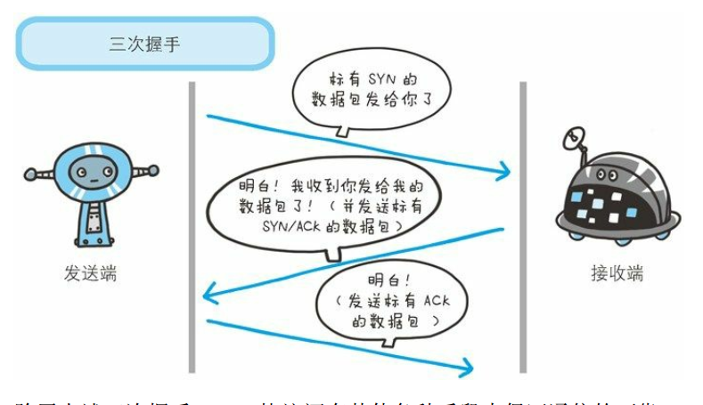
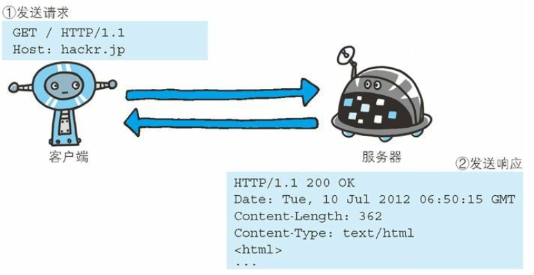
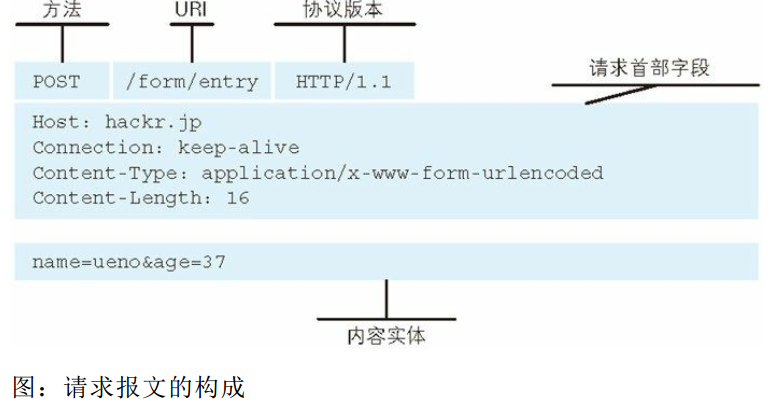
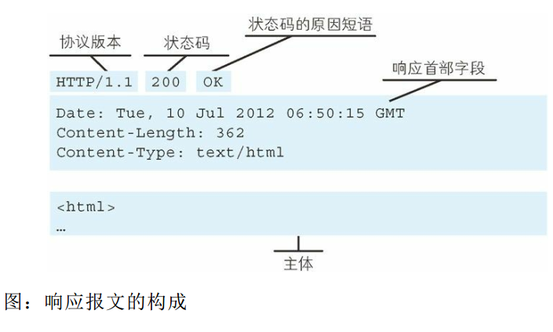
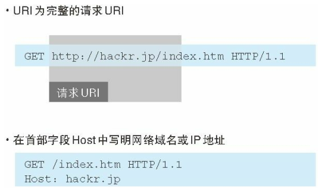
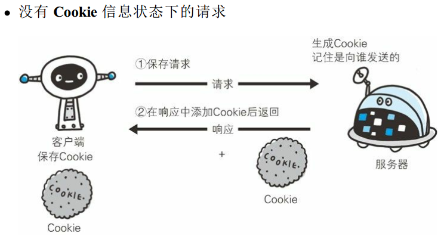
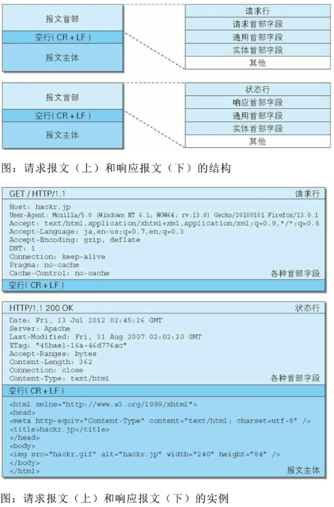
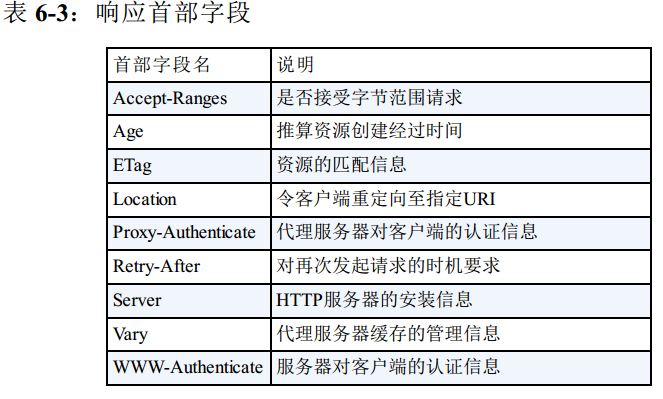
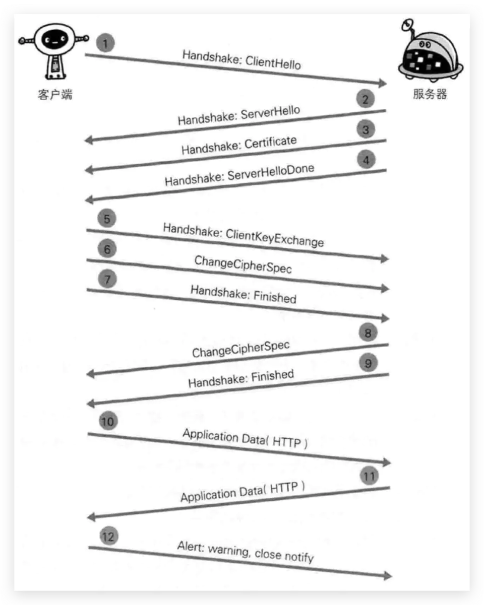

[toc]
# 图解HTTP

### 一、在浏览器中输入url地址 ->> 显示主页的过程

**一次完整的http请求过程，总体来说分为以下几个过程:**
1. DNS域名解析
2. 建立TCP连接
3. 发送HTTP请求
4. 服务器处理请求
5. 返回HTTP报文
6. 关闭TCP连接
7. 浏览器解析HTML
8. 浏览器布局渲

### 二、TCP/IP协议簇
>TCP/IP 的分层管理：**应用层、 传输层、 网络层和数据链路层**
 1. 应用层：应用层决定了向用户提**供应用服务时通信的活动**，如：FTP（File Transfer Protocol， 文件传输协议） 和 DNS（Domain Name System， 域名系统）服务，HTTP协议；
 2. 传输层：对上层应用层， **提供处于网络连接中的两台计算机之间的数据传输**，TCP（Transmission Control Protocol，传输控制协议）和 UDP（User Data Protocol， 用户数据报协议）；
 3. 网络层： 用来处理在网络上流动的数据包。该层**规定了通过怎样的路径（所谓的传输路线）到达对方计算机**，并把数据包传送给对方；
 4. 数据链路层： 包括控制操作系统、硬件的设备驱动、NIC（Network Interface Card，网络适配器，即网卡），及光纤等物理可见部分。

TCP/IP协议族进行网络通信时，会通过分层顺序与对方进行通信。发送端从应用层往下走，接收端则往应用层往上走。


发送端在层与层之间传输数据时，每经过一层时必定会被打上一个该层所属的首部信息。反之，接收端在层与层传输数据时，每经过一层时会把对应的首部消去。--从客户端发送前层层包装送至数据链路层，服务器收到后层层解除包装到应用层。
**传输层打上标记和端口号-->网络层增加作为通信地址的MAC地址转发给数据链路层**

> 与 HTTP 关系密切的协议：IP、TCP、DNS
1. I**P协议：**（Internet Protocol）协议位于网络层，作用是把各种数据包传送给对方。其中两个重要的条件是 IP 地址和 MAC地址（Media Access Control Address）。IP 地址指明了节点被分配到的地址，MAC 地址是指网卡所属的固定地址。IP 地址可以和 MAC 地址进行配对。IP 地址可变换，但 MAC地址基本上不会更改。
**使用ARP协议解析IP获得MAC地址，进行通信**：
IP之间的通信来MAC地址。局域网内简单的绑定ip集可通过arp拆查询到mac。对于多台计算机需要进行中转，这时，ARP协议就需要采用以太网的"广播"功能：将请求包以广播的形式发送，交换机或WiFi设备（无线路由器）收到广播包时，会将此数据发给同一局域网的其他所有主机。

2. **确保可靠性的TCP协议**
位于**传输**层， 提供可靠的**字节流服务**,TCP 协议为了更容易传送大数据才把数据分割， 而且 TCP 协议能够确认数据最终是否送达到对方。
**确保数据能到达目标**
TCP 协议采用了三次握手three-way handshaking）策略,握手过程中使用了 TCP 的标志 —— SYN（synchronize）和 ACK（acknowledgement）。

**为什么要三次握手？**
>三次握手的目的是建立可靠的通信信道，说到通讯，简单来说就是数据的发送与接收，而三次握手最主要的目的就是双方确认自己与对方的发送与接收是正常的。
第一次握手：Client 什么都不能确认；Server 确认了对方发送正常
第二次握手：Client 确认了：自己发送、接收正常，对方发送、接收正常；Server 确认了：自己接收正常，对方发送正常
第三次握手：Client 确认了：自己发送、接收正常，对方发送、接收正常；Server 确认了：自己发送、接收正常，对方发送接收正常

**三次握手为什么要传回 SYN，为什么要ACK?**
>接收端传回发送端所发送的 SYN 是为了告诉发送端，**我接收到的信息确实就是你所发送的信号了。** 双方通信无误必须是两者互相发送信息都无误。**传了 SYN，证明发送方到接收方的通道没有问题，但是接收方到发送方的通道还需要 ACK 信号来进行验证。**


**为什么要四次挥手?**
>断开一个 TCP 连接需要四次挥手：
- 客户端-发送一个 FIN，用来关闭客户端到服务器的数据传送---（客户端表示服务端你要关了）
- 服务器-收到这个 FIN，它发回一 个 ACK，确认序号为收到的序号加1 。和 SYN 一样，一个 FIN 将占用一个序号---(服务端表示我知道了)
- 服务器-关闭与客户端的连接，发送一个FIN给客户端----(发给客户端说我准备关了(半关闭))
- 客户端-发回 ACK 报文确认，并将确认序号设置为收到序号加1---(客户端表示你关吧)
>任何一方都可以在数据传送结束后发出连接释放的通知，待对方确认后进入半关闭状态。当另一方也没有数据再发送的时候，则发出连接释放通知，对方确认后就完全关闭了TCP连接。举个例子：A 和 B 打电话，通话即将结束后，A 说“我没啥要说的了”，B回答“我知道了”，但是 B 可能还会有要说的话，A 不能要求 B 跟着自己的节奏结束通话，于是 B 可能又巴拉巴拉说了一通，最后 B 说“我说完了”，A 回答“知道了”，这样通话才算结束。

3. **负责域名解析的 DNS 服务**：和 HTTP 协议一样位于应用层的协议。它提供==域名到 IP 地址之间的解析服务==。DNS 协议提供通过域名查找 IP 地址，或逆向从 IP 地址反查域名的服务。


4. **各种协议和HTTP的关系**
   可以描写url输入浏览器之后的全流程
   

5. **URI（统一资源标识符）和 URL（Uniform Resource Locator，统一资源定位符）**
>URI 用字符串标识某一互联网资源，而 URL 表示资源的地点（互联网上所处的位置） 。可见 URL 是 URI 的子集
   

如下URI例子：
>ftp://ftp.is.co.za/rfc/rfc1808.txt
http://www.ietf.org/rfc/rfc23...
ldap://[2001:db8::7]/c=GB?objectClass?one
mailto:John.Doe@example.com
news:comp.infosystems.www.servers.unix
tel:+1-816-555-1212
telnet://192.0.2.16:80/
urn:oasis:names:specification:docbook:dtd:xml:4.1.2

### 三、简单的HTTP协议-baseHTTP/1.1
1. HTTP 协议用于客户端和服务器端之间的通信
   
**请求报文：** 是由请求方法、请求 URI、协议版本、可选的请求首部字段和内容实体构成的。
   

**响应报文：** 基本上由协议版本、状态码（表示请求成功或失败的数字代码）、用以解释状态码的原因短语、可选的响应首部字段以及实体主体构成。
   

2. ==HTTP是不保存状态的协议==
   HTTP 是一种不保存状态，即无状态（stateless）协议。不具备保存之前发送过的请求或响应的功能。**虽然是无状态协议，但是为了实现期望的保持状态功能，于是引入了 Cookie 技术。**
3. 请求 URI 定位资源
   >HTTP 协议使用 URI 定位互联网上的资源。
   
   

4. 告知服务器意图的HTTP方法
>**GET：** 获取资源,用来请求访问已被 URI 识别的资源;
**POST：** 传输实体主体；
**PUT：** 传输文件——鉴于 HTTP/1.1 的 PUT 方法自身不带验证机制，任何人都可以上传文件 , 存在安全性问题， 因此一般的 Web 网站不使用该方法；
**HEAD：** 获得报文首部,和 GET 方法一样，只是不返回报文主体部分。用于确认URI 的有效性及资源更新的日期时间等；
**DELETE：** 删除文件，与 PUT 相反的方法。按请求 URI 删除指定的资源；同样不安全
**OPTIONS：** 询问支持的方法；
**TRACE：** 追踪路径，让 Web 服务器端将之前的请求通信环回给客户端的方法。发送请求时，在 Max-Forwards 首部字段中填入数值，每经过一个服务器端就将该数字减 1，当数值刚好减到 0 时，就停止继续传输，最后接收到请求的服务器端则返回状态码 200 OK 的响应。客户端通过 TRACE 方法可以查询发送出去的请求是怎样被加工修改 / 篡改的。不常用易引发XST（Cross-Site Tracing， 跨站追踪）攻击；
**CONNECT：** 要求用隧道协议连接代理，要求在与代理服务器通信时建立隧道，实现用隧道协议进行 TCP 通信。主要使用 SSL（Secure Sockets Layer，安全套接层）和 TLS（Transport Layer Security，传输层安全）协议把通信内容加密后经网络隧道传输。
5. 方法命令
      


6. 持久连接节省通信量
   >持久连接

   HTTP 协议的初始版本中，每进行一次 HTTP 通信就要断开一次 TCP连接。每次的请求都会造成无谓的 TCP 连接建立和断开，增加通信量的开销。为解决上述 TCP 连接的问题，HTTP/1.1 和一部分的 HTTP/1.0 想出了持久连接（HTTP Persistent Connections，也称为 HTTP keep-alive 或 HTTP connection reuse）的方法。**持久连接的特点是，只要任意一端没有明确提出断开连接，则保持 TCP 连接状态。**
> 管线化pipelinling

从前发送请求后需等待并收到响应， 才能发送下一个请求。管线化技术出现后，不用等待响应亦可直接发送下一个请求

7. Cookie的状态管理
  Cookie技术通过在请求和响应报文中写入Cookie信息来控制客户端状态。
  Cookie 会根据从服务器端发送的响应报文内的一个叫做 Set-Cookie 的首部字段信息， 通知客户端保存 Cookie。当下次客户端再往该服务器发送请求时，**客户端会自动在请求报文中加入 Cookie 值**后发送出去。服务器端发现客户端发送过来的 Cookie 后，会去**检查究竟是从哪一个客户端发来的连接请求，然后对比服务器上的记录，最后得到之前的状态信息。**
       

### 四、HTTP报文内的HTTP信息
用于 HTTP 协议交互的信息被称为 HTTP 报文。
>请求端（客户端）的HTTP 报文叫做请求报文，响应端（服务器端）的叫做响应报文。TTP 报文本身是由多行（用 CR+LF 作换行符）数据构成的字符串文本。并不一定要有报文主体。



### 五、 返回结果的HTTP状态码
>状态码的职责是当客户端向服务器端发送请求时，描述返回的请求结果。 如 200 OK，以 3 位数字和原因短语组，数字中的第一位指定了响应类别， 后两位无分类。

1. **2XX成功：2XX的响应结果表明请求被正常处理了。**
- 200 ok：请求成功并根据方法的不同，返回不同的实体；
- 204 No Content：该状态码代表服务器接收的请求已成功处理，但在返回的响应报文中不含实体的主体部分。无资源可返回；
- 206 Partial Content：范围请求后，服务器成功执行了该请求；

2. **3XX重定向：表明浏览器需要执行某些特殊的处理以正确处理请求。**
- 301 Moved Permanently：永久性重定向，表示请求的资源已被分配了新的 URI，以后应使用资源现在所指的 URI。
- 302 Found：临时重定向，该状态码表示请求的资源已被分配了新的 URI，希望用户（本次）能使用新的 URI 访问。
- 303 See Other:由于请求对应的资源存在着另一个 URI，应使用 GET方法定向获取请求的资源。303 状态码和 302 Found 状态码有着相同的功能，但 303 状态码明确表示客户端应当采用 GET方法获取资源，这点与 302 状态码有区别。
**当 301、 02、303响应状态码返回时，几乎所有的浏览器都会把POST 改成 GET，并删除请求报文内的主体，之后请求会自动再次发送。301、302 标准是禁止将 POST 方法改变成 GET 方法的，但实际使用时大家都会这么做。**
- 304 Not Modified:表示客户端发送附带条件的请求时，服务器端允许请求访资源，但未满足条件的情况。 (附带条件的请求是指采用 GET方法的请求报文中包含 If-Match， If-ModifiedSince， If-None-Match， If-Range， If-Unmodified-Since 中任一首部。)**304虽然被划分在3XX中，但是和重定向没有关系**
- 307 Temporary Redirect:临时重定向
3. **4XX 客户端错误**
- 400 Bad Request：表示请求报文中存在语法错误。
- 401 Unauthorized：表示发送的请求需要有通过 HTTP 认证（BASIC 认证、DIGEST 认证）的认证信息。另外若之前已进行过 1 次请求， 则表示用户认证失败。返回含有 401 的响应必须包含一个适用于被请求资源的 WWW-Authenticate 首部用以质询（challenge） 用户信息。
- 403 Forbidden：表明对请求资源的访问被服务器拒绝了。
- 404 Not Found：表明服务器上无法找到请求的资源。
4. **5XX 服务器错误**
- 500 Internal Server Error：表明服务器端在执行请求时发生了错误。有可能是 Web应用存在的 bug 或某些临时的故障。
- 503 Service Unavailable：表明服务器暂时处于超负载或正在进行停机维护，现在无法处理请求。
  
### 六、与HTTP协作的Web服务器
1. **通信数据转发程序 ： 代理、网关、隧道**
 **代理：** 是一种有转发功能的应用程序，代理不改变请求 URI，会直接发送给前方持有资源的目标服务器。可级联多台代理服务器。==需要附加Via 首部字段以标记出经过的主机信息；==

代理有多种使用方法，按两种基准分类。 一种是是否使用缓存，另一种是是否会修改报文。
**缓存代理（Caching Proxy)** 会预先将资源的副本（缓存）保存在代理服务器上。代理再次接收到对相同资源的请求时，就可以不从源服务器那里获取资源， 而是将之前缓存的资源作为响应返回。
不对报文做任何加工的代理类型被称为**透明代理（Transparent Proxy）**。反之，对报文内容进行加工的代理被称为**非透明代理**。


**网关：** 是转发其他服务器通信数据的服务器，接收从客户端发送来的请求时，它就像自己拥有资源的源服务器一样对请求进行处理。**利用网关能提高通信的安全性**，因为可以在客户端与网关之间的通信线路上加密以确保连接的安全。网关能使通信线路上的服务器提供非HTTP协议服务。
**隧道：** 是在==相隔甚远的客户端和服务器两者之间进行中转==，并保持双方通信连接的应用程序。可按要求建立起一条与其他服务器的通信线路，届时使用 SSL等加密手段进行通信。**确保客户端能与服务器进行安全的通信**。

2. **保存资源的缓存**
>缓存是指代理服务器或客户端本地磁盘内保存的**资源副本**。缓存服务器是代理服务器的一种，并归类在缓存代理类型中。可避免多次从源服务器转发资源。**缓存是有有效期限的**，缓存失效， 缓存服务器将会再次从源服务器上获取“新”资源。

###  七、HTTP首部
>HTTP协议的请求和响应报文中必定包含HTTP首部。


>**HTTP请求报文中**， HTTP 报文由方法、 URI、 HTTP 版本、 HTTP 首部字段等部分构成。
  **HTTP响应报文中**， HTTP 报文由HTTP 版本、 状态码（数字和原因短语） 、HTTP 首部字段 3 部分构成。


1. **首部字段类型**
>使用首部字段是为了给浏览器和服务器提供报文主体大小、 所使用的语言、 认证信息等内容。
首部字段结构：首部字段名和字段值构成的， 中间用冒号“:” 分隔

- **通用首部字段（General Header Fields）：** 请求报文和响应报文两方都会使用的首部。
 

- **请求首部字段（Request Header Fields）**：从客户端向服务器端发送请求报文时使用的首部。补充了请求的附加内容、 客户端信息、 响应内容相关优先级等信息。
   

- **响应首部字段（Response Header Fields）**：从服务器端向客户端返回响应报文时使用的首部。补充了响应的附加内容， 也会要求客户端附加额外的内容信息。
  

- **实体首部字段（Entity Header Fields）**：针对请求报文和响应报文的实体部分使用的首部。补充了资源内容更新时间等与实体有关的信息。 

 - **非HTTP/1.1首付字段**
>HTTP 首部根据用途被分为 4 种 HTTP 首部字段类型，在 HTTP 协议通信交互中使用到的首部字段，不限于 RFC2616 中定义的 47 种。还有 Cookie、Set-Cookie 和 Content-Disposition 等在其他 RFC 中定义的，使用频率也很高。

- **End-to-end 首部和 Hop-by-hop 首部**
>HTTP首部字段将定义成缓存代理和非缓存代理的行为分成两种类型：

**端到端首部（End-to-end Header）**：会转发给请求 / 响应对应的最终接收目标，且必须保存在由缓存生成的响应中，另外规定它必须被转发。
**逐跳首部（Hop-by-hop Header）**：首部==只对单次转发有效，会因通过缓存或代理而不再转发==。 使用 hop-by-hop 首部，需提供 Connection 首部字段。只有这8个字段**Connection，Keep-Alive，Proxy-Authenticate，Proxy-Authorization，Trailer，TE，Transfer-Encoding，Upgrade**

2. **HTTP/1.1通用首部字段解析**
   首部字段名|说明
   -|-
   Cache-Control|控制缓存的行为
   Connection|逐跳首部
   Date|创建报文的日期时间
   Pragma|报文指令，仅作为向后兼容
   Trailer|报文末端的首部一览
   Transfer-Encoding|指定报文主题的传输编码方式
   Upgrade|升级为其他协议
   Via|代理服务器的相关信息
   Warning|错误通知
3. **请求首部字段**
>从客户端向服务器端发送请求报文时使用的首部，补充类请求的附加内容、客户端信息、响应内容相关优先级等级等信息。

 首部字段名|说明
   -|-
   **Accept**|用户代理可处理的媒体类型（请求的文件类型）
   Accept-Charset	|优先字符集
   Accept-Encoding|优先的内容编码(压缩方法)
   Accept-Language|优先的语言选择
   Authorization|Web认证信息
   Expect|期待服务器的特定行为
   From|用户的电子邮箱地址
   **Host**|请求资源所在服务器
   If-Match|比较实体标记（ETag）
   If-Modified-Since|比较资源的更新时间
   If-None-Match|比较实体标记（与 If-Match 相反）
   If-Range|资源未更新时发送实体 Byte 的范围请求
   If-Unmodified-Since|比较资源的更新时间（与If-Modified-Since相反）
   Max-Forwards|最大传输逐跳数
   Proxy-Authorization|代理服务器要求客户端的认证信息
   Range|实体的字节范围请求
   Referer|对请求中 URI 的原始获取方
   TE|传输编码的优先级
   **User-Agent**|HTTP 客户端程序的信息
4. **响应首部字段**
>从==服务器端向客户端返回响应报文时使用的首部==。补充了响应的附加内容，也会要求客户端附加额外的内容信息。

首部字段名|说明
   -|-
Accept-Ranges|是否接受字节范围请求
Age|推算资源创建经过时间（源服务器多久前创建了响应）
ETag|资源的匹配信息
Location|令客户端重定向至指定URI
Proxy-Authenticate|代理服务器对客户端的认证信息
Retry-After|对再次发起请求的时机要求
Server|HTTP服务器的安装信息
Vary|代理服务器缓存的管理信息
WWW-Authenticate|服务器对客户端的认证信息

5. **实体首部字段**
首部字段名|说明
   -|-
Allow|通知客户端能够支持的所有HTTP方法
Content-Encoding|告知客户端服务器对实体的主体部分选用的内容编码方式
Content-length|表明实体主体部分的大小-字节
content-MD5|客户端会对接受的报文主体执行相同的MD5算法，然后与首部字段的MD5比较
expires|资源失效日期
last-Modified|源服务器认定的资源作出修改的日期及时间

6. 为 Cookie 服务的首部字段
>Cookie的工作机制是用户识别和状态管理。Web网站为了管理用户的状态会通过Web浏览器，把一些数据临时写入用户的计算机内，接着当用户访问改Web网站时，可通过通信放是取回之前存放的Cookie。调用Cookie校验有效期，以及发送方的域路径，协议等信息。

首部字段名|说明|首部类型
-|-|-
Set-Cookie|开始状态管理使用的Cookie|响应首部字段
Cookie|服务器接收到的Cookie|请求部首字段

>**Set-Cookie**：
Set-Cookie: status=enable; expires=Tue, 05 Jul 2011 07:26:31 GMT; path=/; domain=.hackr.jp;	

Set-Cookie字段属性
属性|说明
-|-
NAME=VALUE|赋予 Cookie 的名称和其值（必需项）
expires=DATE|Cookie 的有效期（若不明确指定则默认为浏览器关闭前为止）
path=PATH|将服务器上的文件目录作为Cookie的适用对象（若不指定则默认为文档所在的文件目录）
domain=域名|作为 Cookie 适用对象的域名 （若不指定则默认为创建 Cookie 的服务器的域名）
Secure|仅在 HTTPS 安全通信时才会发送 Cookie
HttpOnly|加以限制，使 Cookie 不能被 JavaScript 脚本访问

>**Cookie**：
Cookie: status=enable

当客户端想获得 HTTP 状态管理支持时，就会在请求中包含从服务器接收到的 Cookie。


 ### 确保Web安全的HTTPS

1. **HTTP的缺点**
- 通信使用明文（不加密），内容可能会被窃听
- 不验证通信方的身份，因此有可能遭遇伪装
- 无法证明报文的完整性，所以有可能已遭篡改
2.** HTTP+加密+认证+完整性保护性=HTTPS**
   >把添加了加密及认证机制的 HTTP 称为 HTTPS（HTTP Secure）。HTTPS 并非是应用层的一种新协议，==只是 HTTP 通信接口部分用 SSL（Secure Socket Layer）和 TLS（Transport Layer Security）协议代替而已==，通常直接HTTP和SSL通信，变成HTTP显赫SSL通信，再SSL和TCP通信。SSL 是独立于 HTTP 的协议，所以其他运行在应用层的 SMTP 和 Telnet 等协议均可配合 SSL 协议使用。


HTTPS 采用**共享密钥加密**和**公开密钥加密**两者并用的混合加密机制。若密钥能够实现安全交换，那么有可能会考虑仅使用公开密钥加密来通信。公开密钥更安全，但是**公开密钥加密与共享密钥加密相比，其处理速度要慢**。==结合二者优势，在交换密钥环节使用公开密钥加密方式，之后建立通信交换报文阶段则使用共享密钥加密方式==。

3. HTTPS的安全通信机制
   
```html
1. 客户端通过发送 Client Hello 报文开始 SSL 通信。报文中包含客户端支持的 SSL 的指定版本、加密组件（Cipher Suite）列表（所使用的加密算法及密钥长度等）。
2. 服务器可进行 SSL 通信时，会以 Server Hello 报文作为应答。和客户端一样，在报文中包含 SSL 版本以及加密组件。服务器的加密组件内容是从接收到的客户端加密组件内筛选出来的。
4. 之后服务器发送 Certificate 报文。报文中包含公开密钥证书。
4. 最后服务器发送 Server Hello Done 报文通知客户端，最初阶段的 SSL 握手协商部分结束。
5. SSL 第一次握手结束之后，客户端以 Client Key Exchange 报文作为回应。报文中包含通信加密中使用的一种被称为 Pre-master secret 的随机密码串。该报文已用步骤 3 中的公开密钥进行加密。
6. 接着客户端继续发送 Change Cipher Spec 报文。该报文会提示服务器，在此报文之后的通信会采用 Pre-master secret 密钥加密。
7. 客户端发送 Finished 报文。该报文包含连接至今全部报文的整体校验值。这次握手协商是否能够成功，要以服务器是否能够正确解密该报文作为判定标准。
8. 服务器同样发送 Change Cipher Spec 报文。
9. 服务器同样发送 Finished 报文。
10. 服务器和客户端的 Finished 报文交换完毕之后，SSL 连接就算建立完成。当然，通信会受到 SSL 的保护。从此处开始进行应用层协议的通信，即发送 HTTP 请求。
11. 应用层协议通信，即发送 HTTP 响应。
12. 最后由客户端断开连接。断开连接时，发送 close_notify 报文。上图做了一些省略，这步之后再发送 TCP FIN 报文来关闭与 TCP 的通信。
```
3. **SSL 速度慢吗**
HTTPS 也存在一些问题，那就是当使用 SSL 时，它的处理速度会变慢。它慢分两种。一种是指**通信慢**。另一种是指由于大量消耗 CPU 及内存等资源，导致**处理速度变慢**。
和 HTTP 相比，HTTPS 网络负载可能会变慢 2 到 100 倍。除去和 TCP 连接、发送 HTTP 请求响应以外，还必须进行 SSL 通信，因此整体上处理通信量不可避免会增加。另外 SSL 必须进行加密处理，在服务器和客户端都需要进行加解密处理，比 HTTP 消耗更多硬件资源，导致负载增强。
针对速度变慢这一问题，并没有根本性的解决方案，一般会使用 SSL 加速器这种（专用服务器）硬件。能提高数倍 SSL 的计算速度，仅在 SSL 处理时发挥功效，分担负载。
4. **没使用 HTTPS 的原因**
与纯文本通信相比，加密通信会消耗更多的 CPU 及内存资源。如果每次通信都加密，会消耗相当多的资源，平摊到一台计算机上时，能够处理的请求数量必定也会随之减少。
如果是非敏感信息则使用 HTTP 通信，只有在包含个人信息等敏感数据时，才利用 HTTPS 加密通信。可以仅在那些需要信息隐藏时才加密，以节约资源。
除此之外，想要节约购买证书的开销也是原因之一。

### 确认访问用户身份的认证
一些页面只想让特定的人浏览，这就引入了认证功能。

HTTP1.1 常用的认证方式：
1. BASIC 认证（基本认证）
2. DIGEST 认证（摘要认证）
3. SSL 客户端认证
4. FormBase 认证（基于表单认证）