[toc]

# 图解 HTTP

### 一、在浏览器中输入 url 地址 ->> 显示主页的过程


**一次完整的 http 请求过程，总体来说分为以下几个过程:**

1. DNS 域名解析
2. 建立 TCP 连接
3. 发送 HTTP 请求
4. 服务器处理请求
5. 返回 HTTP 报文
6. 关闭 TCP 连接
7. 浏览器解析 HTML
8. 浏览器布局渲

### 二、TCP/IP 协议簇

> TCP/IP 的分层管理：**应用层、 传输层、 网络层和数据链路层**

1.  应用层：应用层决定了向用户提**供应用服务时通信的活动**，如：FTP（File Transfer Protocol， 文件传输协议） 和 DNS（Domain Name System， 域名系统）服务，HTTP 协议；
2.  传输层：对上层应用层， **提供处于网络连接中的两台计算机之间的数据传输**，TCP（Transmission Control Protocol，传输控制协议）和 UDP（User Data Protocol， 用户数据报协议）；
3.  网络层： 用来处理在网络上流动的数据包。该层**规定了通过怎样的路径（所谓的传输路线）到达对方计算机**，并把数据包传送给对方；
4.  数据链路层： 包括控制操作系统、硬件的设备驱动、NIC（Network Interface Card，网络适配器，即网卡），及光纤等物理可见部分。
    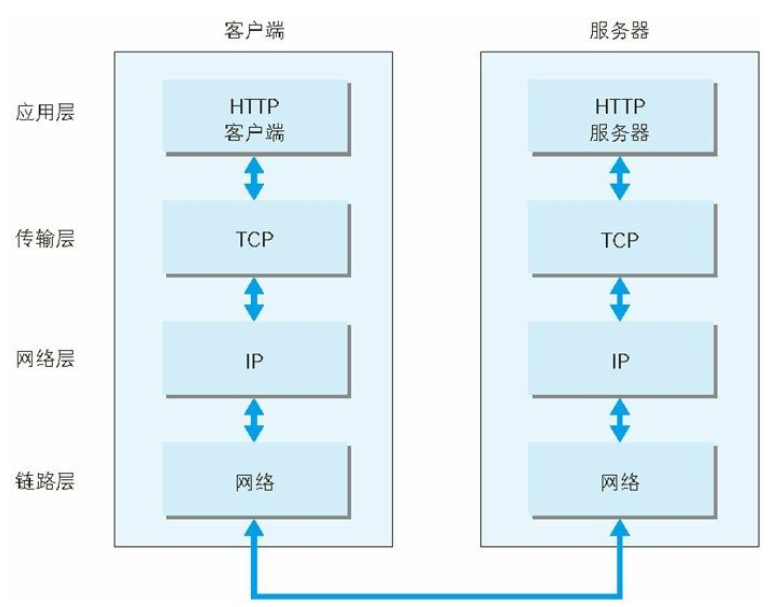
    TCP/IP 协议族进行网络通信时，会通过分层顺序与对方进行通信。发送端从应用层往下走，接收端则往应用层往上走。

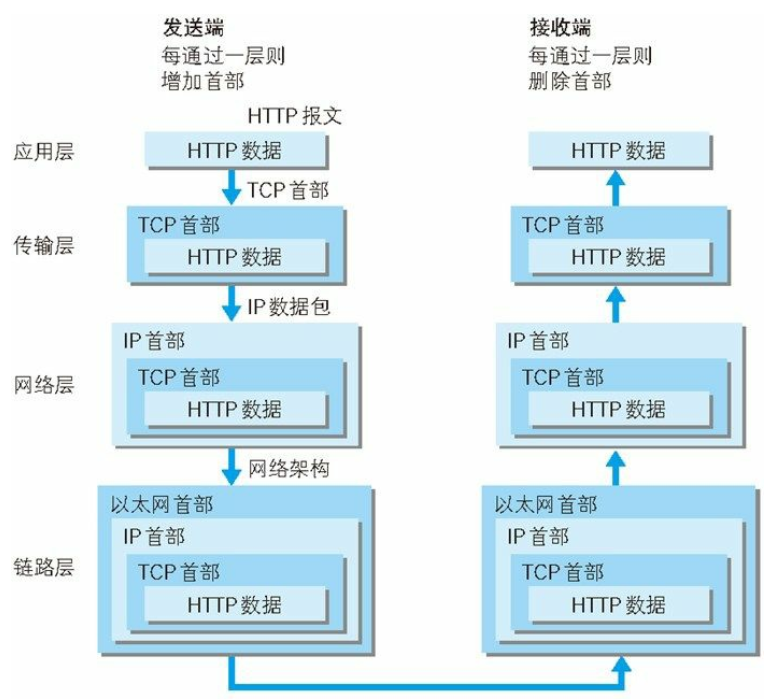
发送端在层与层之间传输数据时，每经过一层时必定会被打上一个该层所属的首部信息。反之，接收端在层与层传输数据时，每经过一层时会把对应的首部消去。--从客户端发送前层层包装送至数据链路层，服务器收到后层层解除包装到应用层。
**传输层打上标记和端口号-->网络层增加作为通信地址的 MAC 地址转发给数据链路层**

> 与 HTTP 关系密切的协议：IP、TCP、DNS

1. I**P 协议：**（Internet Protocol）协议位于网络层，作用是把各种数据包传送给对方。其中两个重要的条件是 IP 地址和 MAC 地址（Media Access Control Address）。IP 地址指明了节点被分配到的地址，MAC 地址是指网卡所属的固定地址。IP 地址可以和 MAC 地址进行配对。IP 地址可变换，但 MAC 地址基本上不会更改。
   **使用 ARP 协议解析 IP 获得 MAC 地址，进行通信**：
   IP 之间的通信来 MAC 地址。局域网内简单的绑定 ip 集可通过 arp 拆查询到 mac。对于多台计算机需要进行中转，这时，ARP 协议就需要采用以太网的"广播"功能：将请求包以广播的形式发送，交换机或 WiFi 设备（无线路由器）收到广播包时，会将此数据发给同一局域网的其他所有主机。

2. **确保可靠性的 TCP 协议**
   位于**传输**层， 提供可靠的**字节流服务**,TCP 协议为了更容易传送大数据才把数据分割， 而且 TCP 协议能够确认数据最终是否送达到对方。
   **确保数据能到达目标**
   TCP 协议采用了三次握手 three-way handshaking）策略,握手过程中使用了 TCP 的标志 —— SYN（synchronize）和 ACK（acknowledgement）。
   

**滑动窗口**
滑动窗口是针对发送端和接收端的流量控制，防止发送端一次性发送太多数据而接收端缓冲区无法支撑，而导致丢包。
窗口：对应一段发送者可以发送的字节序列，这个序列是可以改变的。接收端告知发送端自己的接受能力，然后发送端根据接受能力一次性全部发送，等待接收端确认。

**拥塞控制**
拥塞控制和滑动窗口不同，拥塞控制面向的是整个网络全局，防止过多的数据注入道网络中，导致网络中的路由器或链路过载。

**为什么要三次握手？**

> 三次握手的目的是建立可靠的通信信道，说到通讯，简单来说就是数据的发送与接收，而三次握手最主要的目的就是双方确认自己与对方的发送与接收是正常的。
> 第一次握手：Client 什么都不能确认；Server 确认了对方发送正常
> 第二次握手：Client 确认了：自己发送、接收正常，对方发送、接收正常；Server 确认了：自己接收正常，对方发送正常
> 第三次握手：Client 确认了：自己发送、接收正常，对方发送、接收正常；Server 确认了：自己发送、接收正常，对方发送接收正常

**三次握手为什么要传回 SYN，为什么要 ACK?**

> 接收端传回发送端所发送的 SYN 是为了告诉发送端，**我接收到的信息确实就是你所发送的信号了。** 双方通信无误必须是两者互相发送信息都无误。**传了 SYN，证明发送方到接收方的通道没有问题，但是接收方到发送方的通道还需要 ACK 信号来进行验证。**

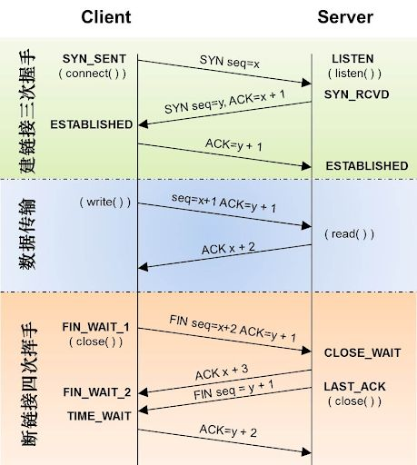

**三次握手中的重要概念：**
未连接队列：在三次握手协议中，服务器维护一个未连接队列，该队列为每个客户端的 SYN 包开设一个特条目，该条目表明服务器已经接收到 SYN 包，并向客户端发出确认，正在等待客户端的确认包。这些条目所表示的连接在服务器处于 SYN_RECV 状态，当服务器收到客户的确认包时候，删除该条目，服务器进入 ESTABLISH 状态。

**因为未连接队列，存在 SYN 攻击(SYN Flood 泛洪)的可能：** 服务器处于 SYN_RECV 状态就会分配线程资源，大量伪造的 IP 配合 SYN 攻击，不断向服务器发送 syn 包，导致目标系统运行缓慢，严重甚至引起网络堵塞和瘫痪。

- 解决办法：**缩短 SYN Timeout 时间**，所以通过缩短从接收到 SYN 报文到确定这个报文无效并丢弃改连接的时间。**设置 SYN Cookie**，给每一个请求连接的 IP 地址分配一个 Cookie，如果短时间内连续受到某个 IP 的重复 SYN 报文，就认定是受到了攻击，以后从这个 IP 地址来的包会被一概丢弃。

**为什么要四次挥手?**

> 断开一个 TCP 连接需要四次挥手：

- 客户端-发送一个 FIN，用来关闭客户端到服务器的数据传送---（客户端表示服务端你要关了）
- 服务器-收到这个 FIN，它发回一 个 ACK，确认序号为收到的序号加 1 。和 SYN 一样，一个 FIN 将占用一个序号---(服务端表示我知道了)
- 服务器-关闭与客户端的连接，发送一个 FIN 给客户端----(发给客户端说我准备关了(半关闭))
- 客户端-发回 ACK 报文确认，并将确认序号设置为收到序号加 1---(客户端表示你关吧)
  > 任何一方都可以在数据传送结束后发出连接释放的通知，待对方确认后进入半关闭状态。当另一方也没有数据再发送的时候，则发出连接释放通知，对方确认后就完全关闭了 TCP 连接。举个例子：A 和 B 打电话，通话即将结束后，A 说“我没啥要说的了”，B 回答“我知道了”，但是 B 可能还会有要说的话，A 不能要求 B 跟着自己的节奏结束通话，于是 B 可能又巴拉巴拉说了一通，最后 B 说“我说完了”，A 回答“知道了”，这样通话才算结束。

**TIME_WAIT 状态为什么要等待 2MSL**：因为第四次的确认报文可能丢失，这个状态是用来重发可能丢失的 ACK 报文。
**为什么会有 CLOSE_WAIT:**,因为服务器可能有数据未发送完毕，这段时间是继续发送数据的。
**如果建立连接之后出现故障：** TCP 有个保活计时器，通常设置为 2 小时，两小时内没有收到客户端发送的数据，服务器发送探测报文，每 75s 发送一次，10 次之后探测报文没有反应，认为出现故障，关闭连接。

==**TIME_WAIT 存在的两个理由:**==

1. 可靠的实现 TCP 全双工连接的终止
2. 允许老的重复的分节在网络上的消逝（TCP 不允许处于 TIME_WAIT 状态的连接启动一个新的化身，因为 TIME_WAIT 状态持续 2MSL，就可以保证当成功建立一个 TCP 连接的时候，来自连接先前化身的重复分组已经在网络中消逝。）

1) **负责域名解析的 DNS 服务**：和 HTTP 协议一样位于应用层的协议。它提供==域名到 IP 地址之间的解析服务==。DNS 协议提供通过域名查找 IP 地址，或逆向从 IP 地址反查域名的服务。

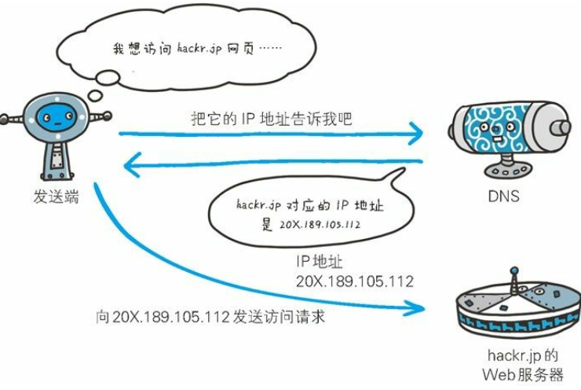

4. **各种协议和 HTTP 的关系**
   可以描写 url 输入浏览器之后的全流程
   1、根据域名查询域名的 IP 地址，DNS 解析。
   2、TCP 连接
   3、发送 HTTP 请求
   4、服务器处理请求并返回 HTTP 报文
   5、浏览器解析渲染页面
   6、连接结束。

**使用的协议：**
DNS(获取域名的 IP 的地址);
TCP(与服务器建立 TCP 连接)；
IP(建立 TCP 协议时，需发送数据，在网络层用到 IP 协议)；
OPSF(IP 数据包在路由之间传送，路由选择使用 OPSF 协议)；
ARP(路由器与服务器通信时，将 IP 地址转化为 MAC 地址，使用 ARP 协议)
HTTP(TCP 建立之后，使用 HTTP 协议访问网页)；

**DNS 寻址：** 先查找浏览器缓存，如果没命中，查询系统缓存，即 hosts 文件。如果没命中，查询路由器缓存。如果没命中，请求本地域名服务器解析域名，没有命中就进入根服务器进行查询。没有命中就返回顶级域名服务器 IP 给本地 DNS 服务器。本地 DNS 服务器请求顶级域名服务器解析，没有命中就返回主域名服务器给本地 DNS 服务器。本地 DNS 服务器请求主域名服务器解析域名，将结果返回给本地域名服务器。本地域名服务器缓存结果并反馈给客户端。

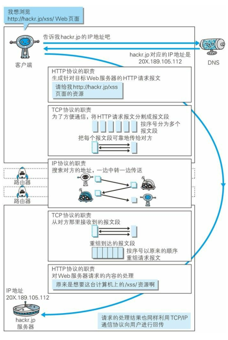

5. **URI（统一资源标识符）和 URL（Uniform Resource Locator，统一资源定位符）**
   > URI 用字符串标识某一互联网资源，而 URL 表示资源的地点（互联网上所处的位置） 。可见 URL 是 URI 的子集
   > 

如下 URI 例子：

> ftp://ftp.is.co.za/rfc/rfc1808.txt
> http://www.ietf.org/rfc/rfc23...
> ldap://[2001:db8::7]/c=GB?objectClass?one
> mailto:John.Doe@example.com
> news:comp.infosystems.www.servers.unix
> tel:+1-816-555-1212
> telnet://192.0.2.16:80/
> urn:oasis:names:specification:docbook:dtd:xml:4.1.2

#### TCP 和 UDP 区别

TCP：提供可靠的面向连接的服务。数据传输之前必须经过三次握手，结束之后必须四次挥手释放连接，数据传输时有==确认重传，分片整理，流量控制，拥塞控制==等机制保证传颂的可靠性。TCP 用于对网络通信质量要求高的地方，比如文件传输，邮件发送等。
UDP：不需要连接，主机不需要确认。提供不可靠交付，一般用于即时通信。

TCP 为了保证可靠传输并减少额外的开销，**采用了基于流的传输，基于流的传输不认为消息是一条一条的，而是无保护消息边界的**。
UDP 是面向消息传输的，是有保护消息边界的，接收方一次只接受一条独立的信息，所以不存在粘包问题。

#### TCP 粘包

粘包指发送方发送的若干报数据到达接收方时粘成了一包，从接收缓冲区来看，后一包数据的头紧接着前一包数据的尾部。**可能是发送方造成的，也可能是接收方造成的**
发送方原因：TCP 默认使用 Nagle 算法，将多次间隔较小，数据量较小的数据合并成一个数据量打的数据块，然后封包。
接收方原因：TCP 将接收到的数据包保存在缓存里，然后应用程序主动从缓存中读取收到的分组。如果接收数据包到缓存的速度大于应用程序读取的速度，多个包会被缓存，那么应用程序可能出现读到粘包的数据。

==发送方可以解决：关闭 nagele 算法，接收方无法解决，只能交给应用层去判断==

#### 点对点和端对端的区别？

点对点是针对数据链路或网络层来说的，**数据联络曾只负责直接相连的两个节点的通信**，一个结点的数据链路层接受 ip 层封装后，就把数据帧从链路上发送到于其相邻的下一个节点。==点对点是基于 MAC 地址或者 IP 地址，是设备之间的数据传输==。
**端对端通信是针对传输层来说的，传输层为网络中的主机提供端到端的通信。** 所以称之为端到端，也就是从发送端到接收端。它是一个网络连接，指的是在数据传输之前，在发送端与接收端之间（忽略中间有多少设备）为数据的传输建立一条链路，链路建立以后，发送端就可以发送数据。

### 三、简单的 HTTP 协议-baseHTTP/1.1

1. HTTP 协议用于客户端和服务器端之间的通信
   
   **请求报文：** 是由请求方法、请求 URI、协议版本、可选的请求首部字段和内容实体构成的。
   

**响应报文：** 基本上由协议版本、状态码（表示请求成功或失败的数字代码）、用以解释状态码的原因短语、可选的响应首部字段以及实体主体构成。


2. ==HTTP 是不保存状态的协议==
   HTTP 是一种不保存状态，即无状态（stateless）协议。不具备保存之前发送过的请求或响应的功能。**虽然是无状态协议，但是为了实现期望的保持状态功能，于是引入了 Cookie 技术。**
3. 请求 URI 定位资源

   > HTTP 协议使用 URI 定位互联网上的资源。

   

4. 告知服务器意图的 HTTP 方法
   > **GET：** 获取资源,用来请求访问已被 URI 识别的资源;
   > **POST：** 传输实体主体；
   > **PUT：** 传输文件——鉴于 HTTP/1.1 的 PUT 方法自身不带验证机制，任何人都可以上传文件 , 存在安全性问题， 因此一般的 Web 网站不使用该方法；
   > **HEAD：** 获得报文首部,和 GET 方法一样，只是不返回报文主体部分。用于确认 URI 的有效性及资源更新的日期时间等；
   > **DELETE：** 删除文件，与 PUT 相反的方法。按请求 URI 删除指定的资源；同样不安全
   > **OPTIONS：** 询问支持的方法；
   > **TRACE：** 追踪路径，让 Web 服务器端将之前的请求通信环回给客户端的方法。发送请求时，在 Max-Forwards 首部字段中填入数值，每经过一个服务器端就将该数字减 1，当数值刚好减到 0 时，就停止继续传输，最后接收到请求的服务器端则返回状态码 200 OK 的响应。客户端通过 TRACE 方法可以查询发送出去的请求是怎样被加工修改 / 篡改的。不常用易引发 XST（Cross-Site Tracing， 跨站追踪）攻击；
   > **CONNECT：** 要求用隧道协议连接代理，要求在与代理服务器通信时建立隧道，实现用隧道协议进行 TCP 通信。主要使用 SSL（Secure Sockets Layer，安全套接层）和 TLS（Transport Layer Security，传输层安全）协议把通信内容加密后经网络隧道传输。
5. 方法命令
   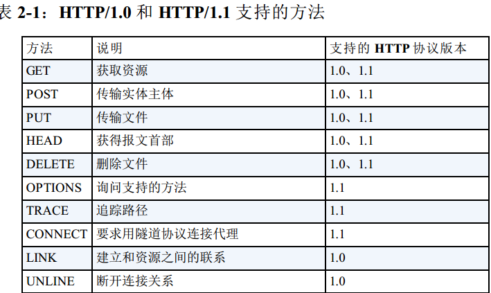

6) 持久连接节省通信量

   > 持久连接

   HTTP 协议的初始版本中，每进行一次 HTTP 通信就要断开一次 TCP 连接。每次的请求都会造成无谓的 TCP 连接建立和断开，增加通信量的开销。为解决上述 TCP 连接的问题，HTTP/1.1 和一部分的 HTTP/1.0 想出了持久连接（HTTP Persistent Connections，也称为 HTTP keep-alive 或 HTTP connection reuse）的方法。**持久连接的特点是，只要任意一端没有明确提出断开连接，则保持 TCP 连接状态。**

   > 管线化 pipelinling

从前发送请求后需等待并收到响应， 才能发送下一个请求。管线化技术出现后，不用等待响应亦可直接发送下一个请求

7. Cookie 的状态管理
   Cookie 技术通过在请求和响应报文中写入 Cookie 信息来控制客户端状态。
   Cookie 会根据从服务器端发送的响应报文内的一个叫做 Set-Cookie 的首部字段信息， 通知客户端保存 Cookie。当下次客户端再往该服务器发送请求时，**客户端会自动在请求报文中加入 Cookie 值**后发送出去。服务器端发现客户端发送过来的 Cookie 后，会去**检查究竟是从哪一个客户端发来的连接请求，然后对比服务器上的记录，最后得到之前的状态信息。**
   

#### HTTP1.0 HTTP1.1，HTTP2.0 的区别

**HTTP1.1 与 1.0 之间的区别:**

1. HTTP1.1 默认开启长连接，在一个 TCP 连接上可以传送多个 HTTP 请求和响应。而 1.0 不支持长连接。客户端和服务器每进行一次 HTTP 操作，就建立一次连接。
2. 缓存处理：在 HTTP1.0 中主要使用 header 里的 If-Modified-Since,Expires 来做为缓存判断的标准，HTTP1.1 则引入了更多的缓存控制策略例如 Entity tag，If-Unmodified-Since, If-Match, If-None-Match 等更多可供选择的缓存头来控制缓存策略。
3. Host 头处理：1.0 请求的 url 并没有传递主机名(服务器与 IP 地址绑定)，1.1 请求和响应都支持 Host 头域(虚拟主机共享 IP 地址)
4. 1.1 新增 24 个错误状态响应码。409：请求的资源和资源的当前状态冲突，410：服务器资源永久性删除。
5. 带宽优化以及网络连接的使用：1.1 允许只请求资源的某个部分.

**HTTP2.0 和 HTTP1.X 相比的新特性**

1. 新的二进制格式：1.x 的解析是基于文本的，而 2.0 的协议解析是采用二进制格式。
2. 多路复用，即连接共享，即每一个 request 都是是用作连接共享机制的；。一个 request 对应一个 id，这样一个连接上可以有多个 request.
3. header 压缩。
4. 服务端推送。

### 四、HTTP 报文内的 HTTP 信息

用于 HTTP 协议交互的信息被称为 HTTP 报文。

> 请求端（客户端）的 HTTP 报文叫做请求报文，响应端（服务器端）的叫做响应报文。TTP 报文本身是由多行（用 CR+LF 作换行符）数据构成的字符串文本。并不一定要有报文主体。


### 五、 返回结果的 HTTP 状态码

> 状态码的职责是当客户端向服务器端发送请求时，描述返回的请求结果。 如 200 OK，以 3 位数字和原因短语组，数字中的第一位指定了响应类别， 后两位无分类。
> 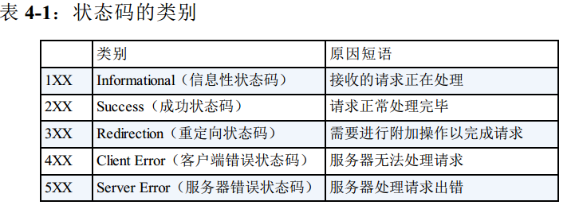

1. **2XX 成功：2XX 的响应结果表明请求被正常处理了。**

- 200 ok：请求成功并根据方法的不同，返回不同的实体；
- 204 No Content：该状态码代表服务器接收的请求已成功处理，但在返回的响应报文中不含实体的主体部分。无资源可返回；
- 206 Partial Content：范围请求后，服务器成功执行了该请求；

2. **3XX 重定向：表明浏览器需要执行某些特殊的处理以正确处理请求。**

- 301 Moved Permanently：永久性重定向，表示请求的资源已被分配了新的 URI，以后应使用资源现在所指的 URI。
- 302 Found：临时重定向，该状态码表示请求的资源已被分配了新的 URI，希望用户（本次）能使用新的 URI 访问。
- 303 See Other:由于请求对应的资源存在着另一个 URI，应使用 GET 方法定向获取请求的资源。303 状态码和 302 Found 状态码有着相同的功能，但 303 状态码明确表示客户端应当采用 GET 方法获取资源，这点与 302 状态码有区别。
  **当 301、 02、303 响应状态码返回时，几乎所有的浏览器都会把 POST 改成 GET，并删除请求报文内的主体，之后请求会自动再次发送。301、302 标准是禁止将 POST 方法改变成 GET 方法的，但实际使用时大家都会这么做。**
- 304 Not Modified:表示客户端发送附带条件的请求时，服务器端允许请求访资源，但未满足条件的情况。 (附带条件的请求是指采用 GET 方法的请求报文中包含 If-Match， If-ModifiedSince， If-None-Match， If-Range， If-Unmodified-Since 中任一首部。)**304 虽然被划分在 3XX 中，但是和重定向没有关系**
- 307 Temporary Redirect:临时重定向

3. **4XX 客户端错误**

- 400 Bad Request：表示请求报文中存在语法错误。
- 401 Unauthorized：表示发送的请求需要有通过 HTTP 认证（BASIC 认证、DIGEST 认证）的认证信息。另外若之前已进行过 1 次请求， 则表示用户认证失败。返回含有 401 的响应必须包含一个适用于被请求资源的 WWW-Authenticate 首部用以质询（challenge） 用户信息。
- 403 Forbidden：表明对请求资源的访问被服务器拒绝了。
- 404 Not Found：表明服务器上无法找到请求的资源。

4. **5XX 服务器错误**

- 500 Internal Server Error：表明服务器端在执行请求时发生了错误。有可能是 Web 应用存在的 bug 或某些临时的故障。
- 503 Service Unavailable：表明服务器暂时处于超负载或正在进行停机维护，现在无法处理请求。

### 六、与 HTTP 协作的 Web 服务器

1. **通信数据转发程序 ： 代理、网关、隧道**
   **代理：** 是一种有转发功能的应用程序，代理不改变请求 URI，会直接发送给前方持有资源的目标服务器。可级联多台代理服务器。==需要附加 Via 首部字段以标记出经过的主机信息；==

代理有多种使用方法，按两种基准分类。 一种是是否使用缓存，另一种是是否会修改报文。
**缓存代理（Caching Proxy)** 会预先将资源的副本（缓存）保存在代理服务器上。代理再次接收到对相同资源的请求时，就可以不从源服务器那里获取资源， 而是将之前缓存的资源作为响应返回。
不对报文做任何加工的代理类型被称为**透明代理（Transparent Proxy）**。反之，对报文内容进行加工的代理被称为**非透明代理**。
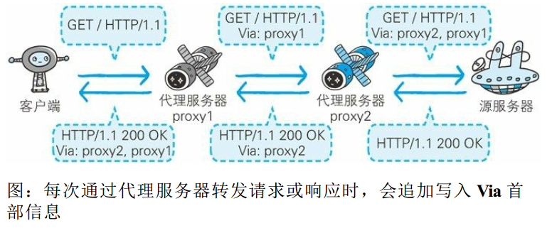

**网关：** 是转发其他服务器通信数据的服务器，接收从客户端发送来的请求时，它就像自己拥有资源的源服务器一样对请求进行处理。**利用网关能提高通信的安全性**，因为可以在客户端与网关之间的通信线路上加密以确保连接的安全。网关能使通信线路上的服务器提供非 HTTP 协议服务。
**隧道：** 是在==相隔甚远的客户端和服务器两者之间进行中转==，并保持双方通信连接的应用程序。可按要求建立起一条与其他服务器的通信线路，届时使用 SSL 等加密手段进行通信。**确保客户端能与服务器进行安全的通信**。

2. **保存资源的缓存**
   > 缓存是指代理服务器或客户端本地磁盘内保存的**资源副本**。缓存服务器是代理服务器的一种，并归类在缓存代理类型中。可避免多次从源服务器转发资源。**缓存是有有效期限的**，缓存失效， 缓存服务器将会再次从源服务器上获取“新”资源。

### 七、HTTP 首部

> HTTP 协议的请求和响应报文中必定包含 HTTP 首部。

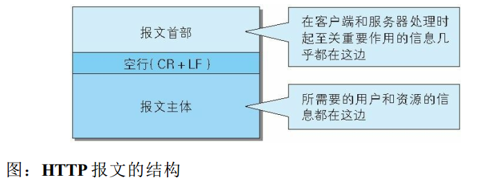

> **HTTP 请求报文中**， HTTP 报文由方法、 URI、 HTTP 版本、 HTTP 首部字段等部分构成。
> **HTTP 响应报文中**， HTTP 报文由 HTTP 版本、 状态码（数字和原因短语） 、HTTP 首部字段 3 部分构成。

1. **首部字段类型**
   > 使用首部字段是为了给浏览器和服务器提供报文主体大小、 所使用的语言、 认证信息等内容。
   > 首部字段结构：首部字段名和字段值构成的， 中间用冒号“:” 分隔

- **通用首部字段（General Header Fields）：** 请求报文和响应报文两方都会使用的首部。
  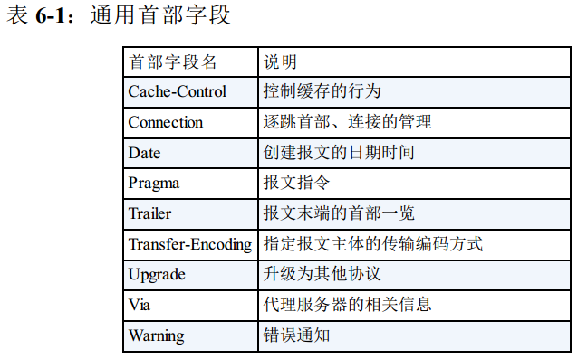

- **请求首部字段（Request Header Fields）**：从客户端向服务器端发送请求报文时使用的首部。补充了请求的附加内容、 客户端信息、 响应内容相关优先级等信息。
  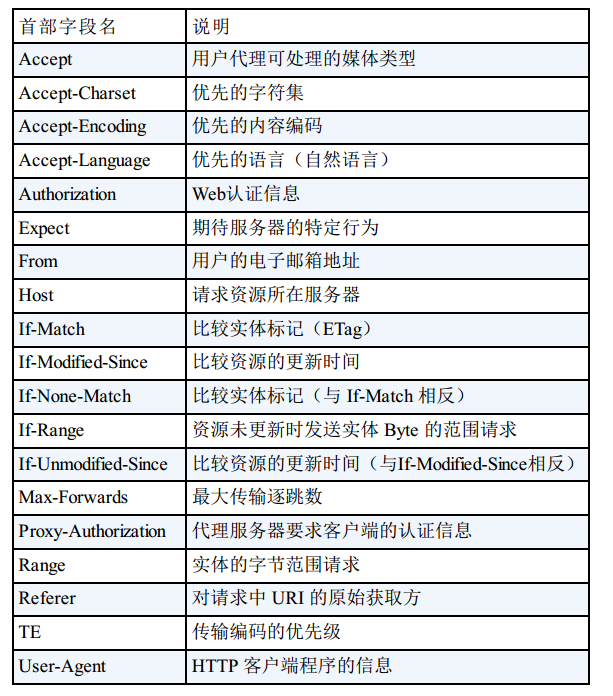

- **响应首部字段（Response Header Fields）**：从服务器端向客户端返回响应报文时使用的首部。补充了响应的附加内容， 也会要求客户端附加额外的内容信息。
  

- **实体首部字段（Entity Header Fields）**：针对请求报文和响应报文的实体部分使用的首部。补充了资源内容更新时间等与实体有关的信息。
  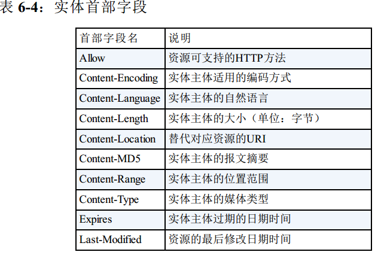
- **非 HTTP/1.1 首付字段**

  > HTTP 首部根据用途被分为 4 种 HTTP 首部字段类型，在 HTTP 协议通信交互中使用到的首部字段，不限于 RFC2616 中定义的 47 种。还有 Cookie、Set-Cookie 和 Content-Disposition 等在其他 RFC 中定义的，使用频率也很高。

- **End-to-end 首部和 Hop-by-hop 首部**
  > HTTP 首部字段将定义成缓存代理和非缓存代理的行为分成两种类型：

**端到端首部（End-to-end Header）**：会转发给请求 / 响应对应的最终接收目标，且必须保存在由缓存生成的响应中，另外规定它必须被转发。
**逐跳首部（Hop-by-hop Header）**：首部==只对单次转发有效，会因通过缓存或代理而不再转发==。 使用 hop-by-hop 首部，需提供 Connection 首部字段。只有这 8 个字段**Connection，Keep-Alive，Proxy-Authenticate，Proxy-Authorization，Trailer，TE，Transfer-Encoding，Upgrade**

2. **HTTP/1.1 通用首部字段解析**
   首部字段名|说明
   -|-
   Cache-Control|控制缓存的行为(==浏览器缓存中的 HTTP 缓存机制==)
   Connection|逐跳首部
   Date|创建报文的日期时间
   Pragma|报文指令，仅作为向后兼容
   Trailer|报文末端的首部一览
   Transfer-Encoding|指定报文主题的传输编码方式
   Upgrade|升级为其他协议
   Via|代理服务器的相关信息
   Warning|错误通知

3) **请求首部字段**
   > 从客户端向服务器端发送请求报文时使用的首部，补充类请求的附加内容、客户端信息、响应内容相关优先级等级等信息。

| 首部字段名          | 说明                                            |
| ------------------- | ----------------------------------------------- |
| **Accept**          | 用户代理可处理的媒体类型（请求的文件类型）      |
| Accept-Charset      | 优先字符集                                      |
| Accept-Encoding     | 优先的内容编码(压缩方法)                        |
| Accept-Language     | 优先的语言选择                                  |
| Authorization       | Web 认证信息                                    |
| Expect              | 期待服务器的特定行为                            |
| From                | 用户的电子邮箱地址                              |
| **Host**            | 请求资源所在服务器                              |
| If-Match            | 比较实体标记（ETag）                            |
| If-Modified-Since   | 比较资源的更新时间                              |
| If-None-Match       | 比较实体标记（与 If-Match 相反）                |
| If-Range            | 资源未更新时发送实体 Byte 的范围请求            |
| If-Unmodified-Since | 比较资源的更新时间（与 If-Modified-Since 相反） |
| Max-Forwards        | 最大传输逐跳数                                  |
| Proxy-Authorization | 代理服务器要求客户端的认证信息                  |
| Range               | 实体的字节范围请求                              |
| Referer             | 对请求中 URI 的原始获取方                       |
| TE                  | 传输编码的优先级                                |
| **User-Agent**      | HTTP 客户端程序的信息                           |

4. **响应首部字段**
   > 从==服务器端向客户端返回响应报文时使用的首部==。补充了响应的附加内容，也会要求客户端附加额外的内容信息。

| 首部字段名         | 说明                                             |
| ------------------ | ------------------------------------------------ |
| Accept-Ranges      | 是否接受字节范围请求                             |
| Age                | 推算资源创建经过时间（源服务器多久前创建了响应） |
| ETag               | 资源的匹配信息                                   |
| Location           | 令客户端重定向至指定 URI                         |
| Proxy-Authenticate | 代理服务器对客户端的认证信息                     |
| Retry-After        | 对再次发起请求的时机要求                         |
| Server             | HTTP 服务器的安装信息                            |
| Vary               | 代理服务器缓存的管理信息                         |
| WWW-Authenticate   | 服务器对客户端的认证信息                         |

5. **实体首部字段**
   首部字段名|说明
   -|-
   Allow|通知客户端能够支持的所有 HTTP 方法
   Content-Encoding|告知客户端服务器对实体的主体部分选用的内容编码方式
   Content-length|表明实体主体部分的大小-字节
   content-MD5|客户端会对接受的报文主体执行相同的 MD5 算法，然后与首部字段的 MD5 比较
   expires|资源失效日期
   last-Modified|源服务器认定的资源作出修改的日期及时间

6. 为 Cookie 服务的首部字段
   > Cookie 的工作机制是用户识别和状态管理。Web 网站为了管理用户的状态会通过 Web 浏览器，把一些数据临时写入用户的计算机内，接着当用户访问改 Web 网站时，可通过通信放是取回之前存放的 Cookie。调用 Cookie 校验有效期，以及发送方的域路径，协议等信息。

| 首部字段名 | 说明                      | 首部类型     |
| ---------- | ------------------------- | ------------ |
| Set-Cookie | 开始状态管理使用的 Cookie | 响应首部字段 |
| Cookie     | 服务器接收到的 Cookie     | 请求部首字段 |

> **Set-Cookie**：
> Set-Cookie: status=enable; expires=Tue, 05 Jul 2011 07:26:31 GMT; path=/; domain=.hackr.jp;

Set-Cookie 字段属性
属性|说明
-|-
NAME=VALUE|赋予 Cookie 的名称和其值（必需项）
expires=DATE|Cookie 的有效期（若不明确指定则默认为浏览器关闭前为止）
path=PATH|将服务器上的文件目录作为 Cookie 的适用对象（若不指定则默认为文档所在的文件目录）
domain=域名|作为 Cookie 适用对象的域名 （若不指定则默认为创建 Cookie 的服务器的域名）
Secure|仅在 HTTPS 安全通信时才会发送 Cookie
HttpOnly|加以限制，使 Cookie 不能被 JavaScript 脚本访问

> **Cookie**：
> Cookie: status=enable

当客户端想获得 HTTP 状态管理支持时，就会在请求中包含从服务器接收到的 Cookie。

### 八、确保 Web 安全的 HTTPS

1. **HTTP 的缺点**

- 通信使用明文（不加密），内容可能会被窃听
- 不验证通信方的身份，因此有可能遭遇伪装
- 无法证明报文的完整性，所以有可能已遭篡改

2. **HTTP+加密+认证+完整性保护性=HTTPS**
   > 把添加了加密及认证机制的 HTTP 称为 HTTPS（HTTP Secure）。HTTPS 并非是应用层的一种新协议，==只是 HTTP 通信接口部分用 SSL（Secure Socket Layer）和 TLS（Transport Layer Security）协议代替而已==，主要用到对称加密、非对称加密、证书，等技术进行客户端与服务器的数据加密传输，最终达到保证整个通信的安全性。通常直接 HTTP 和 SSL 通信，变成 HTTP 先和 SSL 通信，再 SSL 和 TCP 通信。SSL 是独立于 HTTP 的协议，所以其他运行在应用层的 SMTP 和 Telnet 等协议均可配合 SSL 协议使用。

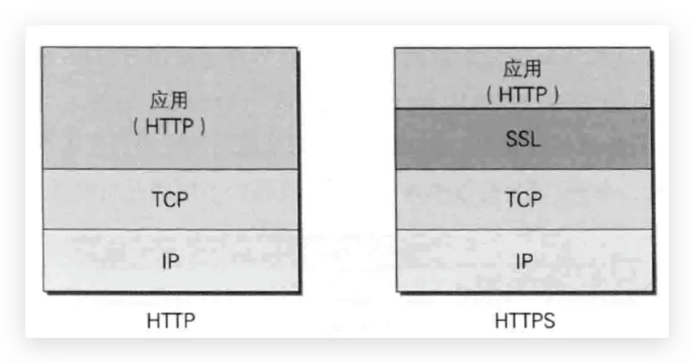
公开密钥：使用对方的公钥加密，对方接收后使用私钥解密
HTTPS 采用**共享密钥加密**和**公开密钥加密**两者并用的混合加密机制。若密钥能够实现安全交换，那么有可能会考虑仅使用公开密钥加密来通信。公开密钥更安全，但是**公开密钥加密与共享密钥加密相比，其处理速度要慢**。==结合二者优势，在交换密钥环节使用公开密钥加密方式，之后建立通信交换报文阶段则使用共享密钥加密方式==。

3. HTTPS 的安全通信机制

   - 浏览器使用 Https 的 URL 访问服务器，建立 SSL 链接；
   - 发送非对称加密的公钥 A 给浏览器
   - 客户端(SSL/TLS)解析证书（无效会弹出警告）
   - 生成随机值(这个相当于传送数据的密钥)，作为对称加密的密钥 B。
   - 浏览器使用服务器返回的公钥 A，对自己生成的对称加密密钥 B 进行加密，得到密钥 C。
   - 浏览器将密钥 C 发送给服务器
   - 务器使用自己的私钥 D 对接受的密钥 C 进行解密，得到对称加密密钥 B。
   - 将信息和密钥 B 混合在一起进行对称加密
   - 将加密的内容发送给客户端
   - 客户端用密钥 B 解密信息

   

```html
1. 客户端通过发送 Client Hello 报文开始 SSL 通信。报文中包含客户端支持的 SSL
的指定版本、加密组件（Cipher Suite）列表（所使用的加密算法及密钥长度等）。 2.
服务器可进行 SSL 通信时，会以 Server Hello
报文作为应答。和客户端一样，在报文中包含 SSL
版本以及加密组件。服务器的加密组件内容是从接收到的客户端加密组件内筛选出来的。
4. 之后服务器发送 Certificate 报文。报文中包含公开密钥证书。 4. 最后服务器发送
Server Hello Done 报文通知客户端，最初阶段的 SSL 握手协商部分结束。 5. SSL
第一次握手结束之后，客户端以 Client Key Exchange
报文作为回应。报文中包含通信加密中使用的一种被称为 Pre-master secret
的随机密码串。该报文已用步骤 3 中的公开密钥进行加密。 6. 接着客户端继续发送
Change Cipher Spec 报文。该报文会提示服务器，在此报文之后的通信会采用 Pre-master
secret 密钥加密。 7. 客户端发送 Finished
报文。该报文包含连接至今全部报文的整体校验值。这次握手协商是否能够成功，要以服务器是否能够正确解密该报文作为判定标准。
8. 服务器同样发送 Change Cipher Spec 报文。 9. 服务器同样发送 Finished 报文。
10. 服务器和客户端的 Finished 报文交换完毕之后，SSL
连接就算建立完成。当然，通信会受到 SSL
的保护。从此处开始进行应用层协议的通信，即发送 HTTP 请求。 11.
应用层协议通信，即发送 HTTP 响应。 12. 最后由客户端断开连接。断开连接时，发送
close_notify 报文。上图做了一些省略，这步之后再发送 TCP FIN 报文来关闭与 TCP
的通信。
```

3. **SSL 速度慢吗**
   HTTPS 也存在一些问题，那就是当使用 SSL 时，它的处理速度会变慢。它慢分两种。一种是指**通信慢**。另一种是指由于大量消耗 CPU 及内存等资源，导致**处理速度变慢**。
   和 HTTP 相比，HTTPS 网络负载可能会变慢 2 到 100 倍。除去和 TCP 连接、发送 HTTP 请求响应以外，还必须进行 SSL 通信，因此整体上处理通信量不可避免会增加。另外 SSL 必须进行加密处理，在服务器和客户端都需要进行加解密处理，比 HTTP 消耗更多硬件资源，导致负载增强。
   针对速度变慢这一问题，并没有根本性的解决方案，一般会使用 SSL 加速器这种（专用服务器）硬件。能提高数倍 SSL 的计算速度，仅在 SSL 处理时发挥功效，分担负载。
4. **没使用 HTTPS 的原因**
   与纯文本通信相比，加密通信会消耗更多的 CPU 及内存资源。如果每次通信都加密，会消耗相当多的资源，平摊到一台计算机上时，能够处理的请求数量必定也会随之减少。
   如果是非敏感信息则使用 HTTP 通信，只有在包含个人信息等敏感数据时，才利用 HTTPS 加密通信。可以仅在那些需要信息隐藏时才加密，以节约资源。
   除此之外，想要节约购买证书的开销也是原因之一。

#### 确认访问用户身份的认证

一些页面只想让特定的人浏览，这就引入了认证功能。

HTTP1.1 常用的认证方式：

1. BASIC 认证（基本认证）
2. DIGEST 认证（摘要认证）
3. SSL 客户端认证
4. FormBase 认证（基于表单认证）

#### HTTP 和 HTTPS 的区别

- https 协议需要到 CA 申请证书，一般免费证书很少，需要交费。
- http 是超文本传输协议，信息是明文传输；https 则是具有安全性的 ssl/tls 加密传输协议。
- http 和 https 使用的是完全不同的连接方式，用的端口也不一样，前者是 80，后者是 443。
- http 的连接很简单，是无状态的；HTTPS 协议是由 SSL+HTTP 协议构建的可进行加密传输、身份认证的网络协议，比 http 协议安全。

#### SSL 和 TSL 区别

- 对于消息认证使用密钥散列法：TLS 使用“消息认证代码的密钥散列法”（HMAC），当记录在开放的网络（如因特网）上传送时，该代码确保记录不会被变更。SSLv3.0 还提供键控消息认证，但 HMAC 比 SSLv3.0 使用的（消息认证代码）MAC 功能更安全。
- 增强的伪随机功能（PRF）：PRF 生成密钥数据。在 TLS 中，HMAC 定义 PRF。PRF 使用两种散列算法保证其安全性。如果任一算法暴露了，只要第二种算法未暴露，则数据仍然是安全的。
- 改进的已完成消息验证：TLS 和 SSLv3.0 都对两个端点提供已完成的消息，该消息认证交换的消息没有被变更。然而，TLS 将此已完成消息基于 PRF 和 HMAC 值之上，这也比 SSLv3.0 更安全。
- 一致证书处理：与 SSLv3.0 不同，TLS 试图指定必须在 TLS 之间实现交换的证书类型。
- 特定警报消息：TLS 提供更多的特定和附加警报，以指示任一会话端点检测到的问题。TLS 还对何时应该发送某些警报进行记录。

### 九、**浏览器缓存**

> Web 缓存机制分为两种，客户端缓存和服务端缓存，本文主要对客户端缓存进行简单的分析。
> 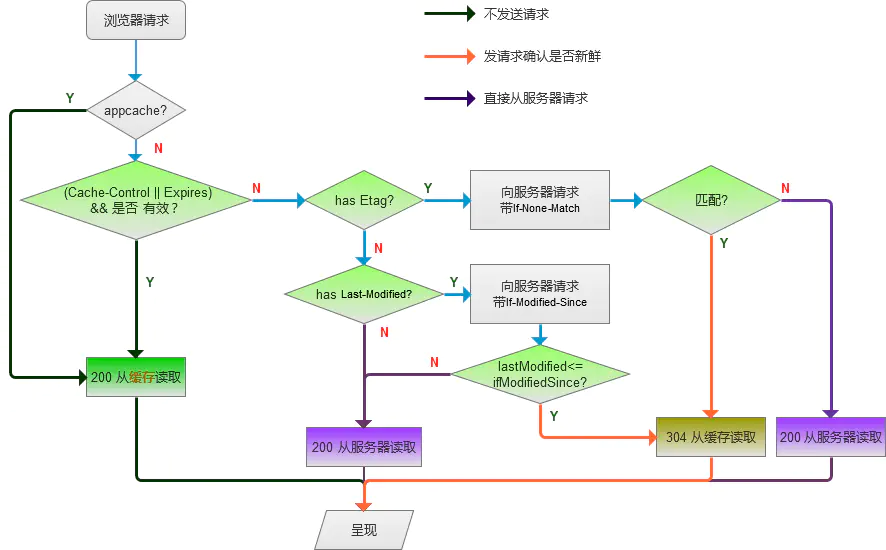

**服务端缓存:**
服务端缓存又分为 代理服务器缓存 和 反向代理服务器缓存（也叫网关缓存，比如 Nginx 反向代理、Squid 等），其实广泛使用的 CDN 也是一种服务端缓存，目的都是让用户的请求走”捷径“，并且都是缓存图片、文件等静态资源。

- 代理服务器缓存
  Vary 是 HTTP/1.1 中的一个头字字段，其值为请求头中的字段，如上图中的 Accept-Encoding，可以是多个，以逗号分割，其记录了代理服务器返回资源参考了哪些请求头字段。代理服务器拿到源服务器的响应报文，会根据 Vary 里的字段列表，缓存不同版本的资源。当有资源请求再次访问时，代理服务器会分析请求头字段，返回正确的版本。

**客户端缓存：**

**客户端缓存一般指浏览器缓存，所以我们认为浏览器存在一个缓存数据库，目的是加速各种静态资源的访问，用于储存一些不经常变化的静态文件（图片、css、js 等）**。

**下面主讲 HTTP 缓存**
我们将缓存分为强制缓存和协商缓存。下面我将分别详细的介绍这两种缓存的缓存规则。

1. 缓存方案
   **强制缓存**
   **不需要发送请求到服务端，直接读取浏览器本地缓存,如果不命中进行协商缓存**，在 Chrome 的 Network 中显示的 HTTP 状态码是 200 ，在 Chrome 中，强缓存又分为 Disk Cache (存放在硬盘中)和 Memory Cache (存放在内存中)，存放的位置是由浏览器控制的。是否强缓存由 Expires、Cache-Control 和 Pragma 3 个 Header 属性共同来控制。
   
   **协商缓存**
   当浏览器的强缓存失效的时候或者请求头中设置了不走强缓存，并且在请求头中设置了 If-Modified-Since 或者 If-None-Match 的时候，会将这两个属性值 **(Etag/Last-Modified)** 到服务端去验证是否命中协商缓存，如果命中了协商缓存，会返回 304 状态，加载浏览器缓存，并且响应头会设置 Last-Modified 或者 ETag 属性。

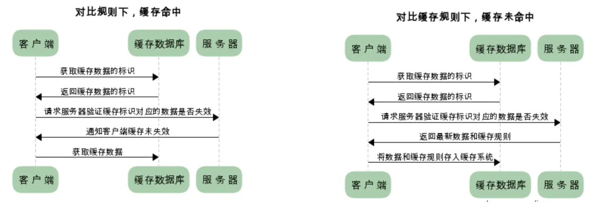
两类缓存机制可以同时存在，**强制缓存的优先级高于协商缓存**，当执行强制缓存时，如若缓存命中，则直接使用缓存数据库数据，不在进行缓存协商。

1. **缓存的方法**
   服务器是如何判断缓存是否失效呢？HTTP 报文中包含首部 header 和主体部分 body。与缓存相关的规则信息就包含在 header 中。body 中的内容是 HTTP 请求真正要传输的部分。举个 HTTP 报文 header 部分的例子如下：
   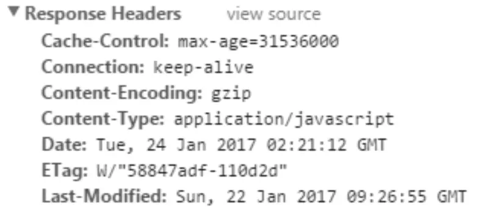

- ==对于强制缓存==
  服务器响应的 header 中会用两个字段来表明——Expires 和 Cache-Control。
- - **Expires**
    Expires 的值是一个 HTTP 日期，在浏览器发起请求时，会根据系统时间和 Expires 的值进行比较，如果系统时间超过了 Expires 的值，缓存失效。**由于和系统时间进行比较，所以当系统时间和服务器时间不一致的时候，会有缓存有效期不准的问题。Expires 的优先级在三个 Header 属性中是最低的**。另一方面，Expires 是 HTTP1.0 的产物，**故现在大多数使用 Cache-Control 替代。**
- - **Pragma**
    Pragma 只有一个属性值，就是 no-cache ，效果和 Cache-Control 中的 no-cache 一致，不使用强缓存，需要与服务器验证缓存是否新鲜，在 3 个头部属性中的优先级最高。

* - **Cache-Control**
    Cache-Control 有很多属性，不同的属性代表的意义也不同。

| 参数      | 说明                                                                                                                                                                                        |
| --------- | ------------------------------------------------------------------------------------------------------------------------------------------------------------------------------------------- |
| private   | 当前响应是针对单个用户的，并非通用数据，因此不建议任何中间缓存对其进行缓存。例如：浏览器就是一个比较私人的缓存源，它会缓存 “private” 的缓存，而 CDN 则不会。                                |
| public    | 默认的策略，表示当前缓存是开放的，任何请求响应的中间环节，都可以对其进行缓存，如果我们不显式指定，则当前为 “public” 缓存。                                                                  |
| max-age=t | 缓存内容将在 t 秒后失效                                                                                                                                                                     |
| no-cache  | 并不是真的不缓存数据，它只是要求每次都确认资源是否过期，也就是它会利用数据令牌 ETag 来一定程度的减小传输的流量---==每次都是协商缓存==                                                       |
| no-store  | 完全是要求客户端，每次都重新请求数据并下载最新的数据，不做任何缓存处理。这种不缓存的策略，也包括中间连接的代理、网关 等中间传输的通道，也一并不对数据进行缓存，每次都从源服务器上获取数据。 |

- ==对于协商缓存==
  协商缓存需要进行对比判断是否可以使用缓存。浏览器第一次请求数据时，服务器会将缓存标识与数据一起响应给客户端，客户端将它们备份至缓存中。再次请求时，客户端会将缓存中的标识发送给服务器，服务器根据此标识判断。若未失效，返回 304 状态码，浏览器拿到此状态码就可以直接使用缓存数据了。
  对于协商缓存来说，缓存标识我们需要着重理解一下，下面我们将着重介绍它的两种缓存方案。

**Last-Modified：** 服务器在响应请求时，会告诉浏览器资源的最后修改时间。返回给客户端，并缓存。
**if-Modified-Since:** 浏览器再次请求服务器的时候，请求头会包含上面的字段，后面跟着在缓存中获得的最后修改时间。服务端收到此请求头发现有 if-Modified-Since，则与被请求资源的最后修改时间进行对比，如果一致则返回 304 和响应报文头，浏览器只需要从缓存中获取信息即可。
==从字面上看，就是说：从某个时间节点算起，是否文件被修改了==

- - 如果真的被修改：那么开始传输响应一个整体，服务器返回：200 OK
- - 如果没有被修改：那么只需传输响应 header，服务器返回：304 Not Modified

**if-Unmodified-Since:** 从字面上看, 就是说: 从某个时间点算起, 是否文件没有被修改

- - 如果没有被修改:则开始`继续'传送文件: 服务器返回: 200 OK
- - 如果文件被修改:则不传输,服务器返回: 412 Precondition failed (预处理错误)

**这两个的区别是一个是修改了才下载一个是没修改才下载。**

**缺点：**
Last-Modified 说好却也不是特别好，因为如果在服务器上，一个资源被修改了，但其实际内容根本没发生改变，会因为 Last-Modified 时间匹配不上而返回了整个实体给客户端（即使客户端缓存里有个一模一样的资源）。为了解决这个问题，HTTP1.1 推出了 Etag。

**Etag**： 服务器响应请求时，通过此字段告诉浏览器当前资源在服务器生成的唯一标识（生成规则由服务器决定）
**If-None-Match：** 接受服务器返回的 Etag
再次请求服务器时，浏览器的请求报文头部会包含此字段，后面的值为在缓存中获取的标识。服务器接收到次报文后发现 If-None-Match 则与被请求资源的唯一标识进行对比。

- - 不同，说明资源被改动过，则响应整个资源内容，返回状态码 200。
- - 相同，说明资源无心修改，则响应 header，浏览器直接从缓存中获取数据信息。返回状态码 304.

但是实际应用中由于 Etag 的计算是使用算法来得出的，而算法会占用服务端计算的资源，所有服务端的资源都是宝贵的，所以就很少使用 Etag 了

**缓存策略树**


1. **缓存的优点**

- 减少了冗余的数据传递，节省宽带流量
- 减少了服务器的负担，大大提高了网站性能
- 加快了客户端加载网页的速度 这也正是 HTTP 缓存属于客户端缓存的原因。

### 十、HTTP 幂等性

HTTP 幂等方法，是指无论调用多少次都不会有不同结果的 HTTP 方法。不管你调用一次，还是调用一百次，一千次，结果都是相同的。

1. GET、DELETE、PUT、POST 语义和幂等性

- **GET 方法用于获取资源，不应有副作用，所以是幂等的**。用于获取资源，不管调用多少次接口，结果都不会改变，所以是幂等的。只是查询数据，不会影响到资源的变化，因此我们认为它幂等。
  值得注意，==幂等性指的是可能改变结果但不会改变资源本身==。怎么理解呢？例如，这个 HTTP GET 方法可能会每次得到不同的返回内容，但并不影响资源。

- **DELETE 方法用于删除资源，但满足幂等性**。比如：调用一次和多次对资源产生影响是相同的，所以也满足幂等性。

- **比较容易混淆的是 POST 和 PUT。** POST 和 PUT 的区别容易被简单地误认为“POST 表示创建资源，PUT 表示更新资源”；而实际上，二者均可用于创建资源，更为本质的差别是在幂等性方面。
  **PUT**因为它直接把实体部分的数据替换到服务器的资源，我们多次调用它，只会产生一次影响，但是有相同结果的 HTTP 方法，所以满足幂等性。
  **POST**方法是一个非幂等方法，因为调用多次，都将产生新的资源。因为他会对资源本身产生影响，每次调用都会有新的资源产生，因此不满足幂等性。
- **PATCH 方法**：PATCH 方法是非幂等的。POST 方法和 PUT 方法可能比较好理解，但是 PATCH 方法只是更新部分资源，怎么是非幂等的呢?
  PATCH 提供的实体则需要根据程序或其它协议的定义，解析后在服务器上执行，以此来修改服务器上的资源。换句话说，PATCH 请求是会执行某个程序的，如果重复提交，程序可能执行多次，对服务器上的资源就可能造成额外的影响，这就可以解释它为什么是非幂等的了。

### 11. [Cookie 和 Session](https://www.cnblogs.com/cxuanBlog/p/12635842.html)

1. Cookie
   Cookie 是客户端保存用户信息的一种机制，用来记录用户的一些信息，**实际上 Cookie 是服务器在本地机器上存储的一小段文本**，并随着每次请求发送到服务器。**Cookie 技术通过请求和响应报文中写入 Cookie 信息来控制客户端的状态。**
   ==Cookie 会根据响应报文里的一个叫做 Set-Cookie 的首部字段信息，通知客户端保存 Cookie。==
   当客户端再向服务端发起请求时，客户端会自动在请求报文中加入 Cookie 值之后发送出去.之后服务端发现客户端发送过来的 Cookie 后，会检查是那个客户端发送过来的请求，然后对服务器上的记录，最后得到了之前的状态信息。

**set-Cookie 的字段的属性**

```
Set-Cookie: logcookie=3qjj; expires=Wed, 13-Mar-2019 12:08:53 GMT; Max-Age=31536000; path=/;
 domain=fafa.com;secure; HttpOnly;
```

| 字段           | 说明                                                                                                                                                                                      |
| -------------- | ----------------------------------------------------------------------------------------------------------------------------------------------------------------------------------------- |
| logcookie=3qjj | 赋予 Cookie 的名称和值，logcookie 是名字 ，3qjj 是值                                                                                                                                      |
| expires        | 设置 cookie 有效期。**当省略 expires 属性时，Cookie 仅在关闭浏览器之前有效**。可以通过覆盖已过期的 Cookie，设置这个 Cookie 的过期时间是过去的时间，实现对客户端 Cookie 的实质性删除操作。 |
| path           | 限制指定 Cookie 的发送范围的文件目录。不过另有办法可避开这项限制，看来对其作为安全机制的效果不能抱有期待                                                                                  |
| domain         | 指定的域名可以做到与结尾匹配一致。比如，指定 domain 是 fafa.com，除了 fafa.com 那么 www.fafa.com 等都可以发送 Cookie                                                                      |
| secure         | 设置 web 页面只有在 HTTPS 安全连接时，才可以发送 Cookie。HHTP 则不可以进行回收                                                                                                            |
| HttpOnly       | 使 JavaScript 脚本无法获得 Cookie                                                                                                                                                         |

2. **Session**
   服务端执行 session 机制时候会生成 session 的 id 值，这个 id 值会发送给客户端，客户端每次请求都会把这个 id 值放到 http 请求的头部发送给服务端，而这个 id 值在客户端会保存下来，**保存的容器就是 cookie，因此当我们完全禁掉浏览器的 cookie 的时候，服务端的 session 也会不能正常使用**。 
   Session 在默认情况下是使用客户端的 Cookie 来保存 Session ID 的，所以当客户端的 cookie 出现问题的时候就会影响 Session 了。
   必须注意的是：Session 不一定必须依赖 Cookie，这也是 Session 相比 Cookie 的高明之处。当客户端的 Cookie 被禁用或出现问题时，PHP 会自动把 Session ID 附着在 URL 中，这样再通过 Session ID 就能跨页使用 Session 变量了。

3. **Cookie 和 Session 的区别**

   **session 是一种网络通讯的会话机制，而 cookie 只是目前实现这种机制的主流方案里面的一个参与者，它一般是用于保存 session ID**

- cookie 数据存放在客户的浏览器（客户端）上，session 数据放在服务器上，但是服务端的 session 的实现对客户端的 cookie 有依赖关系的---也可以不依赖，cookie 被禁用之后可以放在 url 中。
- cookie 不是很安全，别人可以分析存放在本地的 COOKIE 并进行 COOKIE 欺骗，考虑到安全应当使用 session；
- session 会在一定时间内保存在服务器上。当访问增多，会比较占用你服务器的性能。考虑到减轻服务器性能方面，应当使用 COOKIE；
- 单个 cookie 在客户端的限制是 3K，就是说一个站点在客户端存放的 COOKIE 不能超过 3K；

**目前的主流方案是：**

- 当用户登录系统后，服务端根据一定的机制来生成一个 session ID(例如：tomcat 的 ManagerBase 类提供创建 sessionid 的方法：随机数+时间+jvmid)，一个 session ID 唯一标识着一次会话。
- 生成后的 session ID 首先会保存在服务端的内存，文件或者数据库中。在这三种常见的存储方案中，比较主流的就是存放在数据库。
- 因为 HTTP 协议是一个无状态协议，所以，当用户向服务器发起一个 HTTP 请求的时候，服务端是如何知道该用户是谁，又如何知道该用户在这一次会话中产生了什么样的数据呢？
  **cookie 其中的一个用途是用来保存唯一标识用户这一次会话的 session ID**。如何保存呢？
  一般都是先在服务端对 response 的 Cookie header 进行设置，然后，浏览器在接收到 response 之后，设置相应的 cookie 值，这个值可以通过 js 代码 document.cookie 来获取。这样无论是客户端还是服务端都可以获取得到 session ID。
- 对于服务端来说，拿到 session ID 之后就可以跟存储在数据库的 session ID 进行比较，进而判断这个用户是否合法，并且获取该用户其相应的信息，通过接口返回到客户端去。

为什么说 cookie 是目前实现 session 机制主流方案里面的一个参与者呢？因为还有一种方案就是==通过 URL 来保存和传递 session ID==。这种方案是为了应对万一浏览器的 js 被禁用的极端情况！采用这种方案后，那么每次 HTTP 交互，URL 后面都会被附加上一个诸如 sid=xxxxx 这样的参数以供服务端获取并识别用户身份。

### HTTP 结构

**浏览器输入 url 发生了什么：**
**HTTP 请求过程（从 URL 输入到页面展现发生什么？）**

1. 域名解析(浏览器通过向 DNS 服务器发送域名，DNS 服务器查询(查询缓存)到与域名相对应的 IP 地址，然后返回给浏览器，浏览器再将 IP 地址打在协议上，同时请求参数也会在协议搭载，然后一并发送给对应的服务器)

- 查找浏览器缓存（DNS 缓存）
- 查找操作系统缓存（如果浏览器缓存没有，浏览器会从 hosts 文件查找是否有 DNS 信息）
- 向本地域名服务器查找，一般来讲到这一步就都搞定了(迭代查询)。
- 根服务器(递归查询)：如果本地域名服务器还找不到，他就直接向根服务器发出请求。根域名会分配顶级域名服务器去查询
- 顶级域名服务器再分配主域名服务器去查询
- 最后在主域名服务器查到，返回并缓存。
  **DNS 为什么使用 UDP 协议作为传输层协议？**
  「DNS 使用 UDP 协议作为传输层协议的主要原因是为了避免使用 TCP 协议时造成的连接时延。」

2. 发起 TCP 的 3 次握手（浏览器获得对应的 ip 地址后，浏览器与远程 Web 服务器通过 TCP 三次握手协商来建立一个 TCP/IP 连接。）
3. 建立 TCP 连接后发送 HTTP 请求报文
4. 服务器处理请求，并返回 HTTP 响应报文
5. 浏览器解析,渲染,并绘制到网页
6. 断开连接（TCP 四次挥手）

### HTTP 的组成

**http 请求报文由三部分组成：请求行，请求头(各种首部字段)，实体字段**

- 请求行：一般就是，请求方法，url，http 版本什么的
- 请求头:各种首部字段--还能分请求，通用，实体字段
- 实体字段：自定义

**HTTP 响应报文**：状态行，响应头(各种首部字段)，尸体字段

- 状态行：响应状态码，http 版本
- 响应头：各种字段--响应/通用/实体
- 实体字段：自定义

**get 和 post 的区别**

1. 语义，最大的区别就在于语义。http 请求设置了一堆方法，实际上报文结构没什么本质区别，只是为了更好的表达语义--这也是 restful 风格的基础。 get 表示获取，post 表示提交并创建
2. 设计方面的不同，get 的语义要求设计上要幂等性，任何 get 请求都不要去修改服务端状态，post 是非幂等的。
3. 所谓的安全性：get 直接放在 url 里面所以不安全，post 在放在请求实体里面也没安全到哪里去...
   并且 get 放在 url 里面也不是绝对的，放 body 也不是不可以...
4. 长度限制。长度限制是针对浏览器的。HTTP 协议本身没有规定任何报文长度大小问题。

**HTTPS 请求流程**

1. 客户端发器 HTTPS 请求。
2. **服务端的配置**：采用 https 协议的服务器必须要有一套数字证书(**来证明自己是实体的安全的服务器**)，可以自己制作也可以组织申请。区别就是自己颁发的证书需要通过客户端验证通过才可以继续访问，而是用受信用的公司申请的正数则不会弹出提示页面。---**证书其实就是一对公钥和私钥。**
3. **证书传送:** 服务端返回信息，这个证书就是公钥，包含了很多信息。
4. **客户端解析证书：** 这部分由客户端的 SSL/TLS 来完成，验证公钥是否有效。公钥没问题，生成一个随机值，用证书对这个随机值加密。
5. **客户端使用对称加密(CA)传送加密信息：** 传送客户端加密后的随机值，日后服务端就用这个随机值做加密解密。==相当于使用非对称加密护送了一个对称加密的密钥==
6. **服务端私钥解密，拿到对称加密的密钥：** 服务端用私钥解密后，得到客户端传过来的随机值。然后把要发送的内容用随机值进行**对称加密**--===此时客户端可以用随机值进行解密，对称加密==。
7. **传输加密后的信息：** 这部分信息就是服务端用私钥加密后的信息，可以在客户端用随机值揭秘还原。
8. **客户端解密信息：** 客户端用之前生产的私钥解密服务端传来的信息，于是获取了解密内容。

**公钥和私钥到底哪个才是用来加密和哪个用来解密？**

- 你只要想：既然是加密，那肯定是不希望别人知道我的消息，所以只有我才能解密，所以可得出公钥负责加密，私钥负责解密；同理，既然是签名，那肯定是不希望有人冒充我发消息，只有我才能发布这个签名，所以可得出私钥负责签名，公钥负责验证。
  **HTTP 1.0/1.1/2.0 版本差异**
  1.0：
  1.1： 引入长连接(==长连接不关闭，会给服务器带来压力==)，TCP 链接默认不关闭，可以被多个请求复用(==数据通信按次序进行，可能会对头阻塞==)。增加了 E-tag，ifUnodified-sinece 等缓存控制表头。支持断点续传，使用 range 来实现。新增 put/delete 等方法
  2.0： 报文改成二进制协议。1.1 版本头部字段可能会很长，使用 HPACK 算法头部压缩。多路复用,复用 TCP 链接，在一个链接里，客户端和浏览器哦都可以同时发送多个请求或回应，不用按顺序一一对应。允许服务器未经请求，主动向客户端推送信息。
  http3.0:QUIC 基于 UDP 的传输层协议，提供向 TCP 一样的可靠性。

---

- HTTP 协议状态码有哪些分别代表什么意思
- HTTP 幂等性及[GET、POST、PUT、DELETE、PATCH](https://juejin.im/entry/57fec6850e3dd90057e1e47e)的区别和有无幂等性

```html
-
get主要是为了获取数据，而post是为了提交数据。两者虽然都有给服务器传输数据的功能，但是意义是不一样的。
- get拼接在url后，post的数据放入body的param内 - -
GET的目的是是读取，所以，服务器对应的接口应该有幂等性。即：多次请求的数据，不会因为我的get改变。同时，因为幂等，所以就可以对GET请求的数据做缓存。
-
get在url上传递参数，默认是ascii，不支持中文，要经过其他配置，而post内的编码可以是unicode-8，支持中文。
-
URL的最大长度是2083个字符，path的部分最长是2048个字符。不过其实是ie8规定的，http协议没有这一点。
-
post相对于get多走了一次tcp，post客户端要收到来自服务端的100状态码才会穿主体数据，第一次只传消息头
```

- HTTP 缓存机制[
- HTTP 是无状态的,说明它不能以状态来区分和管理请求和响应。也就是说，服务器单从网络连接上无从知道客户身份。[服务器怎么记住上次请求的用户](https://juejin.im/post/5aa783b76fb9a028d663d70a)
- http 存在的安全问题有哪些，https 如何解决安全问题
- [restful 风格](https://www.zhihu.com/question/28557115)-核心思想其实是把网页请求当成资源
- [TCP 协议的 TIME_WAIT 状态详解](https://blog.51cto.com/11859650/1917938)
- [三次握手，四次挥手/tcp 和 udp 的区别](https://juejin.im/post/5d9c284b518825095879e7a5#heading-12)
- TCP/IP 的五层协议模型和 OSI 的七层协议模型了解么？TCP 协议在哪一层？--TCP 协议拥塞--网络层的滑动窗口(流量控制)协议
- [DNS 实现的机制](https://juejin.im/post/5b0a32a36fb9a07ab979f0b4)
- [TCP 怎么保证可靠传输](https://zhuanlan.zhihu.com/p/104929583)
