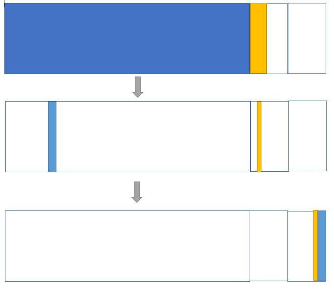

# 第二章：Java 内存区域与内存溢出异常

## 1.运行时数据区域

Java 虚拟机执行 java 的过程中会把他所管理的内存划分为若干个不同的数据区域。
这些区域有各自的用途，以及创建，销毁的时间。(随着虚拟机进程的启动而一直存在，有些区域依赖用户线程的启动和结束而建立和销毁)

  

### 1.1 程序计数器(programing counter register)

- 是一块较小的内存空间，可以当成**当前线程**所执行的==字节码的行号指示器==。
- 字节码解释器的功能：通过改变这个计数器的值来选取下一条需要执行的字节码指令，这是程序控制流的指示器(分支，循环，转跳，异常处理，线程回复等)
- 由于 java 虚拟机的多线程是由线程轮流切换，分配处理器执行时间实现的。**在任何一个确定的时刻，一个处理器内核都只会执行一条线程中的指令**，因此为了线程切换后可以恢复到正确的执行位置，==每一个线程==都需要一个单独的程序计数器。
- 每一个线程的程序计数器部分的内存区域互不影响，独立存在-----**_线程私有内存_**。
  如果线程正在执行 java 方法，计数器记录的是正在执行的==虚拟机字节码指令地址==;若执行 Native 本地方法，计数器值应为空。

**所以为什么为空？**：C++解释：当线程中调用 native 方法的时候，则重新启动一个新的线程，那么新的线程的计数器为空则不会影响当前线程的计数器，相互独立。。也就是说程序计数器是为我们的线程的**java 字节码文件**进行服务的，而不是其他语言，**本地的一些方法大多数都会直接映射到其原生平台，没有我们 jvm 什么事情**。

《Java 虚拟机规范》中未规定程序计数器此内存区域内的溢出异常。

### 1.2 Java 虚拟机栈

- 虚拟机栈是线程私有的
- 生命周期=线程
- 虚拟机栈描述 Java 方法执行的线程内存模型：每个方法被执行的时候，java 虚拟机会同步创建一个栈帧用域存储局部变量表，操作数栈，动态链接，方法出口等信息。---每个方法被调用，直到执行完毕的过程对应着**一个栈桢在虚拟机栈中入栈和出栈的过程**。
- 通常我们日常所说的虚拟机中的**栈**指的就是**Java 虚拟机栈**，更是特指虚拟机栈中的**局部变量表**部分。
- 进步变量表存放了编译期可知的各种 Java 虚拟机基本数据类型(short,int,...,references(**对象引用，她并不等同于对象本身，可能是一个指向对象起始地址的引用指针，也可能是指向一个代表对象句柄或其他与此对象相关的位置**))。
- 方法运行期间不会改变局部变量表的大小。即不会改变变量槽的数量，**虚拟机真正使用多大的内存空间来实现一个变量槽，是完全有虚拟机实现自行决定的**---(一个变量槽占 32bit，还是 64 比特)。

《规范》中，对此内存区域规定两种 u 异常：

1. 线程请求深度大于虚拟机所允许最大深度---StackOverflowError
2. 如果 java 虚拟机栈动态扩展，当栈扩展无法申请到最够的内存--OutOfMemoryError

### 1.3 本地方法栈

- 和 Java 虚拟机栈作用类似，区别是虚拟机栈位 java 方法提供服务，而此栈为本地方法执行服务。
  异常情况：
  与虚拟机栈相同

### 1.4 Java 堆

- Java 堆是虚拟机所管理的内存中最大的一部分。
- Java 堆是被==所有线程共享==的一块内存区域，**虚拟机启动时创建**。
- ==此内存区域唯一是存放对象实例==，几乎所有对象实例都在这里分配内存。
- Java 堆是垃圾收集器管理内存的区域，又被称为 GC 堆
- 从分配内存的角度看，所有线程共享的 Java 堆中可以划分出多个==线程私有的分配缓冲区(TLAB)==,以提升对象分配时的侠侣。**不过无论如何划分，都不会改变 Java 堆中存储内容的共性---只能是对象的实例**，Jav 堆细分的目的只是为了更好的进行内存回收，或内存分配。
- Java 堆可以处于物理上不连续的内存空间中，但逻辑上是连续的。但是对于大对象，例如数组对象，虚拟机常连续存放。

异常规定：

1. Java 堆无法在分配内存，无法扩展，抛出---OutOfMemoryError

### 1.5 方法区

- 各个线程共享的内存区域，它用来存储被虚拟机加载的类型信息，常量，静态变量。即时编译器编译后的代码缓存等数据
- JDK8 以前，很多人把方法区等同于永久代。本质上这二者并不等价，只是用永久代实现了方法区，这使得 HotSpot 的垃圾收集器分代设计扩展到方法区，方便设计。其他某些虚拟机时没用永久代概念的。这种设计方式，道指 Java 应用给更容易遇到内存溢出问题。JDK8 之后，终于把原先永久代中所有信息全部一如元空间。
  在此之后，使用元空间来实现方法区
  异常规定：

1. 方法区无法满足新的内存分配--OutOfMemoryError

### 1.6 运行时常量池

- 运行时常量池是方法区的一部分。这里存放常量池表，用与存放编译期生成的各种字面量与符号引用。再类加载后存放到方法去的运行时常量池中。
- 运行时常量池和 Class 文件常量池的重要区别是，**具备动态性**。Java 语言并不要求常量一定只有编译器参能产生，即，非预置入 Class 文件常量池的内瓤才能进入方法区运行时常量池。运行期间也可以放入该常量池。--String 的 intern()方法。。我也没用过，我也不懂。。
  异常规定：
  隶属于方法区，所以和方法区一样。

### 1.7 直接内存

- 注意，这不是虚拟机运行时数据区的一部分，也不是《规范》定义的内存区域，但是会被平凡使用并可能导致 OutOfMemoryError。
- JDK4 中加入了 NIO 类，引入了一种基于通道的缓冲区，可以使用 Native 函数库直接**分配堆外内存**，然后通过存储在==Java 堆==里面的 DirectByteBuffer
  规定异常：
  本机直接内存的分配，不会受到 Java 堆大小限制，但是既然是内存，一定会受到本基机总内存限制。当各个内存区域总和大于物理内存限制，会报错：OutOfMemoryError

## 2 HotSpot 虚拟机对象

这只讨论最简单的 new 创建对象

#### 2.1 对象创建

当 Java 虚拟机遇到一条字节码 new 指令时

1. 首先检查这个指令的参数是否能够在常量池中定位到一个类的符号引用，并检查这个符号引用代表的类是否已经被加载，解析和初始化。如果没有必须先执行类加载
2. 类加载检查通过后，虚拟机为新生对象分配内存，==对象所需内存大小在类加载完成之后，完全确定。==
3. 对于内存分配，分为两种 a. 指针碰撞，单纯的物理上连续的顺序划分。b.空闲列表，即物理上不连续的分配，虚拟机必须要维护一个列表，记录那些内存是可用的。
4. 选择那种分配方式，由 Java 堆是否规整决定。如果采用的垃圾收集器带有空间压缩整理的能力，用空闲列表，否则就是指针碰撞。

除了对象内存分配，还需要考虑**线程安全**问题：有可能出现再给 A 分配内存，指针还没来得及修改，对象 B 又同时使用用了原来的指针分配内存。

两种方法 ：

1. 对分配内存控键的动作进行同步处理---采用 CAS 配上失败重试的方法保证更新操作的原子性。**CAS 不懂，要看资料**
2. 吧内存分配这个动作按照线程划分在不同的空间中进行--即在 Java 堆中预先分配一小块内存，称之为 TLAB。哪个线程要分配，就在那个现成的本地缓冲区 TLAB 中分配。

内存分配完成后，虚拟机必须讲分配到的内存空间(不包括对象头)初始化。TLAB 其实可以把这部完成

设置对象：例如对象时哪一个类的实例，如何才能找到类的元数据信息，对象的哈希码，GC 分代年龄信息等等。这些需要放置到对象头中。

此时，在虚拟机中对象已经产生了，但是在程序员视角中，对象创建才刚刚开始---构造函数。即，Class 文件中的`<init>()`方法还没有执行，所有字段时默认值，对象所需的自愿和状态未加载。---随后才会逐一构造

### 2.2 对象的内存布局

HotSpot 虚拟机对象的对象头部分包括两类信息。

1. 用于存储对象自身的运行时数据。例如哈希码，GC 分代年龄，锁状态标志等等。这部分数据的长度在 32 位和 64 位的虚拟机中分别为 32bit 和 64bit。但是实际上对象要存储的运行时数据很多，已经超出了 32，64 位 BitMap 的极限。由于对象头里的信息，与对象自身无关的数据，我们将 Mark Word 设计成**动态定义的数据结构**
   在==对象未被同步锁锁定==的情况下，32 位 hotspot 虚拟机中，25bit 用于存储对象哈希码，4bit 分代年龄，2bit 用于存储锁标志位，1bit 固定为 0。其他状态如下：

| 存储内容                              | 标志位 | 状态             |
| ------------------------------------- | ------ | ---------------- |
| 对象哈希码，对象分代年龄              | 01     | 未锁定           |
| 指向锁记录的指针                      | 00     | 轻量级锁定       |
| 指向重量级锁的指针                    | 10     | 膨胀(重量级锁定) |
| 空，不需要记录信息                    | 11     | GC 标记          |
| 偏向线程 ID，偏向时间戳，对象分代年龄 | 01     | 可偏向           |

2. 类型指针，即对象指向它的类型元数据的指针---**Java 虚拟机通过这个指针确定该对象是那个类的实例**。但是并不是所有的虚拟机实现都必须在对象数据上保留类型指针。
   ==此外，如果对象是一个 Java 数组==，那再对象头中还必须有一块用于记录数组的长度，数组长度不确定，虚拟机无法从对象的元数据中推断出数组大小。

# 第三章 垃圾收集器与内存分配策略

为什么需要垃圾收集？
当需要排查内存各种内存溢出、内存泄漏问题时；当垃圾收集成为系统高并发的瓶颈时，我们必须对原本“内部自动化的”的技术进行监控和调节。
程序计数器，虚拟机栈，本地方法栈，这些随着线程而生，线程而灭。栈中的栈桢随着方法的进入和推出进行出栈和入站工作，每一个栈桢中分配多少内存，在类结构确定下来时就已经确定，所以这几个区域的内存分配和回收都具备**确定性**，方法结束内存自然回收，所以一般不关注这部分的垃圾回收。
Java 堆和方法区则有着显著的**不确定性**，只有处于运行期间我们才能知道要创建什么对象，多少对象，这涉及到**内存分配和动态回收**

## 3.1 如何判断对象死亡？

### 3.1.1 引用计数法

在对象中添加一个引用计数器，有一个地方引用，计数器值+1；当引用失效，计数器值-1；任意时刻计数器值为 0 的对象就不再被使用。
**但是此方法无法解决对象之间循环引用的问题。**

### 3.1.2 可达性分析算法

通过可达性分析算法来判断对象是否存活。算法的基本思路时通过一系列被叫“GC Root”的根对象作为起始**节点集**，从这些根节点开始根据引用关系乡下搜索(搜索的路劲被称之为"引用链")，如果某个对象 GC root 无法引用，则证明此对象不能再被使用。
**GC root 有以下几种：**

1. 虚拟机栈（栈桢中的本地变量表）中引用的对象，譬如各个线程被调用的方法堆栈中使用到的参数，局部变量，临时变量等
2. 方法区中类静态属性引用的对象
3. 方法区中常量引用的对象
4. 本地方法中 JNI(native 方法)引用的对象
5. Java 虚拟机内部的引用
6. 被同步锁只有的对象
7. 反应 JVM 虚拟机内部情况的 JMXBean，JVMTI 中注册的回调、本地代码等

### 3.1.3 引用的分类

过去仅仅讲引用分为：引用和未引用，过于简单。
JDK1.2 之后堆引用的概念进行了扩充，将引用分为四种，强度依次减弱：

1. **强引用**：传统的引用定义，代码中普遍存在。无论任何情况，只要强引用关系还在，垃圾收集器永远不会回收。
2. **软引用：** 用来描述一些还有用但是非必须的对象。只被软引用关联着的对象，在系统将要发生内存溢出异常前，会把这些对象列进回收范围中做二次回收，如果还不够，抛出内存溢出。
3. **弱引用：** 比软引用强度更低，仅能存活到下一次垃圾收集发生为止。
4. **虚引用：** 又称为幽灵引用，甚至无法通过它来获取一个对象实例，唯一目的只是为了能在这个对象被收集器回收的时候收到一个系统通知。

### 3.1.4 对象的生死

即使在可达性分析算法中判定为不可达的对象，也不是一定要被回收。宣告一个对象死亡至少要经过两次标记：

1. 可达性分析后发现没有与 GCroot 相连的引用链，第一次标记，随后进行筛选。筛选的条件是该对象是否有必要执行 finalize()方法。如果该对象没有覆盖此方法，或已经执行过此方法(只能执行一次)，那么虚拟机将认为没有必要执行该方法。
   若判断该对象有必要执行 finalize()方法，该对象会被放与 F-Queue 中，并新建一个线程去执行(此执行指标是会触发，但不一定等待执行结束，可以防止万一该线程出现死循环导致回收系统崩溃)。
2. 第二次标记则在 F-Queue 中，堆队列中的对象进行小规模标记，如果某对象在 finalize()中成功拯救自己--重新建立某种引用，则不会被回收。

注意：任何一个对象的 finalize()方法都只会被系统自动调用一次，如果对象面临下一次回收，不会再被执行。

**_！最好不要使用 finalize()方法_**

### 3.1.5 方法区回收

方法区(HptSopt 中的永久代或者元空间)的回收是没有性价比的，因为方法区回收的条件极其苛刻，收集性价比往往不高。
方法区回收的内容：废弃常量池中的内容和不再使用的类型。
前者和回收 java 堆类似
后者比较麻烦，需要同时满足三个条件：1. 该类所有实例都被回收。2. 该类的类加载器已经被回收，除非精心设计过，否则很难。3. 该类对应的 `java.lang.Class`方法没有在任何地方被引用---也就是无法被反射拿到。

## 3.2 垃圾收集算法

本文只讨论追踪式垃圾收集。

#### 3.2.1 分代收集理论

目前大多数垃圾收集器都遵循分代收集理论(应该只有 ZGC 不是？)
**该理论建立在两个假说之上:**

1. 弱分代假说：绝大多数对象都是朝生夕灭的
2. 强分代假说:熬过越多次垃圾回收的对象，越难以消亡。

这两个分代假说奠定了垃圾收集器的设计原则：收集器应该将 Java 堆划分出不同的区域，然后将回收对象以具年龄分配到不同的区域中存储。
**对于朝生夕灭的对象，做垃圾回收时应当关注如何保留少量存货，而不是标记大量将要被回收的对象。对于强分代，应当把他们集中在一起，虚拟机将会以较低的频率收集这个区域。**

Java 堆划分为不同区之后，垃圾收集器被允许每次之回收一个部分区域--Minor GC，Major GC Full GC。通常会被划分为新生代和老年代，在新生代中每次收集对象都有大量的对象死去，每次收集后存活的少量对象**会被逐步**的放入老年代中存放。
但前述方式存在**跨代引用问题**：新生代中对象可能跨代引用老年代对象，为了找出跨代的问题，不得不需要在 GC root 外全局扫描所有老年代对象，但是这会造成巨大的性能消耗。

**存在第三条理论：**

3. 跨代引用假说：跨代引用相对于同代引用来说仅占极少数。
   即，存在互相引用关系的两个对象，应该趋于同生同灭。

依据第三条假说，不需要再为极少数的跨代引用扫描全区，也不需要浪费空间记录每一个对象是否存在以及存在哪些跨代引用。只需要咋**新生代**生建立一个全局数据结构(**记忆集**)，该结构将老年代划分为若干个区，表示出老年代的哪一块内存存在跨代引用。运行时只有包含了跨代引用指定区域的老年代对象才会被加入 GC Root 扫描。

#### 3.2.1 标记-清除算法

最早最基础的算法。算法分为标记和清楚两个阶段
首先标记处所有需要回收的对象，在标记完成之后，同意回收掉所有被标记的对象；也可以反过来，标记存活对象，统一回收未标记的。
标记过程就是可达性算法啦。
**缺点：**

1. 执行效率不稳定，Java 堆汇中包含大量的对象，必须进行大量的标记和清除动作，导致执行效率随着对象数量增长而降低。
2. 内存空间的碎片化问题。标记清除后会产生大量不连续的内存碎片，可能导致日后分配大对象无法找到连续的而不得不触发垃圾收集动作。

#### 3.2.2 标记-复制算法

这是一种半区复制的垃圾收集算法，他将可用的内存按容量划分为大小相等的两块，每次只适用其中一块。当一半的内存使用完了，则复制存活对象到另一半，清楚现有空间。
**缺点：**
浪费了一半内存空间，过于奢侈。

过后又出现一种更优化的半区复制分代策略：具体做法是**把新生代分为一块较大的 Eden 空间，和两块较小的 Survivor 空间，每次分配只是用 Eden 和其中一块 survivor。发生垃圾收集时，将任然存活的对象一次性复制到另一块 survivor 上，然后清理本身。**
HptSpot 虚拟机默认 Eden 和 survivor 的比例是 8：1，也就可用空间为新生代的 90%。当然不能保证每次存活对象都再 10%以内，所以当超出时，借助其他内存区域进行分配担保。

**为什么需要两个 survivor：**
==设置两个 Survivor 区最大的好处就是解决了碎片化。==

**假设现在只有一个 survivor 区：**
刚刚新建的对象在 Eden 中，一旦 Eden 满了，触发一次 Minor GC，Eden 中的存活对象就会被移动到 Survivor 区。
这样继续循环下去，下一次 Eden 满了的时候，问题来了，此时进行 Minor GC，Eden 和 Survivor 各有一些存活对象，如果此时把 Eden 区的存活对象硬放到 Survivor 区，很明显这两部分对象所占有的内存是不连续的，也就导致了内存碎片化。

白色框分别代表 Eden 区（大）和 Survivor 区（小）

碎片化带来的风险是极大的，严重影响 JAVA 程序的性能。堆空间被散布的对象占据不连续的内存，最直接的结果就是，堆中没有足够大的连续内存空间。

顺理成章的，应该==建立两块 Survivor 区==，刚刚新建的对象在 Eden 中，经历一次 Minor GC，Eden 中的存活对象就会被移动到第一块 survivor space S0，Eden 被清空；等 Eden 区再满了，就再触发一次 Minor GC，Eden 和 S0 中的存活对象又会被复制送入第二块 survivor space S1（这个过程非常重要，因为这种复制算法保证了 S1 中来自 S0 和 Eden 两部分的存活对象占用连续的内存空间，避免了碎片化的发生）。S0 和 Eden 被清空，然后下一轮 S0 与 S1 交换角色，如此循环往复。如果对象的复制次数达到 16 次，该对象就会被送到老年代中。

上述机制最大的好处就是，==整个过程中，永远有一个 survivor space 是空的，另一个非空的 survivor space 无碎片。==

#### 3.2.3 标记-整理算法

标记整理算法一般针对老年代算法。因为老年代存活率较高，不适合复制，同时我们也不想浪费内存空间。

如果**移动存活对象**，尤其是在老年代这种每次回收都有大量对象存活的区域，移动对象并更新引用是极大的负担。==另外这种移动对象的操作必须**全程暂停用户程序**才能进行==。

如果**不移动对象**，采用标记清除算法，弥散再空间中的碎片文件会影响**程序吞吐量**。
即，关注吞吐量的收集器采用标记整理算法，关注低延迟的收集器采用标记清除算法。

或是采用和稀泥方式，平时多数时间采用标记清楚算法，当内存空间的碎片化程度影响对象分配的时候，采用标记整理手机一次。实际上 CMS 面临空间碎片过多时就这样采用标记整理算法。
