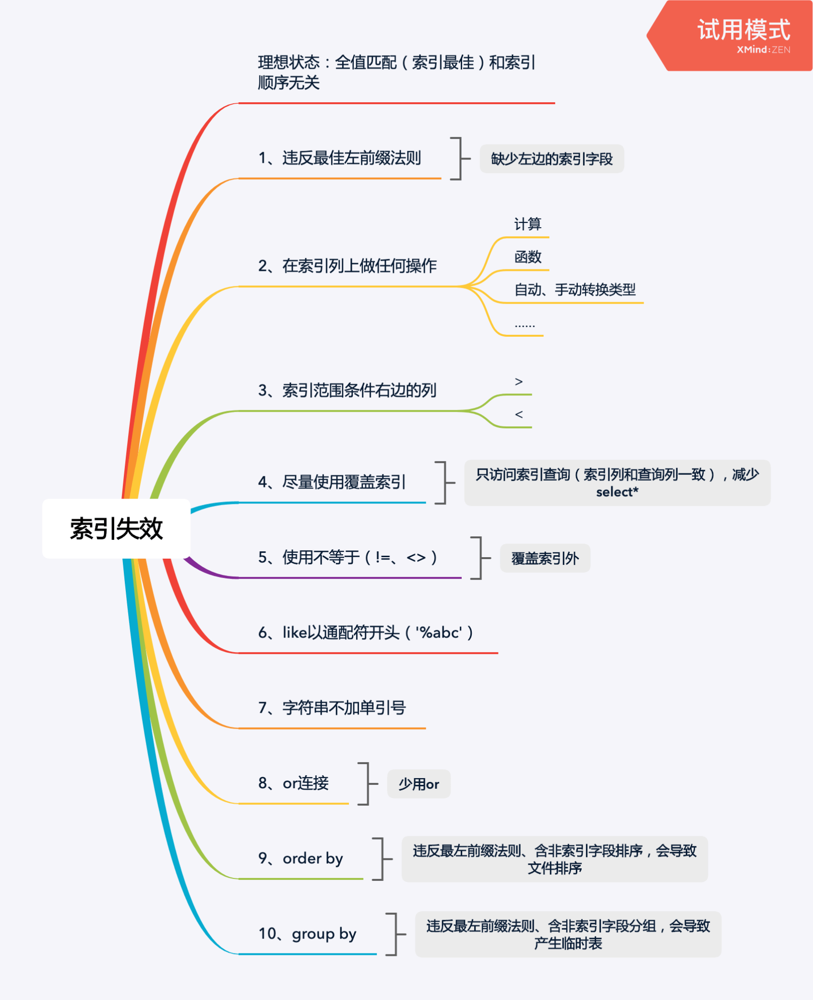

## **数据库**
1. 谈谈MySQL的读写锁

共享锁:很好理解，就是多个事务只能读数据不能改数据。
排他锁:指的是一个事务在一行数据加上排他锁后，其他事务不能再在其上加其他的锁。

mysql InnoDB引擎默认的修改数据语句，update,delete,insert 都会自动给涉及到的数据加上排他锁，select 语句默认不会加任何锁类型。

如果加排他锁可以使用select ...for update 语句，加共享锁可以使用select ... lock in share mode语句。所以加过排他锁的数据行在其他事务种是不能修改数据的，也不能通过for update和lock in share mode锁的方式查询数据，但可以直接通过select ...from...查询数据，因为普通查询没有任何锁机制。

2. ==[MySQL 的锁机制](https://juejin.im/post/5b82e0196fb9a019f47d1823#heading-1)==---悲观锁和乐观锁呢？悲观和乐观锁的具体实现原理呢？

3. [MySQL的隔离机制](https://www.cnblogs.com/PerkinsZhu/p/6828105.html)
4. [mysql 的三级封锁协议](https://blog.csdn.net/hulinku/article/details/79787692)
封锁协议和隔离机制的个人理解：
-  一级封锁协议：事务T在修改数据A之前，要加上X锁，可以解决修改丢失得问题。但是一级封锁协议只关心写时的问题，对于读不做关心，所以无法避免脏读。
问题-脏读：脏读就是事务A读到了事务B修改但是未提交的数据。
隔离机制对应-读未提交：解决修改丢失，无法解决脏读

- 二级封锁协议：在一级封锁协议的基础上，事务读数据之前加S锁，读完之后释放。加了S锁之后，无法加X锁，所以要么只有一个事务在操作，如果一个事务读，一个事务修改，那么原则上这两个操作会阻塞。在innodb中使用MVCC机制，通过日志和版本链(当前读和快照读)解决了阻塞问题。
问题-不可重复读：事务A读，未提交，事务B修改并提交，事务A再读，数据不一致
隔离机制对应-读已提交：通过MVCC快照读，解决

- 三级封锁协议：在一级封锁协议的基础上，事务读数据之前加S锁！事务结束之后释放！加了S锁之后，无法加X锁，所以要么只有一个事务在操作，如果一个事务读，一个事务修改，那么原则上这两个操作会阻塞。在innodb中使用MVCC机制，通过日志和版本链(当前读和快照读)解决了阻塞问题。
问题-幻读：读到之前不存在读数据
隔离机制对应-读已提交：通过mvcc快照读解决。但是使用间隙锁和nextkey会调用当前读，还是会读到。

5. 数据库三大范式
第一范式：强调每一列都是不可分割的原子数据项。
第二范式：在第一范式的基础上，非主键列完全依赖于主键，而不能是依赖于主键的一部分。消除冗余
第三范式：在第二范式的基础上，非主键列只依赖于主键，不依赖于其他非主键。消除传递依赖
6. 如何查询并解决数据库死锁
**第一种：**
查询是否锁表
show OPEN TABLES where In_use > 0;
查询进程（如果您有SUPER权限，您可以看到所有线程。否则，您只能看到您自己的线程）
show processlist
杀死进程id（就是上面命令的id列）
kill id
**第二种：**
查看当前的事务
SELECT * FROM INFORMATION_SCHEMA.INNODB_TRX;
查看当前锁定的事务
SELECT * FROM INFORMATION_SCHEMA.INNODB_LOCKS;
查看当前等锁的事务
SELECT * FROM INFORMATION_SCHEMA.INNODB_LOCK_WAITS;
杀死进程
kill 进程ID

7. 数据库如何避免死锁
- 如果不同程序会并发存取多个表，尽量约定以相同的顺序访问表，可以大大降低死锁机会。
- 在同一个事务中，尽可能做到一次锁定所需要的所有资源，减少死锁产生概率；
- 对于非常容易产生死锁的业务部分，可以尝试使用升级锁定颗

8. 什么是事务？介绍一下ACID
9. MVCC 机制的实现原理
多版本并发控制指的就是在使用 `READ COMMITTD、REPEATABLE READ` 这两种隔离级别的事务在执行普通的 SEELCT 操作时访问记录的版本链的过程，这样子可以使不同事务的读-写、写-读操作并发执行，从而提升系统性能。
`READ COMMITTD、REPEATABLE READ`这两个隔离级别的一个很大不同就是生成 `ReadView` 的时机不同。
`READ COMMITTD` 在每一次进行普通 SELECT 操作前都会生成一 `ReadView。`
`REPEATABLE READ` 只在第一次进行普通 SELECT 操作前生成一个 ReadView，之后的查询操作都重复这个 ReadView就好了
10. 谈谈InnoDB和MySIAM的区别，了解Memory么
11. SQL查询执行流程是什么/生命周期
    - 应用服务器与数据库服务器建立一个连接
    - 数据库进程拿到请求sql
    - 解析并生成执行计划，执行
    - 读取数据到内存并进行逻辑处理
    - 通过步骤一的连接，发送结果到客户端
    - 关掉连接，释放资源
      
12. 数据库的视图
视图是一个虚拟表，其内容由查询定义。同真实的表一样，视图包含一系列带有名称的列和行数据。但是，视图并不在数据库中以存储的数据值集形式存在。行和列数据来自由定义视图的查询所引用的表，并且在引用视图时动态生成。
视图使开发者只关心感兴趣的某些特定数据和所负责的特定任务，只能看到视图中所定义的数据，而不是视图所引用表中的数据，从而提高了数据库中数据的安全性。

13. 数据库的存储过程
存储过程是一个预编译的SQL语句。优点是允许模块化的设计，就是说只需要创建一次，以后在该程序中就可以调用多次。如果某次操作需要执行多次SQL，使用存储过程比单纯SQL语句执行要快。
**优点：**
    - 存储过程预编译，执行效率高
    - 存储过程的代码直接存放在数据库中，可以直接调用。
    - 安全性高，执行存储过程需要有一定全限
    - 可以重复使用
**缺点：**
    - 调试麻烦 
    - 因为是预编译的所以和数据库相关，移植麻烦。
    - 重新编译受影响。

14. 触发器 (出发某个事件时，自动执行这些代码)-做某个表的字段监控。
触发器是一个特殊的存储过程，不同的是存储过程要用CALL来调用，而触发器不需要使用CALL ，也不需要手工启动，只要当一个预定义的事件发生的时候，就会被MYSQL自动调用
15. 什么是游标
游标是一个数据缓冲区，存放SQL语句的执行结果集，每个游标区都有一个名字。在存储了游标之后，应用程序可以根据需要滚动或浏览其中的数据。

16. MySQL 外键删除策略（外键列全部设置为null，或者直接删除）
17. SQL 语句 exist 和 in 的区别
主要的区别在于驱动表和被驱动表不同。
in：外面的是被驱动表，里面的是驱动表
exist：外面的是驱动表，里面的是被驱动表
1.如果查询的两个表大小相当，那么用in和exists差别不大。
2.如果两个表中一个较小，一个是大表，则子查询表大的用exists，子查询表小的用in。(把驱动表设置为较小的表)
3.not in 和not exists：如果查询语句使用了not in，那么内外表都进行全表扫描，没有用到索引；
not extsts的子查询依然能用到表上的索引。所以无论那个表大，用not exists都比not in要快。

18. 组合索引吗？怎么实现的？
---
<font size=6>**基本类型**</font>

19. VARCHAR和CHAR的区别？
20. DATETIME和TIMESTAMP的区别？
21. 数据类型有哪些优化策略？(更小的通常更好/尽可能简单/尽量避免NULL，null不会使索引，索引统计和值比较都更复杂)

---
<font size=6>**索引**</font>

22. 索引有那些？
23. 索引有什么作用？
24. [以 B tree 和 B+ tree 的区别来分析 mysql 索引实现](https://www.jianshu.com/p/0371c9569736)
    - B树只适合随机检索，而B+树同时支持随机检索和顺序检索；
    - B+树空间利用率更高，可减少I/O次数，磁盘读写代价更低。一般来说，索引本身也很大，不可能全部存储在内存中，因此索引往往以索引文件的形式存储的磁盘上。这样的话，索引查找过程中就要产生磁盘I/O消耗。B+树的内部结点并没有指向关键字具体信息的指针，只是作为索引使用，其内部结点比B树小，盘块能容纳的结点中关键字数量更多，一次性读入内存中可以查找的关键字也就越多，相对的，IO读写次数也就降低了。而IO读写次数是影响索引检索效率的最大因素；
    - B+树的查询效率更加稳定。B树搜索有可能会在非叶子结点结束，越靠近根节点的记录查找时间越短，只要找到关键字即可确定记录的存在，其性能等价于在关键字全集内做一次二分查找。
    - B+树中，顺序检索比较明显，随机检索时，任何关键字的查找都必须走一条从根节点到叶节点的路，所有关键字的查找路径长度相同，导致每一个关键字的查询效率相当。
    - B-树在提高了磁盘IO性能的同时并没有解决元素遍历的效率低下的问题。B+树的叶子节点使用指针顺序连接在一起，只要遍历叶子节点就可以实现整棵树的遍历。而且在数据库中基于范围的查询是非常频繁的，而B树不支持这样的操作。增删文件（节点）时，效率更高。因为B+树的叶子节点包含所有关键字，并以有序的链表结构存储，这样可很好提高增删效率。

25. 了解hash索引么？
26. 什么是自适应哈希索引？
自适应哈希索引是 InnoDB 引擎的一个特殊功能，当它注意到某些索引值被使用的非常频繁时，会在内存中基于 B-Tree 索引之上再创键一个哈希索引，这样就让 B-Tree 索引也具有哈希索引的一些优点，比如快速哈希查找。这是一个完全自动的内部行为，用户无法控制或配置，但如果有必要可以关闭该功能。

27. 什么是空间索引？(MySIMA支持，存储地理数据。MySQL支持不完善)
28. 什么是全文索引？(MySIAM的基于相似度的查询，非精确比较)
29. 聚簇索引和非聚簇索引
**聚簇索引和非聚簇索引的根本区别：**
聚簇索引（innodb）的叶子节点就是数据节点而非聚簇索引（myisam）的叶子节点仍然是索引文件只是这个索引文件中包含指向对应数据块的指针。
**B+树有主键索引和辅助索引两种:** 主键索引就是按照表中主键的顺序构建一颗B+树，并在叶节点中存放表中的行记录数据，一个表只能有一个主键索引。而辅助索引，叶节点并不存储行记录数据，仅仅是主键。通过辅助索引查找到对应的主键，最后在聚集索引中使用主键获取对应的行记录。（这个叫回表查询）

30. 什么是覆盖索引？以及为什么要使用索引(除了加快速度)
指一个索引包含或覆盖了所有需要查询的字段的值，不再需要根据索引回表查询数据。覆盖索引必须要存储索引列的值，因MySQL 只能使用 B-Tree 索引做覆盖索引。
**优点：**
    - 索引条目通常远小于数据行大小，可以极大减少数据访问量。
    - 因为索引按照列值顺序存储，所以对于 IO 密集型防伪查询回避随机从磁盘读取每一行数据的 IO 少得多。
    - 由于InnoDB 使用聚簇索引，覆盖索引对 InnoDB 很有帮助。InnoDB 的二级索引在叶子节点保存了行的主键值，如果二级主键能覆盖查询那么可以避免对主键索引的二次查询。

31. 那些索引使用原则？
    - 建立索引 
    - 对于比较长的列，使用前缀索引.缺点是不能做分组和排序和覆盖索引 
    - 合适的索引顺序
    - 删除多余索引
32.  [索引失效有那些？](https://www.cnblogs.com/huwling/p/12144517.html)

33. 除开使用 B+ 树实现的索引，还了解其他数据结构实现的索引吗--[为什么不使用 AVL/红黑树](https://www.cnblogs.com/aspirant/p/9214485.html)(920P64)
因为普通的全表查询时间复杂度是 O(n);
如果是平衡二叉树，或者红黑树，查找时间变 成O(log2N)，但他们依然不适合做索引。
因为索引通常比较大，存于磁盘中，无法一次将全部的索引加载到内存中，每次只能从磁盘中读取一个页到内存中，而平衡二叉树底层实现是数组，逻辑上相邻的节点在物理结构上可能相差很远，因此磁盘 IO 次数可能很大，**平衡二叉树没能充分利用磁盘预读功能**。磁盘往往不是严格按需读取，而是每次都会预读，即使只需要一个字节，磁盘也会从这个位置开始，顺序向后读取一定长度的数据放入内存。这样做的理论依据是计算机科学中著名的局部性原理。 
红黑树这种结构，**h 明显要深的多**。由于逻辑上很近的节点（父子）物理上可能很远，无法利用局部性，所以红黑树的 I/O 渐进复杂度也为 O(h)，效率明显比 B-Tree 差很多。
B树的每个节点可以存储多个关键字，它将节点大小设置为磁盘页的大小，充分利用了磁盘预读的功能。每次读取磁盘页时就会读取一整个节点。也正因每个节点存储着非常多个关键字，树的深度就会非常的小。进而要执行的磁盘读取操作次数就会非常少，更多的是在内存中对读取进来的数据进行查找。


---
<font size=6>**优化**</font>

34. 如何定位低效SQL？
    - 慢查询日志定位已经执行完毕的SQL。
    - 使用show processlist查询当前正在执行的线程的低效sql。 找到sql通过show profile、explain或trace继续优化）
35. show profile的作用。
    分析sql性能消耗，例如执行多少时间，显示cpu内存使用率，花费时间等)
36. trace的作用？
    通过trace文件进一步获取**优化器是如何选择执行计划的**，需要手动打开设置，然后执行一次sql，最后查看 information_schema.optimizer_trace表的内容。
37. [慢查询日志](https://juejin.im/post/5e108a55f265da5d5537fe11#heading-14)
    MySQL提供的一种慢查询日志记录，用来记录在MySQL查询中响应时间超过阀值的记录具体指运行时间超过`long_query_time`值的SQL，则会被记录到慢查询日志中。
38. [Explain 语句的字段](https://juejin.im/post/5ec4e4a5e51d45786973b357?utm_source=gold_browser_extension)
    - 表的读取顺序(id)
    - 数据读取操作的操作类型(type)
    - 哪些索引可以使用(possible_key)
    - 哪些索引被实际使用(key)
    - 表之间的引用(table)
    - 每张表有多少行被优化器查询(row)
    - 使用索引的情况：null：要回表。using_index:使用覆盖索引。Using where：未找到可用索引。Using temporary：临时表

| 指标名        | 含义                                                         |
| ------------- | ------------------------------------------------------------ |
| id            | 表示 SELECT 子句或操作表的顺序，执行顺序从大到小执行，当 id 一样时，执行顺序从上往下。 |
| select_type   | 表示查询中每个 SELECT 子句的类型，例如 SIMPLE 表示不包含子查询、表连接或其他复杂语法的简单查询，PRIMARY 表示复杂查询的最外层查询，SUBQUERY 表示在 SELECT 或 WHERE 列表中包含了子查询。 |
| type          | 表示访问类型，性能由差到好为：ALL 全表扫描、index 索引全扫描、range 索引范围扫描、ref 返回匹配某个单独值得所有行，常见于使用非唯一索引或唯一索引的非唯一前缀进行的查找，也经常出现在 join 操作中、eq_ref 唯一性索引扫描，对于每个索引键只有一条记录与之匹配、const 当 MySQL 对查询某部分进行优化，并转为一个常量时，使用这些访问类型，例如将主键或唯一索引置于 WHERE 列表就能将该查询转为一个 const、system 表中只有一行数据或空表，只能用于 MyISAM 和 Memory 表、NULL 执行时不用访问表或索引就能得到结果。SQL 性能优化的目标：至少要达到 range 级别，要求是 ref 级别，如果可以是consts 最好。 |
| possible_keys | 表示查询时可能用到的索引，但不一定使用。列出大量可能索引时意味着备选索引数量太多了。 |
| key           | 显示 MySQL 在查询时实际使用的索引，如果没有使用则显示为 NULL。 |
| key_len       | 表示使用到索引字段的长度，可通过该列计算查询中使用的索引的长度，对于确认索引有效性以及多列索引中用到的列数目很重要。 |
| ref           | 表示上述表的连接匹配条件，即哪些列或常量被用于查找索引列上的值。 |
| rows          | 表示 MySQL 根据表统计信息及索引选用情况，估算找到所需记录所需要读取的行数。 |
| Extra         | 表示额外信息，例如 Using temporary 表示需要使用临时表存储结果集，常见于排序和分组查询。Using filesort 表示无法利用索引完成的文件排序，这是 ORDER BY 的结果，可以通过合适的索引改进性能。Using index 表示只需要使用索引就可以满足查询表得要求，说明表正在使用覆盖索引。 |

1.  有哪些优化SQL策略？
    - **优化count查询**
count用来统计某个列值的数量，要求非空，不会统计null。
但是由于count需要扫描大量行才能获取精确结果所以很难优化。但是部分业务场景中不需要精确值，所以可以用EXPALIN优化器估算出来的近似值来代替。
    - **优化关联查询**
确保ON或USING子句中的列上有索引
确保任何group by和order by的表达式只涉及到一个表中的列，这样才能用索引
尽量避免子查询，用关联查询代替。因为执行器会先执行外部sql在执行内部sql
    - **优化group by**
group by会将结果自动按分组排序，可以使用oder by null禁止排序。
    - **优化limit分页**
在偏移量offset很大的时候，需要查询很多条数据在舍弃，代价很高。要优化这种查询，要么是在页面中限制分页数量，要么是优化大偏移量的性能。最简单的办法是尽量收集用覆盖索引扫描，不要查询所有列。
        - 先子查询索引定位，再用子查询的索引顺序找到对应值
        ```sql
        SELECT * FROM tableName WHERE id >= (SELECT id FROM tableName ORDER BY id LIMIT 500000 , 1) LIMIT 2;
        ```
        - 使用子查询或join优化，先找到需要查询的id起始位置，然后限制limt 2即可。
https://www.jianshu.com/p/efecd0b66c55
https://juejin.im/post/6863668253898735629
    - **优化union** 
  若非必要，一般用union all。因为union会给临时表加锁distinct，唯一性检查消耗性能。
    - 优化insert
一张表插入多行数据时候，尽量一次性插入多个。减少数据库的连接关闭小号。
40.  [大表优化](https://www.zhihu.com/question/19719997)
    - 优化sql/索引
    - 加缓存
    - 主从/读写分离
    - 垂直拆分
    - 水平切分
41.    [怎么优化 mysql，mysql 性能分析工具](https://www.kaimingwan.com/post/shu-ju-ku/mysqlxing-neng-fen-xi-fang-fa-gong-ju-jing-yan-zong-jie)---`mysql的查询优化，用explain查询是否用到了索引`
42. mysql cpu 过高怎么排查呀（不会，面试官说可以用 error log 看下）
43. 关心过业务系统里面的sql耗时吗？统计过慢查询吗？对慢查询都怎么优化过？慢查询的优化首先要搞明白慢的原因是什么？ 是查询条件没有命中索引？是load了不需要的数据列？还是数据量太大？
所以优化也是针对这三个方向来的，
    - 首先分析语句，看看是否load了额外的数据，可能是查询了多余的行并且抛弃掉了，可能是加载了许多结果中并不需要的列，对语句进行分析以及重写。
    - 分析语句的执行计划，然后获得其使用索引的情况，之后修改语句或者修改索引，使得语句可以尽可能的命中索引。
    - 如果对语句的优化已经无法进行，可以考虑表中的数据量是否太大，如果是的话可以进行横向或者纵向的分表。

44. 如果要存储用户的密码散列，应该使用什么字段进行存储？
密码散列，盐，用户身份证号等固定长度的字符串应该使用char而不是varchar来存储，这样可以节省空间且提高检索效率。


---
<font size=6>**主从**</font>

45. redolog和binlog是什么？
46. [事务的二段提交](https://www.jianshu.com/p/765b5a3dac15)
47. 主从复制是什么？ 将主数据库中的DDL和DML操作通过二进制日志（BINLOG）传输到从数据库上，然后将这些日志重新执行（重做）；从而使得从数据库的数据与主数据库保持一致。
48. 主从复制的作用？ 1.主数据库出现问题，备库可以接管。 2.可以进行数据库层面的读写分离。 3.可以从数据库上进行日常备份。

49. 主从复制解决的问题？
    - 数据分布：随意开始或停止复制，并在不同地理位置分布数据备份。
    - 负载均衡
    - 高可用和故障切换：避免单点故障
    - 升级测试：主从向后兼容，高级版本可以作为低级版本的从库
50. MySQL主从复制工作原理
    - 主服务器将数据的更新记录到二进制日志中（记录被称作二进制日志事件 binlog）-- 主库线程；
    - 从库将主库的二进制日志复制到本地的中继日志（relay log）-- 从库 I/O 线程；
    - 从库读取中继日志中的事件，将其重放到数据中 -- 从库 SQL 线程。

**基本原理和流程**：3个线程以及之间的关联主binlog线程——记录下所有改变了数据库数据的语句，放进master上的binlog中；(master在每个事务更新数据完成之前，将该操作记录串行地写入到binlog文件中。)
**从：** io线程——在使用start slave 之后，负责从master上拉取 binlog 内容，放进自己的relay log中；(salve开启一个I/O Thread，该线程在master打开一个普通连接，主要工作是binlog dump process。如果读取的进度已经跟上了master，就进入睡眠状态并等待master产生新的事件。I/O线程最终的目的是将这些事件写入到中继日志中)
**从：** sql执行线程——执行relay log中的语句；(SQL Thread会读取中继日志，并顺序执行该日志中的SQL事件，从而与主数据库中的数据保持一致)
51.  数据库的热备份和冷备份？

---
<font size=6>SQL</font>

- 姓名、科目、成绩，写 sql 语句统计总分前三的学生姓名，如果有并列的怎么办？统计这个班的学生选了哪些科目

### JDBC和Mybatis
- [介绍下 JDBC 的过程 /JDBC 的 Statement 对象有哪几类 ](https://www.jianshu.com/p/187c7f796b18)
- jdbc 的使用，什么是 sql 注入 mysql 防注入
- JDBC 连接 mysql 的几个步骤、为什么要加载驱动呢，原理是什么、PreparedStatement 和 Statement 区别、返回结果如何查询
- ==Mybatis 底层实现==---`一二级缓存，#和\$的区别`
使用`#{}`意味着使用的预编译的语句，即在使用 jdbc 时的 `preparedStatement，sql` 语句中如果存在参数则会使用?作占位符，我们知道这种方式可以防止 sql 注入，并且在使用`#{}`时形成的 sql 语句，已经带有引号，例，`selectfrom table1 where id=#{id}`在调用这个语句时我们可以通过后台看到打印出的 sql 为：`select \* from table1 where
id='2'` 加入传的值为 2.也就是说在组成 sql 语句的时候把参数默认为字符串。

    使用`${}`时的sql不会当做字符串处理，是什么就是什么，如上边的语句：`select * from table1 where id=${id} `在调用这个语句时控制台打印的为：`select _ from table1 where id=2 `，假设传的参数值为 `2 `从上边的介绍可以看出这两种方式的区别，我们最好是能用#{}则用它，因为它可以防止 sql 注入，且是预编译的，在需要原样输出时才使用`${}`，如，`select _ from ${tableName} order by ${id} `这里需要传入表名和按照哪个列进行排序
，加入传入` table1、id` 则语句为：`select _ from table1 order by id` 如果是使用`#{}`则变成了 `select _ from 'table1' order by 'id'` 我们知道这样就不对了。
**为什么预编译可以解决 SQL 注入**: 
在我理解，预编译就是按照已有的关键字对 sql 进行编译，只留下一些坑位填充，坑位作为字符串填充直接执行，而不会重新作为整个 sql 编译。从而避免某些注入行为。


- 缓存机制，一级、二级原理和作用
  - mybatis 的查询缓存分为一级缓存和二级缓存，一级缓存是 SqlSession 级别的缓存，
  - 二级缓存是 mapper 级别的缓存，二级缓存是多个 SqlSession 共享的;
  当在同一个SqlSession 中执行两次相同的 sql 语句时，第一次执行完毕会将数据库中查询的数据写到缓存（内存）中，第二次查询时会从缓存中获取数据，不再去底层进行数据库查询，从而提高了查询效率。如果 SqlSession执行了DML操（insert、update、 delete），并执行commit（）操作，mybatis则会清空SqlSession 中的一级缓存,避免 脏读现象。 Mybatis的二级缓存是Mapper级别的缓存，默认不开启，需手工配置。其存储作用 域为Mapper，也就是同一个namespace 的 mappe.xml; 当一个 sqlseesion 执行了一次select 后，在关闭此session的时候，会将查询结果缓存到二级缓存。当另一个sqlsession执行select时，首先会在他自己的一级缓存中找，如果没找到，就回去二级缓存中找，找到了就返回，就不用再去数据库了。
