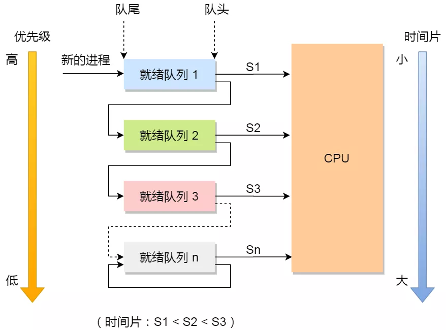
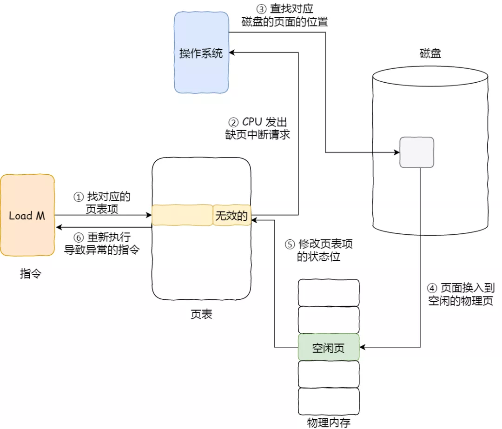

[toc]
调度算法
----
# 一、进程调度算法
首先进程调度算法分为非抢占式和抢占式：
非抢占式：必须要执行到进程阻塞或进程正常退出为止
抢占式：每个进程轮转执行一个时间片
## 1.1调度
一旦操作系统把进程切换到运行状态，也就意味着该进程占用着 CPU 在执行，但是当操作系统把进程切换到其他状态时，那就不能在 CPU 中执行了，于是操作系统会选择下一个要运行的进程。

选择一个进程运行这一功能是在操作系统中完成的，通常称为**调度程序**

**调度时机：** 当进程从一个运行状态到另外一个状态变化的时候，会触发一次调度。这些状态变化的时候，操作系统需要考虑是否要让新的进程给 CPU 运行，或者是否让当前进程从 CPU 上退出来而换另一个进程运行。

可以根据如何处理时钟中断，把调度算法分为两类：
- 非抢占式调度算法：一个进程一直运行到被阻塞或进程退出才调用另外一个进程。
- 抢占式调度算法：进程只运行某一个时间片，到了就挂起。通常意义上的**时间片机制**。

## 1.2 调度原则
1. 如果运行的程序，发生了 I/O 事件的请求，那 CPU 使用率必然会很低，因为此时进程在阻塞等待硬盘的数据返回。这样的过程，势必会造成 CPU 突然的空闲。**所以，为了提高 CPU 利用率，在这种发送I/O 事件致使 CPU 空闲的情况下，调度程序需要从就绪队列中选择一个进程来运行。**
2. 有的程序执行某个任务花费的时间会比较长，如果这个程序一直占用着 CPU，会造成系统吞吐量（CPU 在单位时间内完成的进程数量）的降低。所以，**要提高系统的吞吐率，调度程序要权衡长任务和短任务进程的运行完成数量。**
3. 从进程开始到结束的过程中，实际上是包含两个时间，分别是进程运行时间和进程等待时间，这两个时间总和就称为周转时间。进程的周转时间越小越好，**如果进程的等待时间很长而运行时间很短，那周转时间就很长，这不是我们所期望的，调度程序应该避免这种情况发生。**
4. 处于就绪队列的进程，也不能等太久，当然希望这个等待的时间越短越好，这样可以使得进程更快的在 CPU 中执行。**所以，就绪队列中进程的等待时间也是调度程序所需要考虑的原则**。
5. 对于鼠标、键盘这种交互式比较强的应用，我们当然希望它的响应时间越快越好，否则就会影响用户体验了。所以，**对于交互式比较强的应用，响应时间也是调度程序需要考虑的原则。**
五种调度原则总结：
- CPU 利用率：调度程序应确保 CPU 是始终匆忙的状态，这可提高 CPU 的利用率；
- 系统吞吐量：吞吐量表示的是单位时间内 CPU 完成进程的数量，长作业的进程会占用较长的 CPU 资源，因此会降低吞吐量，相反，短作业的进程会提升系统吞吐量；
- 周转时间：周转时间是进程运行和阻塞时间总和，一个进程的周转时间越小越好；
- 等待时间：这个等待时间不是阻塞状态的时间，而是进程处于就绪队列的时间，等待的时间越长，用户越不满意；
- 响应时间：用户提交请求到系统第一次产生响应所花费的时间，在交互式系统中，响应时间是衡量调度算法好坏的主要标准。

## 1.3 调度算法
对于单核CPU系中常见的调度算法：
1. 先来先得算法，非抢占式。**每次从就绪队列选择最先进入队列的进程，然后一直运行，直到进程退出或被阻塞，才会继续从队列中选择第一个进程接着运行。**
   对长作业有利，适用于cpu繁忙的作业系统，不适用于IO密集型的
2. 最短作业优先：优先选择运行时间短的进程来执行，提高系统吞吐量。容易造成极端现象，长作业无法执行。
3. 高响应比优先算法：权衡短作业和常做月，用一个计算公式来执行。`等待时间+服务时间/服务时间`
4. 时间片轮转：最简单最公平的算法。但是如果时间片太短会有太多上下文签环，太长可能想时间太长。
5. 最高优先级调度算法：就绪队列中选择按照优先级运行
6. 多级反馈队列算法：4+5的结合。
   - 「多级」表示有多个队列，每个队列优先级从高到低，同时优先级越高时间片越短。
   - 「反馈」表示如果有新的进程加入优先级高的队列时，立刻停止当前正在运行的进程，转而去运行优先级高的队列；
  **对于短作业可能可以在第一级队列很快被处理完。对于长作业，如果在第一级队列处理不完，可以移入下次队列等待被执行，虽然等待的时间变长了，但是运行时间也会更长了，所以该算法很好的兼顾了长短作业，同时有较好的响应时间。**
  
# 页面置换算法
**缺页中断：** 当CPU访问的页面不在物理内存时候，便会产生一个缺页中断，请求操作系统将缺页调入物理内存。这于一般中断的区别主要现在于：
- 缺页中断在指令执行**期间**产生和处理中断信号，而**一般中断**在一条指令执行完成后检查和处理中断信号。
- 缺页中断返回到该指令的**开始重新执行「该指令」**，而一般中断返回回到该指令的**下一个指令」执行**。
  
1. 在 CPU 里访问一条 Load M 指令，然后 CPU 会去找 M 所对应的页表项。
2. 如果该页表项的状态位是`「有效的」`，那 CPU 就可以直接去访问物理内存了，如果状态位是`「无效的」`，则 CPU 则会发送缺页中断请求。
3. 操作系统收到了缺页中断，则会执行缺页中断处理函数，先会查找该页面在磁盘中的页面的位置。
4. 找到磁盘中对应的页面后，需要把该页面换入到物理内存中，但是在换入前，需要在物理内存中找空闲页，如果找到空闲页，就把页面换入到物理内存中。
5. 页面从磁盘换入到物理内存完成后，则把页表项中的状态位修改为「有效的」。
6. 最后，CPU 重新执行导致缺页异常的指令
虚拟内存管理流程

**总的来说，页面置换算法的功能是，当出现缺页异常，需调入新页面而内存已满时，选择被置换的物理页面，也就是说选择一个物理页面换出到磁盘，然后把需要访问的页面换入到物理页。**

## 置换算法
1. 最佳页面置换算法
   置换未来最长时间不访问的页面。因为程序访问是动态的，我们无法预测页面下次使用时间，所以这个实际上无法使用，只能作为衡量算法效率的算法。
2. 先进先出置换算法
   既然无法预知页面下一次访问的等待时间，可以选择**在内存驻留时间很长的页面进行中置换。**
3. 最近最久未使用的置换算法(LRU)
   **选则最长时间没有被访问的页面进行置换**，也就是说，该算法假设已经很久没有使用的页面很有可能在未来较长的一段时间内仍然不会被使用。
   虽然 `LRU` 在理论上是可以实现的，但代价很高。为了完全实现 `LRU`，**需要在内存中维护一个所有页面的链表，最近最多使用的页面在表头，最近最少使用的页面在表尾**。

   困难的是，在每次访问内存时都必须要更新「整个链表」。在链表中找到一个页面，删除它，然后把它移动到表头是一个非常费时的操作。

   所以，LRU 虽然看上去不错，但是由于开销比较大，实际应用中比较少使用。

4. 时钟页面置换算法
   它跟 LRU 近似，又是对 FIFO 的一种改进
   该算法的思路是，**把所有的页面都保存在一个类似钟面的「环形链表」中，一个表针指向最老的页面。**
   当发生缺页中断时，算法首先检查表针指向的页面：
   - 如果它的访问位位是 0 就淘汰该页面，并把新的页面插入这个位置，然后把表针前移一个位置；
   - 如果访问位是 1 就清除访问位，并把表针前移一个位置，重复这个过程直到找到了一个访问位为 0 的页面为止；
5. 最不常用算法（LFU）
    **当发生缺页中断时，选择「访问次数」最少的那个页面，并将其淘汰**。

# 磁盘调度算法
磁盘最大的消耗在于磁盘寻道，所以主要就是优化磁盘寻道。
1. 先来先服务，顾名思义，简单粗暴，但是如果大量进程竞争使用磁盘，请求访问的磁道可能会很分散，那先来先服务算法在性能上就会显得很差，因为寻道时间过长。
2. 最短寻道时间有限
   优先选择，离当前磁头位置最近的寻道请求。
   **这个算法可能存在某些请求的饥饿，产饥饿的原因是磁头在一小块区域来回移动。**
3. 扫描算法：为了解决方法二可能由于来回小区域寻道导致饥饿，由此而来的算法：**规定磁头在一个方向上移动，访问所有未完成的请求，知道磁头到达该方向上最后的磁道，带调换方向。**
扫描调度算法性能较好，不会产生饥饿现象，**但是存在这样的问题，中间部分的磁道会比较占便宜，中间部分相比其他部分响应的频率会比较多，也就是说每个磁道的响应频率存在差异**。
4. 循环扫描算法：方法3磁盘区域相应频率存在差异，那么我们可以每次复位扫描。规定磁头朝着特定方向扫描，到头了就直接由从头开始，并且返回途中不做任何处理请求。
5. Look和C-Look算法：3.4方法都是在末端才折返扫描，在本方法中优化：**磁头在移动到最远的请求位置，然后立即反向移动**。
   - 对于scan算法--优化为look算法，不需要扫描到最后就可以折返，并且返回途中相应请求。
   - 对于C-scan-优化为c-look，同样折返，但是直接复位并且中途不响应请求。