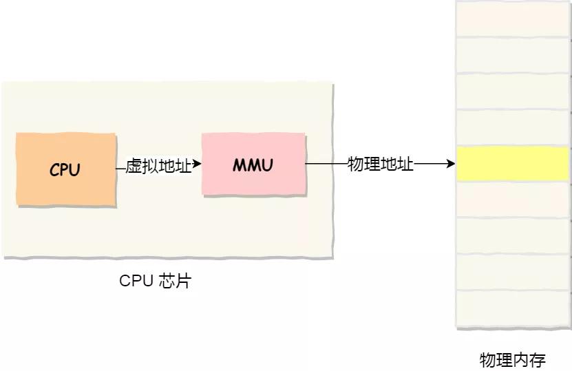
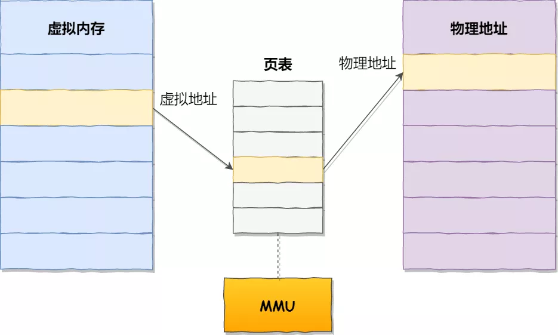
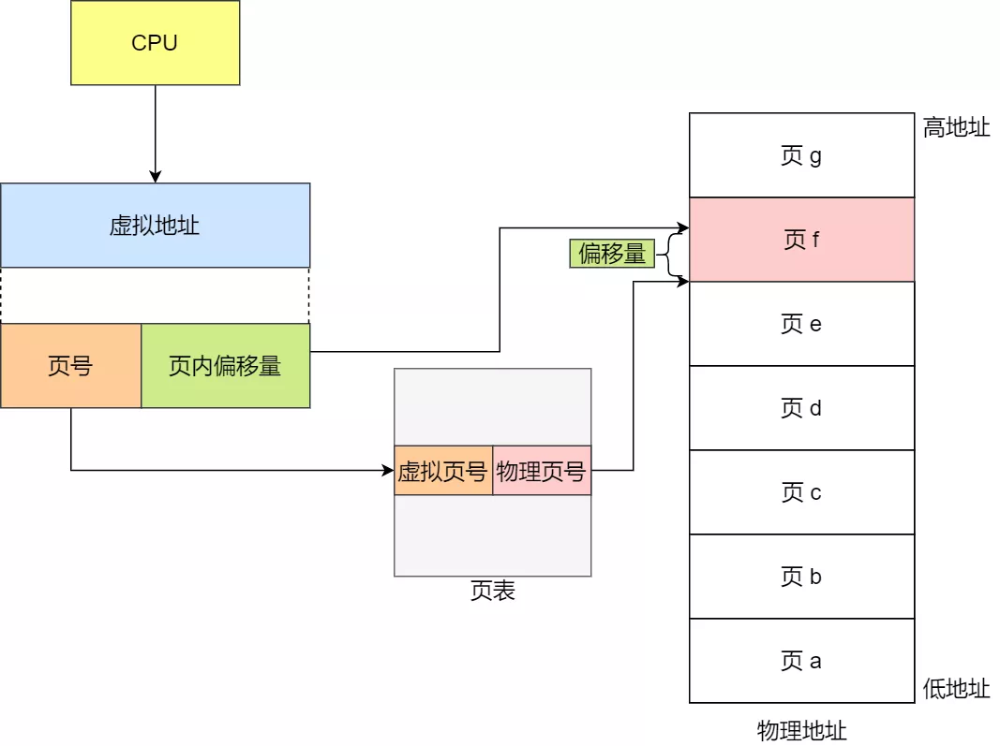
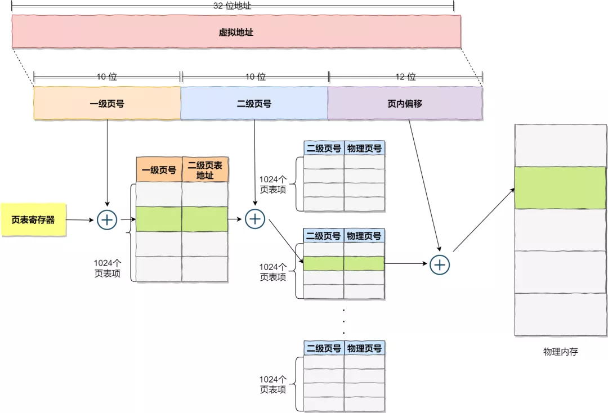
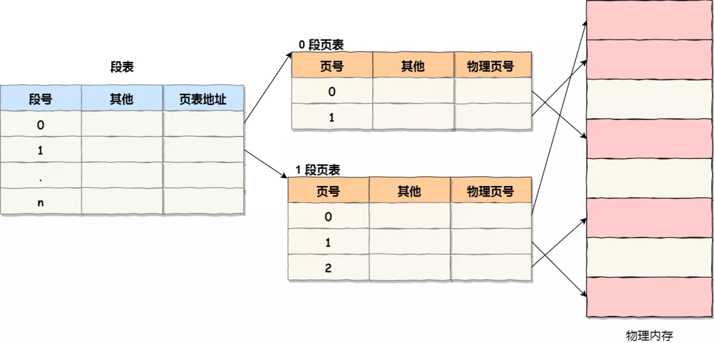

[toc]
---
## 1、 虚拟内存
类似于单片机，直接操纵内存的物理地址会存在问题：无法再相同内存地址中运行两端程序。前一个程序写入的值会被第二个程序覆盖。另外用户直接操控物理内存容易损坏操作系统。
==操作系统是如何解决这个问题呢？==

我们可以把进程所使用的地址隔离开来，让操作系统有为每个进程分配独立的一套**虚拟地址**，这样大家就可以各玩各的。但是有个前提，每个进程都不能访问物理地址，至于虚拟地址最终怎么落到物理内存，对进程来说是透明的，一切都交给操作系统。**虚拟内存相当于进程和物理内存之间的中间层**
==操作系统会提供一种机制，将不同进程的虚拟地址和不同内存的物理地址映射起来。==

如果程序要访问虚拟地址的时候，由操作系统转换成不同的物理地址，这样不同的进程运行的时候，写入的是不同的物理地址，这样就不会冲突了，即：
    我们程序所使用的内存地址叫做**虚拟内存地址**。
    实际存在硬件里面的空间地址叫**物理内存地址**。
操作系统引入了虚拟内存，进程持有的虚拟地址会通过 CPU 芯片中的**内存管理单元（MMU）**的映射关系，来转换变成物理地址，然后再通过物理地址访问内存，如下图所示：

==操作系统是如何管理虚拟地址与物理地址之间的关系？==
这个就是内存管理方式：
内存管理方式分为连续方式和非连续方式：
连续方式：块式管理，将内存分为一个一个的块，每个进程独占一个块，这样会导致块内有浪费。
非连续方式：页式/段式/段页式。
### 1.1 **内存分段：**
程序是由若干个逻辑分段组成的，如可由代码分段、数据分段、栈段、堆段组成。==不同的段是有不同的属性的，所以就用分段的形式把这些段分离出来。==

**分段机制下，虚拟地址和物理地址是如何映射的？**
分段机制下的虚拟地址由两部分组成，**段选择因子和段内偏移量**。

- **段选择因子**就保存在段寄存器里面。这其中对应**段号**，用作段表的索引。段表里面保存的是这个**段的基地址**、**段的界限和特权等级**。==这个的主要作用就是通过段号--段表--找到段基地址==
- 虚拟地址中的**段内偏移量**应该位于0和段界限之间，如果段内偏移量是合法的，就==将段基地址加上段内偏移量得到物理地址==。
所以虚拟地址是通过**段表**与物理地址进行映射的，分段机制会把程序的虚拟地址分成 4 个段，每个段在段表中有一个项，在这一项找到段的基地址，再加上偏移量，于是就能找到物理内存中的地址，如下图：

**分段机制的问题：**
1. 内存碎片
2. 内存交换效率低

==我们先来看看，分段为什么会产生内存碎片的问题==？
**内存碎片的问题共有两处地方：**
- **外部内存碎片**：也就是产生了多个不连续的小物理内存，导致新的程序无法被装载；
- **内部内存碎片**：程序所有的内存都被装载到了物理内存，但是这个程序有部分的内存可能并不是很常使用，这也会导致内存的浪费；

**解决外部内存碎片的问题就是==内存交换==**
把某程序占用的内存写到硬盘上，再从硬盘读回内存，此时紧挨着分配，这样内存就会连续了。
这个内存交换空间，在Linux系统里也就是我们常看到的Swap空间，用于内存和硬盘的交换。

**==再来看看，分段为什么会导致内存交换效率低的问题？==**
对于多进程的系统来说，用分段的方式，内存碎片是很容易产生的，产生了内存碎片，那不得不重新 Swap 内存区域，这个过程会产生性能瓶颈。

因为硬盘的访问速度要比内存慢太多了，每一次内存交换，我们都需要把一大段连续的内存数据写到硬盘上。

所以，如果**内存交换的时候，交换的是一个占内存空间很大的程序，这样整个机器都会显得卡顿**。

为了解决内存分段的内存碎片和内存交换效率低的问题，就出现了内存分页。

### 1.2 内存分页
当需要进行内存交换的时候，让需要交换写入或者从磁盘装载的数据更少一点，这样就可以解决分段的问题。这个办法，也就是内存分页。
**分页是把整个虚拟和物理内存空间切成一段段固定尺寸的大小.** 这样一个连续并且尺寸固定的内存空间，我们叫页（Page）。在 Linux 下，每一页的大小为 `4KB`。
虚拟地址与物理地址之间通过页表来映射，如下图：

==页表实际上存储在 CPU 的内存管理单元 （MMU） 中，于是 CPU 就可以直接通过 MMU，找出要实际要访问的物理内存地址。==

而当进程访问的**虚拟地址在页表中查不到时，系统会产生一个缺页异常**，**进入系统内核空间**分配物理内存、更新进程页表，最后再返回用户空间，恢复进程的运行。

**==分页是怎么解决分段的内存碎片、内存交换效率低的问题?==**

1. 由于内存空间都是预先划分好的，也就**不会像分段会产生间隙非常小的内存**，这正是分段会产生内存碎片的原因。而采用了分页，那么**释放的内存都是以页为单位释放的，也就不会产生无法给进程使用的小内存**。

2. 如果内存空间不够，操作系统会把其他正在运行的进程中的「最近没被使用」（**页面置换算法**）的内存页面给释放掉，也就是暂时写在硬盘上，称为换出（Swap Out）。一旦需要的时候，再加载进来，称为换入（Swap In）。所以，**一次性写入磁盘的也只有少数的一个页或者几个页，不会花太多时间，内存交换的效率就相对比较高**。
更进一步地，分页的方式使得我们在加载程序的时候，不再需要一次性都把程序加载到物理内存中。我们完全可以在进行虚拟内存和物理内存的页之间的映射之后，并不真的把页加载到物理内存里，而是**只有在程序运行中，需要用到对应虚拟内存页里面的指令和数据时，再加载到物理内存里面去**。

**==分页机制下，虚拟地址和物理地址是如何映射的？==**
在分页机制下，虚拟地址分为两部分，**页号和页内偏移**。页号作为页表的索引，**页表**包含物理页每页所在物理内存的**基地址**，这个**基地址与页内偏移的组合就形成了物理内存地址**，见下图。

总结一下，对于一个内存地址转换，其实就是这样三个步骤：
- 把虚拟内存地址，切分成页号和偏移量；
- 根据页号，从页表里面，查询对应的物理页号；
- 直接拿物理页号，加上前面的偏移量，就得到了物理内存地址

**==简单的分页有什么缺陷吗？==**
有空间上的缺陷。
因为操作系统同时运行非常多的进程，这意味着页表十分庞大。在32位系统下虚拟地址4G，假设一个页大小4KB，每个页表项需要4个字节来存储这些页。那么就需要4MB内存来存储页表...如果每个进程都携带这么一个页表。多进程情况下内存负载就很大。

**多级页表**
前面我们知道了，对于单页表的实现方式，在 32 位和页大小 4KB 的环境下，一个进程的页表需要装下 100 多万个「页表项」，并且每个页表项是占用 4 字节大小的，于是相当于每个页表需占用 4MB 大小的空间。
我们把这个 100 多万个「页表项」的单级页表再分页，将页表（一级页表）分为 1024 个页表（二级页表），每个表（二级页表）中包含 1024 个「页表项」，**形成二级分页**。如下图所示：

**==分了二级表，映射 4GB 地址空间就需要 4KB（一级页表）+ 4MB（二级页表）的内存，这样占用空间不是更大了吗？==**

如果 4GB 的虚拟地址全部都映射到了物理内上的，二级分页占用空间确实是更大了，但是，我们往往不会为一个进程分配那么多内存。
使用了二级分页，一级页表就可以覆盖整个 4GB 虚拟地址空间，但**如果某个一级页表的页表项没有被用到，也就不需要创建这个页表项对应的二级页表了，即可以在需要时才创建二级页表**。

**为什么不分级的页表就做不到这样节约内存呢？** 我们从页表的性质来看，保存在内存中的页表承担的职责是将虚拟地址翻译成物理地址。假如虚拟地址在页表中找不到对应的页表项，计算机系统就不能工作了。**所以页表一定要覆盖全部虚拟地址空间**，不分级的页表就需要有 100 多万个页表项来映射，而二级分页则只需要 1024 个页表项（此时一级页表覆盖到了全部虚拟地址空间，二级页表在需要时创建）

**==TLB==**
多级页表虽然解决了空间上的问题，但是虚拟地址到物理地址的转换就多了几道转换的工序，这显然就降低了这俩地址转换的速度，也就是带来了时间上的开销。
此时**无处不在的局部性原理**出现了，在一段时间内，震哥哥程序的执行仅限于程序中的某一部分。相应的，执行所访问的存储空间也局限于某个内存区域。
利用这一特性，**把最常访问的几个页表项存储到访问速度更快的硬件**，于是就在 CPU 芯片中，加入了一个专门存放程序最常访问的页表项的 Cache，这个 Cache 就是 TLB，通常称为页表缓存、转址旁路缓存、快表等。

在 CPU 芯片里面，封装了MMU芯片，它用来完成地址转换和 TLB 的访问与交互。

### 1.3 段页式内存管理
内存分段和内存分页并不是对立的，它们是可以组合起来在同一个系统中使用的，那么组合起来后，通常称为段页式内存管理。
**段页式内存管理实现的方式：**
- 先将程序划分为多个有逻辑意义的段，也就是前面提到的分段机制；
- 接着再把每个段划分为多个页，也就是对分段划分出来的连续空间，再划分固定大小的页

地址结构就由**段号、段内页号和页内位移**三部分组成。
用于段页式地址变换的数据结构是每一个程序一张段表，每个段又建立一张页表，**段表中的地址是页表的起始地址，而页表中的地址则为某页的物理页号**，如图所示：

段页式地址变换中要得到物理地址须经过三次内存访问：
- 第一次访问段表，得到页表起始地址；
- 第二次访问页表，得到物理页号；
- 第三次将物理页号与页内位移组合，得到物理地址。

## Linux的内存管理
1. intel X86的发展历史
   段号+偏移量/逻辑地址==》段内存单元==》虚拟地址/线性地址==》页式内存管理的单元==》物理地址。
2. Linux 采用了什么方式管理内存
**Linux 内存主要采用的是页式内存管理，但同时也不可避免地涉及了段机制。**
这主要是上面 Intel 处理器发展历史导致的，因为 Intel X86 CPU 一律对程序中使用的地址先进行段式映射，然后才能进行页式映射。既然 CPU 的硬件结构是这样，Linux 内核也只好服从 Intel 的选择。

但是事实上，**Linux 内核所采取的办法是使段式映射的过程实际上不起什么作用**。
Linux 系统中的每个段都是从 0 地址开始的整个 4GB 虚拟空间（32 位环境下），也就是所有的段的起始地址都是一样的。**这意味着，Linux 系统中的代码，包括操作系统本身的代码和应用程序代码，所面对的地址空间都是线性地址空间（虚拟地址）**，这种做法相当于屏蔽了处理器中的逻辑地址概念，段只被用于访问控制和内存保护。

**==Linux的虚拟地址空间是如何分布的？**
在 Linux 操作系统中，虚拟地址空间的内部又被分为内核空间和用户空间两部分：

- 32 位系统的内核空间占用 1G，位于最高处，剩下的 3G 是用户空间；
- 64 位系统的内核空间和用户空间都是 128T，分别占据整个内存空间的最高和最低处，剩下的中间部分是未定义的。

**再来说说，内核空间与用户空间的区别：**
- 进程在用户态时，只能访问用户空间内存；
- 只有进入内核态后，才可以访问内核空间的内存；
虽然每个进程都各自有独立的虚拟内存，但是**每个虚拟内存中的内核地址，其实关联的都是相同的物理内存**。这样，进程切换到内核态后，就可以很方便地访问内核空间内存。

## 总结
为了在多进程环境下，使得进程之间的内存地址不受影响，相互隔离，于是操作系统就为每个进程独立分配一套的虚拟地址空间，每个程序只关心自己的虚拟地址就可以，实际上大家的虚拟地址都是一样的，但分布到物理地址内存是不一样的。作为程序，也不用关心物理地址的事情。

每个进程都有自己的虚拟空间，而物理内存只有一个，所以当启用了大量的进程，物理内存必然会很紧张，于是操作系统会通过内存交换技术，把不常使用的内存暂时存放到硬盘（换出），在需要的时候再装载回物理内存（换入）。

那既然有了虚拟地址空间，那必然要把虚拟地址「映射」到物理地址，这个事情通常由操作系统来维护。

那么对于虚拟地址与物理地址的映射关系，可以有分段和分页的方式，同时两者结合都是可以的。

内存分段是根据程序的逻辑角度，分成了栈段、堆段、数据段、代码段等，这样可以分离出不同属性的段，同时是一块连续的空间。但是每个段的大小都不是统一的，这就会导致内存碎片和内存交换效率低的问题。

于是，就出现了内存分页，把虚拟空间和物理空间分成大小固定的页，如在 Linux 系统中，每一页的大小为 4KB。由于分了页后，就不会产生细小的内存碎片。同时在内存交换的时候，写入硬盘也就一个页或几个页，这就大大提高了内存交换的效率。

再来，为了解决简单分页产生的页表过大的问题，就有了多级页表，它解决了空间上的问题，但这就会导致 CPU 在寻址的过程中，需要有很多层表参与，加大了时间上的开销。于是根据程序的局部性原理，在 CPU 芯片中加入了 TLB，负责缓存最近常被访问的页表项，大大提高了地址的转换速度。

Linux 系统主要采用了分页管理，但是由于 Intel 处理器的发展史，Linux 系统无法避免分段管理。于是 Linux 就把所有段的基地址设为 0，也就意味着所有程序的地址空间都是线性地址空间（虚拟地址），相当于屏蔽了 CPU 逻辑地址的概念，所以段只被用于访问控制和内存保护。

另外，Linxu 系统中虚拟空间分布可分为用户态和内核态两部分，其中用户态的分布：代码段、全局变量、BSS、函数栈、堆内存、映射区。
