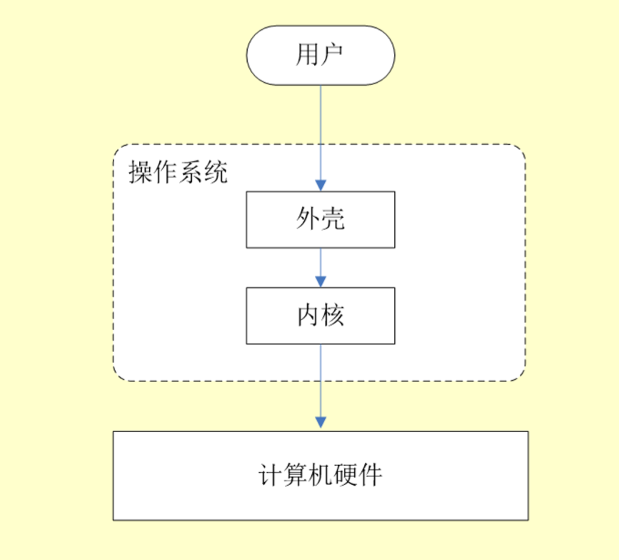
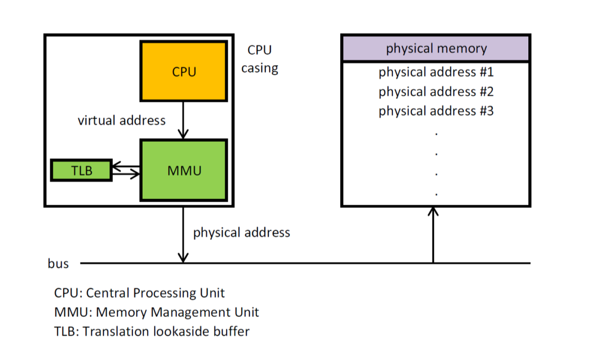

1. 进程和线程是什么，有什么区别
2. 进程和线程的创建，父进程子进程
3. 操作系统的线程和JVM线程的区别
4. 进程的通信，哪一个最快。
5. 进程调度策略
6. 虚拟内存：分页分表。分页和分段的区别
7. 页面置换算法
8. 死锁的原因是什么？如何避免死锁，死锁预防
9. select/poll/epoll的区别
10. 用户态，内核态
---
## 问题
1. 什么是操作系统？
   - 操作系统是管理计算机硬件与软件资源的程序，是计算机的内核和基石。
   - 操作系统本质上就是运行在计算机上的软件
   - 操作系统为用户提供一个和系统交互的界面
   - 操作系统氛围内核与外壳
   - 内核负责管理系统的进程，内存，文件和网络等，决定性能和稳定性。内核是操作系统的核心

2. 什么是系统调用
   根据进程访问资源的特点，我们可以把进程在系统上的运行分为两个级别。
   - 用户态：用户态运行的进程或可以直接读取用户程序的数据
   - 内核态：可以理解为内核态运行的进程或程序几乎可以访问计算机的任何资源。
   **那么什么是系统调用？**
   在我们运行的用户程序中，凡是与内核态的资源有关的操作(文件控制，进程管理等)，都必须通过系统调用方式向操作系统提出服务请求，并且由操作系统代为完成。
   系统调用按照功能大致分为：
   - 设备管理。
   - 文件管理
   - 进程管理：进程的创建、撤销、阻塞和唤醒
   - 进程通信：进程之间消息传递或信号传递
   - 内存管理：完成内存的分配、回收以及获取作业占用内存区大小及地址等功能
  ---
  3. 进程和线程的区别？
   从JVM角度讨论线程和进程。一个进程中可以有多个线程，多个线程共享方法区和对的资源，但是每个线程都有自己私有的程序计数器，虚拟机栈和本地方法栈。
   **总的来说**：
   线程是进程划分的更小运行单位，一个京城在其执行的过程中可以产生多个线程。
   线程和进程最大的不同在于基本上个进程是独立的，而个线程不一定，因为同一进程中的线程极有可能互相影响。
   线程执行开销小，但不利于资源的管理和保护；而进程正相反。
4. 进程有哪几种状态 
   - 创建： 进程正在被创建
   - 就绪reday ：进程创建完毕，得到除了cpu资源之外的所有资源，一旦得到处理器资源就运行
   - 运行 running：进程在在处理器上运行
   - 阻塞 wait ：进程等待状态，为某个事件而暂停，等待时间完成，即便cpu、空闲也不会工作。
   - 结束 ternamted： 进程结束或中断
5. 进程通信方式
   - 管道/匿名管道：具有**亲缘关系**的父子进程或兄弟进程之间的通信
   - 命名管道：严格遵循先进先出。已磁盘文件的方式存在，实现本机任意两个进程通信
   - 共享内存： **多个进程可以访问同一块内存空间，不同进程可以及时看到对方进程中对共享内存中数据的更新。这种方式依靠同步操作，例如互斥锁或信号量等。最快和好的进程通信方式。**
   - 套接字socket： 客户端和服务器之间通过网络通信。
   - 信号signal： 用于通知接收进程某个事件已发生
   - 消息队列： 消息链表，具有特定格式，存放在内存中并由消息队列标识符标识，先进先出原则。**与命名管道不同的是，消息队列放在内核中，只有内核修改才能删除消息队列。消息队列可以实现消息的随即查询，克服了信号承载信息量少，管道只能承载五个师等缺陷。**
6. 线程间同步的方式
   线程同步是两个或多个共享关键资源的线程并发执行，操作系统一般三种线程同步方式：
   - 互斥量：采用互斥对象机制，只有拥有互斥对象的线程才可以访问公共资源的全限。因为互斥u第项只有一个，可以保证公共资源不会被多个线程同时访问到，Java中的syn和各种lock都是这种机制
   - 信号量： 它允许同一时刻多个线程访问统一资源，但是需要控制同一时刻访问此资源的最大线程数量。
   - 事件(**wait.notfiy**):通过通知操作的方式来保持多线程同步，还可以方便的实现多线程优先级的比较操作。
7. 进程调度算法：
   - 先来先得：从就绪队列中选择一个最先进入该队列的进程位置分配资源，他立即执行并一直到结束，完事儿之后在下一个。
   - 短作业优先：就绪队列中估计一个运行时间最短的，先执行。
   - 时间片轮转调度：每个进程分配一个时间段轮流执行
   - 多级反馈队列调度算法：既能使高优先级的作业先执行又能使短作业迅速完成，UNIX使用这种。
   - 优先级调度。进程分配优先级
  ---
8. 操作系统的内存管理主要是做什么？
   操作系统的内存管理主要负责内存的分配与回收，另外地址转换也就是将逻辑地址转换成相应的物理地址等功能。
9. 操作系统的内存管理机制，有哪几种方式
    - 连续分配管理机制：为一个用户程序分配一个连续的内存空间**块式管理**
    - 非连续分配管理方式：允许一个程序使用的内存，分布在离散或者说不相邻的内存中--**页式管理和段式管理**
    - - 块式管理：将内存分为几个固定大小的块，每个块中只包含一个京城。如果程序运行需要内存的话，操作系统就分配给他一块，如果程序运行只需要很小的空间，那一大块内存就被浪费了。
    - - 页式管理：把主存分为大小相等且固定的一页一页的行是，页较小，相比于块式管理划分粒度更小，提高内存利用率，减少了碎片。**页式管理通过页表对应逻辑和物理地址**
    - - 段式管理： 虽然页式管理提高了内存利用率，但是页式管理并无实际意义。段式管理把主存分为一段一段，每一段又比页小很多。**最主要的区别在于，段是具有实际意义的，把程序按照内容或者过程函数关系分成段，每段都有自己的名字。每一个段定义了一组逻辑信息主程序段，子程序段，栈段等。** 段式管理通过段表对应逻辑地址和物理地址。
    - - 段页式管理：段页式管理结合了段式和页式的优点。**简单地说，该管理机制先把主存分为若干个段，每个段又分成若干个页**。由于管理软件的增加，复杂性和开销随之增加。需要的硬件以及占用的内存也有所增加。
    
10. 快表和多级页表
    分页内存管理中最重要的两点：
    - 虚拟地址到物理地址的转换要快
    - 解决虚拟地址大，页表也会很大的问题。
  **快表**
  解决虚拟地址到物理地址转换速度的问题，再页表方案之上引入快表来加速虚拟地址转换。可以把快表理解为一种特殊的高速Cache，其中内容是页表的一部分或者全部内容。
  **快表的地址转换流程：**
  根据虚拟地址中的页号查找快表
  如果该页在快表中，直接从快表中读取相应物理地址
  如果该页不在快表中，访问内存中的页表的到物理地址，同时把该页表映射到快表中。
  当快表填满后，按照淘汰策略更新快表。
  **多级页表**
  目的是为了避免全部页表一直放在内存中占用过多空间。
**总结：** 为了提高空间性能提出了多级页表；但是提高空间性能浪费了时间，从而提出了快表。

11. 分页机制和分段机制的区别和共同点
    - 共同点：1. 分页机制和分段机制都是为了提高内存利用率减少碎片。2. 页和段都是离散存储的，二者都是非连续分配方式，但是每个页和段内部师连续的。
    - 区别：1.页的大小是固定的，由操作系统决定；段的大小不固定，由当前运行的程序决定。2. 分页仅仅是满足操作系统对内存管理的需求，而段是逻辑信息单位，在程序中可以体现为程序段。

12. 逻辑地址和物理地址？
    日常编程只可能和逻辑地址打交道，比如java里面的引用变量的地址，逻辑地址由操作系统决定。物理地址是内存中真实地址，具体来说就是地址寄存器中的地址。
13. cpu寻址，为什么需要逻辑地址
    现代处理器使用一种叫做虚拟寻址的寻址方式。**使用虚拟寻址，cpu需要将虚拟地址翻译成物理地址，这样才能访问到真实的物理地址。** 完成虚拟地址和物理地址转换的是cpu中的**内存管理单元**。
    
     **为什么要有虚拟地址空间？**
     如果没有虚拟地址空间，**程序可以直接访问和操作物理内存**这样会造成：
     - 用户程序可以访问任意内存，用户权限过大，很容易或坏操作系统。
     - 想要同时运行多个程序很困难，可能会地址被覆盖。
    **总结：** 如果把物理地址暴露出来的话会带来严重问题，给同时运行多个程序造成困难。

    **使用虚拟地址有如下优势：**
    - 程序可以使用一系列相邻的虚拟地址来访问物理内存中不相邻的大内存缓冲区。
    - 程序可以使用一些列虚拟地址来访问大于可用物理内存的内存缓冲区。物理内存不够的时候，内存管理器会将物理内存也保存到磁盘。数据或代码可以根据需要在内存和磁盘来回移动。
    - 不同进程使用的虚拟地址彼此隔离，一个进程中的代码不会影响另一个。

---
14. 什么是虚拟内存？
    平时使用了很多内存软件，这些软件的占用可能远大于物理内存。通过虚拟内存可以让程序拥有超过系统物理内存大小的可用内存空间。另外，**虚拟内存为每个进程提供了一个一致的、私有的地址空间，它让每个进程产生了一种自己在独享主存的错觉(每个进程有一片连续完整的内存空间)。**
    简单的说，就是使用硬盘空间来扩展内存计数。虚拟内存的重要意义是它定义了一个连续的虚拟地址空间，并且把内存扩展到硬盘。
15. 局部性原理
    局部性原理是虚拟内存技术的基础，因为有局部性原理，才可以之状如部分程序到内存就开始运行。
    - 时间局部性：如果程序中某条指令被执行，不久之后该指令可能还会被执行(非公平锁，自旋锁)。
    - 空间局部性：一旦程序访问某个存储单元后，不久之后附近的存储单元也将被访问。
16. 虚拟存储器
    基于局部性原理，可以将程序的一部分装入内存，而其他部分留在外存，就可以启动程序执行。外存往往比内存大很多，所以运行软件的内存大小实际上比计算机系统实际的内存大得多。程序执行过程中，访问信息不在内存里，操作系统从外存把信息调入内存，继续执行，操作系统还会把内存中暂时不会用到的内容换到外存上。---虚拟存储器
    **实际上，虚拟内存同样是一种时间换空间的方式，不停的把数据在内存和外存之间移动，耗费cpu资源，但是提供了更大的内存。**
17. 虚拟内存技术的实现？
    虚拟内存的实现需要建立在离散分配的内存管理方式上。
    - 请求分页存储管理：建立在分页管理之上，为了支持虚拟存储器功能而增加了请求调页功能和页面置换功能。**在作业开始运行之前，仅装入当前要执行的部分页即可运行。**加入作业运行的过程中发现要访问的页面不存在内存，则有处理器通知操作系统按照对应的页面置换算法将相应的页面调入内存，也可能讲暂时不用的页面置换到外存中。
    - 请求分段存储管理：和请求分页一样。增加了**请求掉段和分段置换功能**
    - 请求段页式存储管理
    **这里多说一下？很多人容易搞混请求分页与分页存储管理，两者有何不同呢？**
    **请求分页存储管理**建立在**分页存储管理**之上。他们的根本区別是是否将程序全部所需的全部地址空间都裝入主存，这也是**请求分页存储管理可以提供虚拟内存**的原因，我们在上面已经分析过了。
    它们之间的根本区别在于是否将一作业的全部地址空间同时装入主存。**请求分页存储管理不要求**将作业全部地址空间同时装入主存。基于这一点，**请求分页存储管理可以提供虚存**，而分页存储管理却不能提供虚存。
    不管是上面那种实现方式，我们一般都需要
    - **一定容量的內存和外存**：在载入程序的时候，只需要将程序的一部分裝入内存，而将其他部分留在外存，然后程序就可以执行了；
    - **缺页中断**∶如果需执行的指令或访问的数据尚未在內存（称为缺页或缺段），则由处理器通知操作系统将相应的页面或段调入到内存，然后继续执行程序
    - **虚拟地址空间**：逻辑地址到物理地址的变换。
18. 页面置换算法的作用？常用的页面置换算法有哪些？
    地址映射的过程中，**若在页面中发现所要访问的页面不在内存中，则发生缺页中断。这时候需要操作系统将其调入主存后在进行访问。在这个时候内存映射的文件实际上成了一个分页交换文件**
    当发生缺页中断，并且当前内存没有空闲页面，操作系统必须讲内存中暂时不用的页面移除内存，让出空间。
    - OPT 最佳页面置换算法：置换算法所选择的被淘汰的页面将是以后永不使用的，或是最长时间内不再被访问的页面。实际上无法做到。
    - FIFO 先进先出置换算法： 总是淘汰最先进入内存的页面
    - LRL：最近最久未使用置换算法：每个页面有一个访问字段，记录上次被访问依赖所经历的时间T，淘汰T最大的。
    - LFU 最近最少使用：使用次数最少的页面。 