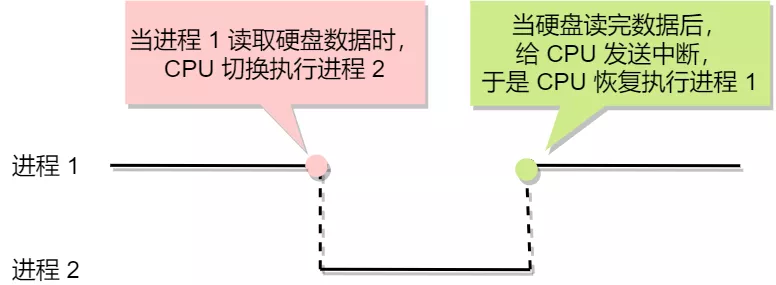

进程和线程基础
---
## 进程
进程是操作系统分配资源的最小单位。
原则上不可能在进程读取硬盘数据的时候cpu一直阻塞等待，所以当进程要从硬盘读取数据时，CPU 不需要阻塞等待数据的返回，而是去执行另外的进程。当硬盘数据返回时，CPU 会收到个中断，于是 CPU 再继续运行这个进程。

这种**多个程序、交替执行**的思想，就有 CPU 管理多个进程的初步想法。虽然单核cpu在任意时刻只会执行一个进程，但是在一段时间内可能执行了多个进程，以此产生并行的错觉，实际上是并发。

### 进程的状态
在一个进程的活动期间至少具备三种基本状态，即**运行状态、就绪状态、阻塞状态**。另外加上两个基本状态：创建和结束。构成以下五种：
- 运行：该时刻进程占用cpu
- 就绪：除了cpu时间片，获得了全部
- 阻塞：该进程等待某一事件发生
- 新建：
- 结束：

挂起状态：它表示进程没有占有物理内存空间。这跟阻塞状态是不一样，阻塞状态是等待某个事件的返回。由于虚拟内存管理原因，**进程的所使用的空间可能并没有映射到物理内存，而是在硬盘上，这时进程就会出现挂起状态**，另外调用 sleep 也会被挂起。挂起也分为两种：
**阻塞挂起状态：** 进程在外存（硬盘）并等待某个事件的出现；
**就绪挂起状态：** 进程在外存（硬盘），但只要进入内存，即刻立刻运行；

### 进程的控制结构
在操作系统中，是用**进程控制块（process control block，PCB）**数据结构来描述进程的。

**PCB 是进程存在的唯一标识**，这意味着一个进程的存在，必然会有一个 PCB，如果进程消失了，那么 PCB 也会随之消失。

**PCB具体包含的信息**
进程描述信息：进程标识符、用户标识符
进程控制和管理信息：进程当前状态、进程优先级
资源分配清单
cpu相关信息

**PCB如何组织？**
通常通过**链表**的方式进行组织，把具有相同状态的进程链在一起，组成各种队列。
- 就绪状态的进程在一起，称之为就绪队列
- 类似的还有阻塞队列
另外还有**索引方式**等。
### 进程的控制
**创建进程**

操作系统允许一个进程创建另一个进程，而且允许子进程继承父进程所拥有的资源。当子进程中止时候，它在父进程处继承的资源应当还给父进程。**(如果父进程一直很忙，没有去wait、waitpid子进程结束时留下的状态信息，那么已经结束的子进程数据结构无从清流，产生僵尸进程)**  同时中止父进程时同时也会终止其所有的子进程。 **(如果没有中止，就是孤儿进程马会杯pid=1的init进程托管)**
**创建进程的过程如下：**
- 为新进程分配一个唯一的进程标识号，并申请一个空白的 PCB，PCB 是有限的，若申请失败则创建失败；
- 为进程分配资源，此处如果资源不足，进程就会进入等待状态，以等待资源；
- 初始化 PCB；
- 如果进程的调度队列能够接纳新进程，那就将进程插入到就绪队列，等待被调度运行；

**终止进程**
三种方式中止进程：正常结束、异常结束、外界干预(Kill)
- 查找需要中止的进程PCB
- 如果出于执行状态则立即中止该进程的执行，然后讲CPU分配给其他进程
- 如果还有子进程，则应将其所有子进程中止
- 将该进程所拥有的全部资源都归还给父进程或操作系统。
- 讲其从PCB所在队列中删除
**阻塞进程**
一旦被阻塞，他只能由另一个进程唤醒
- 找到将要被阻塞的进程标识号对应的PCB
- 转为阻塞状态，停止运行
- PCB插入阻塞链表中
**唤醒进程**
- 在PCB阻塞队列中找到对应的PCB
- 从队列中移出，置为就绪住哪个太
- 这个PCB插入就绪队列，等待cpu分配时间

### 进程上下文切换
各个进程之间是共享 CPU 资源的，在不同的时候进程之间需要切换，**让不同的进程可以在 CPU 执行，那么这个一个进程切换到另一个进程运行，称为进程的上下文切换**。

**什么是CPU上下文切换？**
任务是交给 CPU 运行的，那么在每个任务运行前，CPU 需要知道任务从哪里加载，又从哪里开始运行。**操作系统需要事先帮 CPU 设置好 CPU 寄存器和程序计数器**。
cpu寄存器:CPU 内部一个容量小，但是速度极快的内存（缓存)。
程序计数器：用来存储 CPU 正在执行的指令位置、或者即将执行的下一条指令位置。
**CPU 寄存器和程序计数是 CPU 在运行任何任务前，所必须依赖的环境，这些环境就叫做 CPU 上下文。**
所谓的上下文切换就是保存当前寄存器和程序计数器状态，加载新的任务上下文到里面，开始从新位置执行。

