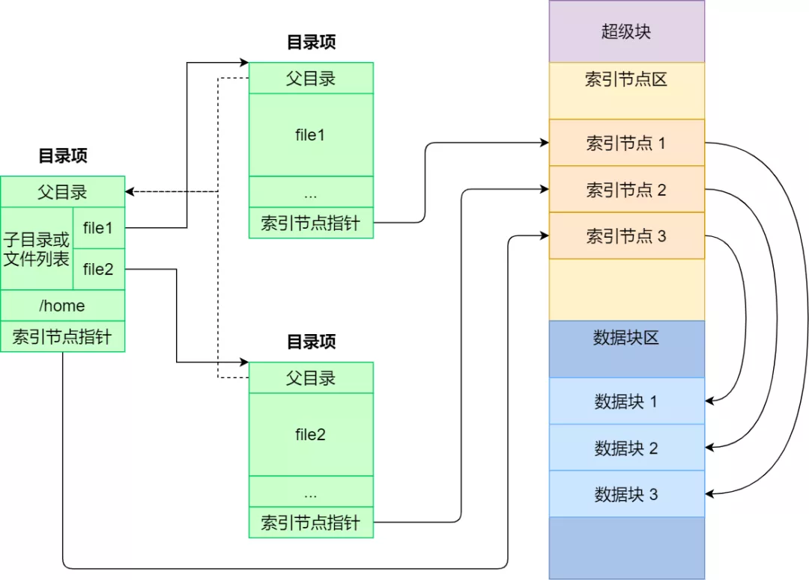
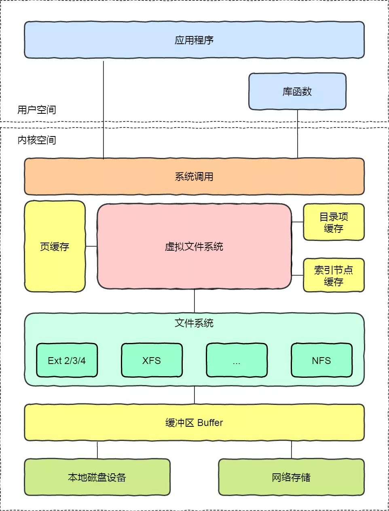
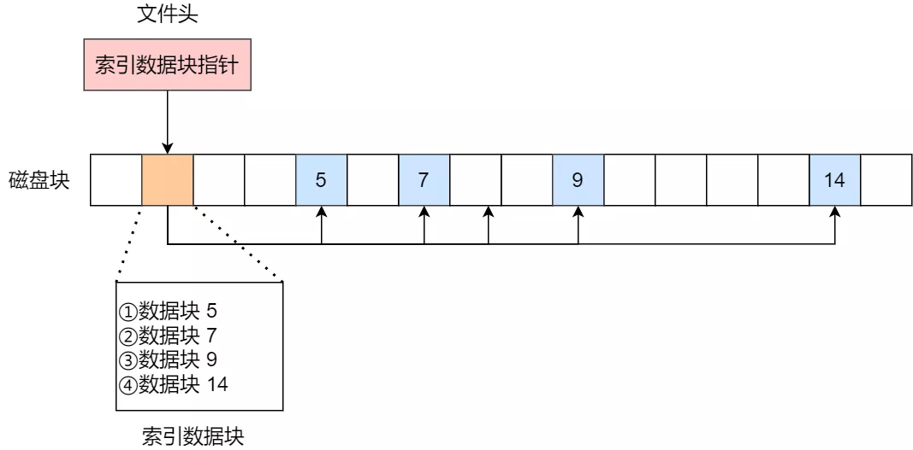
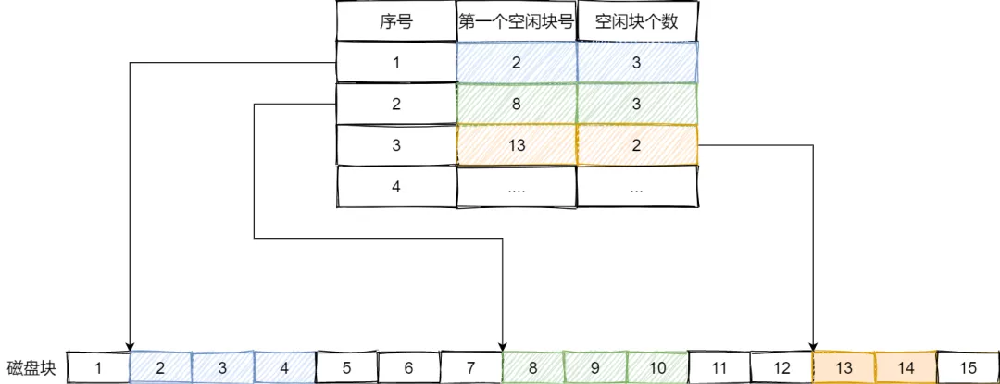
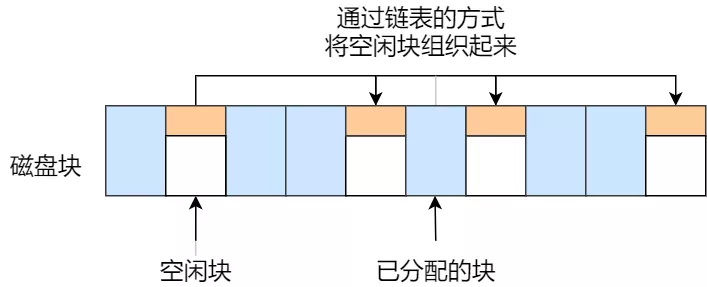
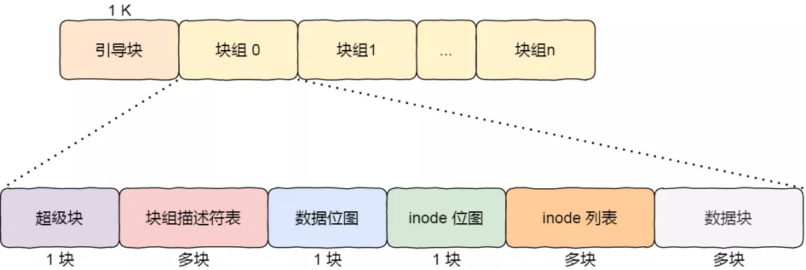

[toc]

# 文件系统

---

## 文件系统的组成

文件系统的基本数据单位是文件，他的目的是对磁盘上的文件进行组织管理，那组织的方式不同就会形成不同的文件系统。
Linux 文件系统会为每个文件分配两个数据结构：**索引节点（index node）**和**目录项（directory entry）**，它们主要用来记录文件的元信息和目录层次结构。
- 索引节点 inode，用来记录文件的元信息，比如inode编号、文件大小、访问权限、创建时间、修改时间、**数据在磁盘的位置**等等。**索引节点是文件的唯一标识**，他们之间一一对应，也同样会被**存储在硬盘中，所以索引节点同样占用磁盘空间**。
- 目录项 dentry，用来记录文件的名字、索引结点指针以及与其他目录项的层级关联关系。多个目录项关联起来，就会形成目录结构、但它与索引节点不同的是，**目录项是由内核维护的一个数据结构，不存放于磁盘，而是缓存在内存**。

由于索引节点唯一标识一个文件，而目录项记录着文件的名字，所以目录项和索引节点的关系是多对一，即一个文件可以有多个别名。比如，硬链接的实现就是多个目录项中的索引节点指向同一个文件。
注意，<font color=red>**目录**(不是目录项)也是文件，也是用索引节点唯一标识，和普通文件不同的是，普通文件在磁盘里面保存的是文件数据，而目录文件在磁盘里面保存子目录或文件。</font>
### 目录项和目录？
目录是一个文件，持久化存在磁盘中。而目录项是内核一个数据结构，缓存在内存。如果查询目录频繁从磁盘中读，效率会很低，所以内核会把已经度过的目录用目录项这个数据结构缓存在内存，下次再此读到相同目录，只需要从内存读就可以。**目录项相当于是目录的一个缓存。**
**注意：**  目录项这个数据结构不仅仅可以表示目录，也可以表示文件。
### 文件数如何存储在磁盘里的
磁盘读写最小单位是**扇区**，扇区的大小只有`512B`，如果每次读写都以这么小为单位，那这读写的效率会非常低。所以文件系统把多个扇区组成了一个**逻辑块**，每次读写的最小单位就是逻辑块，Linux中逻辑块大小为`4KB`，也就是一次性读写8个扇区，大大提高磁盘读写的效率。

索引节点是存储在硬盘上的数据，那么为了加速文件的访问，通常会把索引节点加载到内存中。为了加速文件的访问速度，通常会把索引节点加载到内存中。另外磁盘格式化的时候，会被分成三个存储区域--**超级快、索引节点区和数据块区**。
- 超级块：用来存储文件系统的详细信息，比如块个数、块大小、空闲块等等。
- 索引节点区：用来存储索引节点
- 数据块区：用来存储文件或目录数据


**不能把超级块和索引节点区全部加载到内存**，这样内存肯定撑不住，所以只有当需要使用的时候，才将其加载进内存，它们加载进内存的时机是不同的：
- 超级块：当文件系统挂载时进入内存
- 索引节点区：当文件被访问时进入内存

## 虚拟文件系统
文件系统的种类众多，操作系统希望对用户提供一个统一的接口，于是在用户层与文件系统层引入了中间层，这个中间层就称为**虚拟文件系统（Virtual File System，VFS）**。
VFS 定义了一组所有文件系统都支持的数据结构和标准接口，这样程序员不需要了解文件系统的工作原理，只需要了解 VFS 提供的统一接口即可。


Linux 支持的文件系统也不少，根据存储位置的不同，可以把文件系统分为三类：
- 磁盘的文件系统：他是直接把数据存储在磁盘中 `Ext 2/3/4、XFS`都是这类文件系统。
- 内存的文件系统，这类文件系统的数据不是存储在硬盘的，而是占用内存空间。`/proc` 和 `/sys` 文件系统都属于这一类，读写这类文件，实际上是读写内核中相关的数据数据。
- 网络文件系统：用来访问其他计算机主机数据的文件系统 `NFS,SMB`。

文件系统首先要挂载到某个目录才可以正常使用，比如Linux系统在启动时，会把文件系统挂载到根目录。

## 文件的使用
 通过系统调用来打开一个文件。
 
 ```c
fd = open(name, flag); # 首先用 open 系统调用打开文件，open 的参数中包含文件的路径名和文件名。
...
write(fd,...);         # 使用 write 写数据，其中 write 使用 open 所返回的文件描述符，并不使用文件名作为参数。
...
close(fd);             # 使用完文件后，要用 close 系统调用关闭文件，避免资源的泄露
 ```
打开一个文件系统后，操作系统会跟踪进程打开的所有文件，**即操作系统为每个进程维护一个打开文件表，文件里的每一项代表文件描述符，所以说文件描述符是打开文件的标识。**
 
操作系统在打开文件表中维护着打开文件的状态和信息：
- 文件指针：系统跟踪上次读写位置，作为当前文件位置指针，这种只针对打开文件的某个进程来说是唯一的。
- 文件打开计数器：文件关闭时，操作系统必须重用其打开文件表条目，否则表内空间不够用。因为多个进程可能打开同一个文件，所以系统在删除打开文件条目之前必须等待最后一个进程关闭文件，**该计数器跟踪打开和关闭的数量，当该计数器为0时，系统关闭文件，删除该条目**。
- 文件磁盘位置：绝大多数文件操作都要求系统修改文件数据，该信息保存在内存中，避免每次操作都从磁盘中读取。
- 访问权限：每个进程打开文件都有访问模式（创建、只读、读写、添加等），该信息保存在进程的打开文件表中，以便操作系统能允许或拒绝之后的 I/O 请求。

在**用户视角**里，文件就是一个**持久化的数据结构**，但操作系统并不会关心你想存在磁盘上的任何的数据结构，操作系统的视角是如何把文件数据和磁盘块对应起来。
所以，用户和操作系统对文件的读写操作是有差异的，用户习惯以字节的方式读写文件，而操作系统则是以数据块来读写文件，那**屏蔽掉这种差异的工作就是文件系统**了。

**读文件和写文件的过程：**
1. 当用户进程从文件读取 1 个字节大小的数据时，文件系统则需要获取字节所在的数据块，再返回数据块对应的用户进程所需的数据部分。
2. 当用户进程把 1 个字节大小的数据写进文件时，文件系统则找到需要写入数据的数据块的位置，然后修改数据块中对应的部分，最后再把数据块写回磁盘。

所以说，**文件系统的基本操作单位是数据块。**

## 文件的存储
文件的数据是要存储在硬盘上面的，**数据在磁盘上的存放方式**，就像程序在内存中存放的方式那样，有以下两种：
- 连续空间存放方式
- 非连续空间存放方式(链表方式、索引方式)

1. 连续空间存放方式
   文件存放在磁盘连续的物理空间中。这种模式下，文件的数据都是紧密相连，读写效率很高，因为一次磁盘寻道就可以读出整个文件。
   使用**连续存放的方式有一个前提，必须先知道一个文件的大小**，这样文件系统才会根据文件的大小在磁盘上找到一块连续的空间分配给文件。**所以，文件头里需要指定起始块的位置和长度**，有了这两个信息就可以很好的表示文件存放方式是一块连续的磁盘空间。
   缺点：连续空间存放的方式虽然读写效率高，但是会产生磁盘空间碎片 并且文件长度不易扩展。删除和移动比较麻烦
2. 非连续方式
   - 链表方式：离散的，不用连续的，可以消除磁盘碎片问题，提高磁盘利用率，同时支持文件长度动态扩展。根据实现的方式不同，链表分为**隐式链表**和**显式链表**。
   - - 隐式链表：文件头要包含第一块和最后一块的位置，并且每个数据块里面要留出一个指针空间，用来存放下一个数据块的位置。**缺点：** 无法直接访问数据块，只能通过指针顺序访问文件，以及数据块指针消耗了一定的存储空间。另外隐式链表分配的**稳定性较差，如果导致链表中的指针丢失或损坏，会导致文件数据的丢失**。
   - - 显示链表：把每个磁盘块的指针把他放在内存的一个表中，解决隐式链表的问题。**把用于链接文件各数据块的指针，显式地存放在内存的一张链接表中，该表在整个磁盘仅设置一张，每个表项中存放链接指针，指向下一个数据块号。** 查找记录的过程是在内存中进行的，因而不仅**显著地提高了检索速度**，而且大大**减少了访问磁盘的次数**。但也正是整个表都存放在内存中的关系，它的主要的**缺点是不适用于大磁盘**。
- 索引方式
  索引的实现是为**每个文件创建一个索引数据块**，里面存放的是**指向文件数据块的指针列表**。另外，**文件头需要包含指向索引数据块的指针，** 这样就可以通过文件头知道索引数据块的位置，再通过索引数据块里的索引信息找到对应的数据块。 
  
  优点：文件的扩展和缩小很方便，没有碎片化问题，支持顺序读写和随机读写。
  缺点：由于索引数据也是存放在磁盘块的，如果文件很小，明明只需一块就可以存放的下，但还是需要额外分配一块来存放索引数据，所以缺陷之一就是存储索引带来的开销。
  
  
如果文件很大，一个索引数据块放不下索引信息，**可以通过链表+索引的组合方式解决(链式索引块)**，**实现的方式是在索引数据块留出一个存放下一个索引数据块的指针**，于是当一个索引数据块的索引信息用完了，就可以通过指针的方式，找到下一个索引数据块的信息。  
  
还有**另外一种组合方式是索引 + 索引的方式(多级索引块)**，实现方式是通过一个索引块来存放多个索引数据块，一层套一层索引。 
 

**总结：**
 
早期 Unix 文件系统是组合了前面的文件存放方式的优点，根据文件大小存放方式混合使用。

## 空闲空间管理
针对磁盘的空闲空间也是要引入管理的机制：**空闲表法  空闲链表法  位图法**
### 空闲表法
空闲表法就是为所有空闲空间建立一张表，表内容包括空闲区的第一个块号和该空闲区的块个数，注意，**这个方式是连续分配的**。如下图：
 
当请求分配磁盘空间时，系统依次扫描空闲表里的内容，直到找到一个合适的空闲区域为止，当撤销一个文件的时候也要顺序扫描空闲表，释放空间。
这种方法适合空闲空间比较小的时候。因为，如果存储空间中有着大量的小的空闲区，则空闲表变得很大，这样查询效率会很低。另外，这种**分配技术适用于建立连续文件**。
### 空闲链表法
使用链表的方式来管理空闲空间，每一个空闲块里有一个指针指向下一个空闲块，这样也能很方便的找到空闲块并管理起来：
 
当创建文件需要一块或几块时，就从链头上依次取下一块或几块。反之，当回收空间时，把这些空闲块依次接到链头上。
**空闲表法和空闲链表法都不适合用于大型文件系统，因为这会使空闲表或空闲链表太大。**
### 位图法
利用二进制的一位来表示磁盘中一个盘块的使用情况，磁盘上所有的盘块都有一个二进制位与之对应，当值为 0 时，表示对应的盘块空闲，值为 1 时，表示对应的盘块已分配。
**在 Linux 文件系统就采用了位图的方式来管理空闲空间，不仅用于数据空闲块的管理，还用于 inode 空闲块的管理，因为 inode 也是存储在磁盘的，自然也要有对其管理。**

## 文件系统的结构
 `Linux` 是用位图的方式管理空闲空间，用户在创建一个新文件时，`Linux` 内核会通过 `inode` 的位图找到空闲可用的 `inode`，并进行分配。要存储数据时，会通过块的位图找到空闲的块，并分配。如果采用「一个块的位图 + 一系列的块」，外加「一个块的 inode 的位图 + 一系列的 inode 的结构」能表示的最大空间也就 128M，在 Linux 文件系统，把这个结构称为一个块组，那么有 N 多的块组，就能够表示 N 大的文件。 Linux Ext2 整个文件系统的结构和块组的内容，文件系统都由大量块组组成，在硬盘上相继排布： 
 
最前面的第一个块是引导块，在系统启动时用于启用引导，接着后面就是一个一个连续的块组了，块组的内容如下：
- **超级块**，包含的是文件系统的重要信息，比如 inode 总个数、块总个数、每个块组的 inode 个数、每个块组的块个数等等。

- **块组描述符**，包含文件系统中各个块组的状态，比如块组中空闲块和 inode 的数目等，每个块组都包含了文件系统中「所有块组的组描述符信息」。

- **数据位图和 inode 位图**， 用于表示对应的数据块或 inode 是空闲的，还是被使用中。

- **inode 列表**，包含了块组中所有的 inode，inode 用于保存文件系统中与各个文件和目录相关的所有元数据。

- **数据块**，包含文件的有用数据。