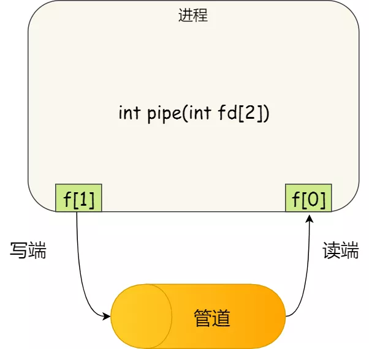
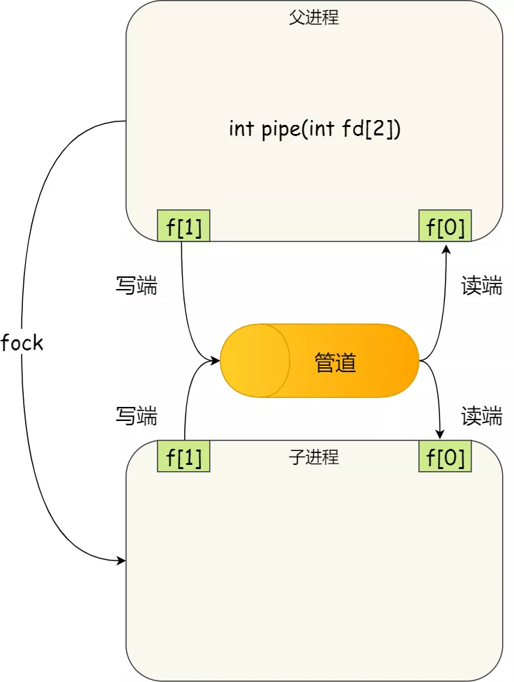
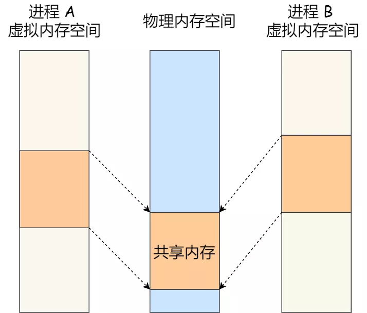

[toc]
## 进程间通信
---
### 管道
```c
$ ps auxf | grep mysql
```
这其中的`|`，就是一个管道，表示前一个命令的输出作为后一个命令的输入。从这一点来看**管道传输数据是单向的。**
在 shell 里通过`|`匿名管道将多个命令连接在一起，实际上也就是创建了多个子进程，那么在我们编写 shell 脚本时，能使用一个管道搞定的事情，就不要多用一个管道，这样可以减少创建子进程的系统开销。
这种管道称之为**匿名管道**。
另外管道还有一个**命名管道**，也叫做FIFO，数据时先进先出方式。命名管道必须要先`mkfifo`手动创建并指定名字。
==管道存在一个问题：管道内容没有被读取命令是不会退出的。== 所以**管道这种通信方式效率低，不合适进程间频繁通信**。

**管道如何创建，背后的原理是什么？**
```c
int pipe(int fd[2])  //管道的创建就是这个系统调用
```
这里表示创建一个匿名管道，并返回了两个描述符，一个是管道的读取端描述符 `fd[0]`，另一个是管道的写入端描述符 `fd[1]`。注意，这个匿名管道是特殊的文件，只存在于内存，不存于文件系统中。

**所谓的管道，就是内核里面的一串缓存**。从管道的一段写入的数据，实际上是缓存在内核中的，另一端读取，也就是从内核中读取这段数据。另外，**管道传输的数据是无格式的流且大小受限**。

**文件描述符在一个文件里面，如何进行进程通信呢？**
我们可以使用fork创建子进程，**创建的子进程会复制父进程的文件描述符**，这样就会有两个`fd[0]`和`fd[1]`，这样两个进程就可以通过各自的fd写入和读取同一个管道文件实现跨越通信。

管道只能一端写入，另一端读出，所以上面这种模式容易造成混乱，因为父进程和子进程都可以同时写入，也都可以读出。那么，为了避免这种情况，通常的做法是：
- 父进程关闭读取的 fd[0]，只保留写入的 fd[1]；
- 子进程关闭写入的 fd[1]，只保留读取的 fd[0]；
**所以说如果需要双向通信，则应该创建两个管道。**
<font color=red>对于匿名管道，它的通信范围是存在父子关系的进程。</font>因为管道没有实体，也就是没有管道文件，只能通过 fork 来复制父进程 fd 文件描述符，来达到通信的目的。

另外，<font color=red>对于命名管道，它可以在不相关的进程间也能相互通信</font>。因为命令管道，提前创建了一个类型为管道的设备文件，在进程里只要使用这个设备文件，就可以相互通信。

不管是匿名管道还是命名管道，进程写入的数据都是缓存在内核中，另一个进程读取数据时候自然也是从内核中获取，同时通信数据都遵循先进先出原则，不支持 lseek 之类的文件定位操作。
### 消息队列
管道的通信方式是效率低的，因此管道不适合进程间频繁地交换数据.
对于这个问题，消息队列的通信模式就可以解决。比如，A 进程要给 B 进程发送消息，**A 进程把数据放在对应的消息队列后就可以正常返回了**，B 进程需要的时候再去读取数据就可以了。同理，B 进程要给 A 进程发送消息也是如此。
这就是非阻塞方式咯。
**消息队列是保存在内核中的消息链表**，在发送数据时，会分成一个一个独立的数据单元，也就是消息体（数据块），消**息体是用户自定义的数据类型**，消息的发送方和接收方要约定好消息体的数据类型，所以每个消息体都是固定大小的存储块，**不像管道是无格式的字节流数据**。如果进程从消息队列中**读取了消息体，内核就会把这个消息体删除**。

如果没有释放消息队列或者没有关闭操作系统，消息队列会一直存在(**生命周期是系统或消息队列**)，而前面提到的匿名管道的生命周期，是随进程的创建而建立，随进程的结束而销毁(**生命周期是进程**)。

**缺点：**
- 通信不及时。通信过程中又用户态和内核态之间的数据拷贝开销。
- 附件大小有限制。消息队列不适合比较大的数据传输，每个消息体都有最大长度限制。

### 共享内存
消息队列的读取和写入的过程，都会有发生用户态与内核态之间的消息拷贝过程。那**共享内存**的方式，就很好的解决了这一问题。
<font color=red>共享内存的机制，就是拿出一块虚拟地址空间来，映射到相同的物理内存中</font>。这样这个进程写入的东西，另外一个进程马上就能看到了，都不需要拷贝来拷贝去，传来传去，大大提高了进程间通信的速度。


### 信号量
用了共享内存通信方式，**带来新的问题，那就是如果多个进程同时修改同一个共享内存，很有可能就冲突了。** 例如两个进程都同时写一个地址，那先写的那个进程会发现内容被别人覆盖了。
为了防止多进程竞争共享资源，而造成的数据错乱，所以需要保护机制，使得共享的资源，在任意时刻只能被一个进程访问。正好，**信号量**就实现了这一保护机制。

**<font color=red>信号量其实是一个整型的计数器，主要用于实现进程间的互斥与同步，而不是用于缓存进程间通信的数据。</font>**

**实际上，信号初始化为 1，就代表着是互斥信号量(Mutex)，它可以保证共享内存在任何时刻只有一个进程在访问，这就很好的保护了共享内存。**

### 信号
上面说的进程间通信，都是常规状态下的工作模式。**对于异常情况下的工作模式，就需要用「信号」的方式来通知进程**。
<font color=red>实际上我们在shell种用的快捷键，还有kill等命令方式都是给进程发送信号</font>
信号是进程间通信机制中**唯一的异步通信机制**，因为可以在任何时候发送信号给某一进程，一旦有信号产生，我们就有下面这几种，用户进程对信号的处理方式。
1. 执行默认操作
2. 捕捉信号
3. 忽略信号

### Socket
**想跨网络与不同主机上的进程之间通信，就需要 Socket 通信了。**
