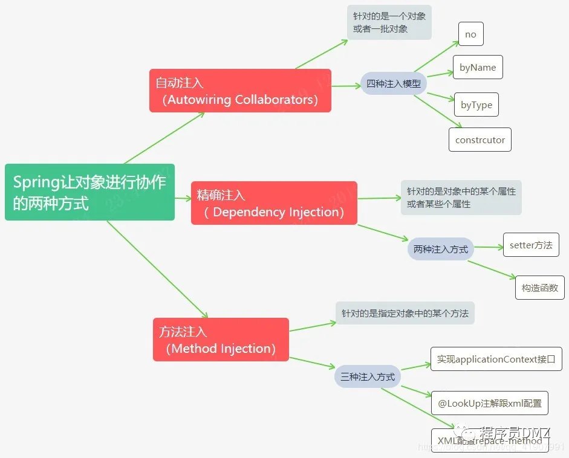

[toc]
# 一、 容器及实例化
## 1.1 容器是什么？
从官方给出的解释来看大致是两点：
- Spring IOC容器就是一个`org.springframework.context.ApplicationContext`的实例化对象
- 容器负责实例化、配置以及装配一个Bean

那么在程序员角度来讲可以说：
- 代码层次：Spring容器就是实现了`ApplicationContext`接口的对象。
- 功能层次：Spring容器时Spring框架的核心，是用来管理对象的。容器将创建对象，把他们连接在一起，配置他们，并管理他们的整个生命周期从创建到销毁。

## 1.2 容器如何工作？
Spring容器通过我们提交的POJO类以及配置元数据产生一个充分配置的可以使用的系统。**实际上这个配置元数据就是XML文件，或注解等。**

## 1.3 如何实例化一个Bean？
- 构造方法
- 静态工厂方法
- 实例工厂方法
在`org.springframework.beans.factory.support.AbstractAutowireCapableBeanFactory#createBeanInstance`中选择不同的方式进行实例化。
1. 没有特殊操作的时候默认会使用无参构造函数进行对象的实例化。
2. `@Bean`会通过反射调用静态工厂,使用工厂实例化，实例化的对象是根据BeanName去BD里面找。
3. 直接通过静态工厂方法模式创建对象，**不需要被Spring管理**。直接通过`<bean>`标签获得对象，调用`Method.invoke()`，不需要经过BD等。
4. 实例工厂方法，和@Bean是一样的。

## 1.4 实例化总结
1. 对象实例化，只是得到一个对象，还不是一个完全的Spring中的Bean，我们实例化后的这个对象还没有完成依赖注入，没有走完一系列的声明周期。
2. Spring官网指明了，在Spring中实例化一个对象有三种方式。
   - 构造方法
   - 实力工厂方法
   - 静态工厂方法


# 二、依赖注入以及方法注入
## 2.1 依赖注入

1. 构造函数注入
2. Setter方法注入

**`@Autowired`直接加到字段上跟加到set方法上有什么区别？为什么验证的时候需要将其添加到setter方法上？**
- 首先，直接添加@Autowired注解到字段上，不需要提供setter方法也能完成注入。调用Filed.set()方法
- 将`@Autowired`添加到setter方法时,对于这种方式来说，最终是通过`Method.invoke(object,args)`的方式反射来完成注入的，这里的method对象就是我们的setter方法

**`@Autowired`为什么加到构造函数上可以指定使用这个构造函数？**
- **在默认的注入模型下**，Spring如果同时找到了两个符合要求的构造函数，那么Spring会采用默认的无参构造进行实例化，如果这个时候没有无参构造，那么此时会报错java.lang.NoSuchMethodException。什么叫符合要求的构造函数呢？就是构造函数中的参数Spring能找到，参数被Spring所管理。
**这里需要着重记得：一，默认注入模型；二，符合要求的构造函数**
**所以要把autowired加到构造函数上指定。**

**如果同时采用构造注入加属性注入会怎么样呢？**
- Spring虽然能在构造函数里完成属性注入，但是这属于**实例化对象阶段**做的事情，那么在后面真正进行属性注入的时候，肯定会将其覆盖掉。 

**那么基于构造器注入和Setter注入的区别？**
- 构造函数注入跟setter方法注入可以混用
- 对于一些强制的依赖，最好使用构造器注入，对于可选的依赖可以采用setter
- Spring团队推荐使用构造器注入

## 2.2 方法注入
对于方法注入不是很熟悉..大致上分为
- 通过注入上下文
- @LookUp
- replace-method

## 2.3 总结
首先明确什么是依赖：一个对象的依赖就是他自身的属性，**Spring中的依赖注入就是属性注入。**

依赖注入跟方法注入的总结：
- 我们知道一个对象由两部分组成：属性+行为（方法），可以说Spring通过属性注入+方法注入的方式掌控的整个bean。
- 属性注入跟方法注入都是Spring提供给我们用来处理Bean之间协作关系的手段
- 属性注入有两种方式：构造函数，Setter方法。
- 方法注入（LookUp Method跟Replace Method）需要依赖动态代理完成
- 方法注入对属性注入进行了一定程度上的补充，因为属性注入的情况下，原型对象可能会失去原型的意义。


# 三、自动注入
先要对**自动注入及精确注入**有一个大概的了解，所谓**精确注入**就是指，我们通过构造函数或者setter方法指定了我们对象之间的依赖，也就是我依赖注入，然后Spring根据我们指定的依赖关系，精确的给我们完成了注入。

**那么自动注入是什么？**
```xml
<?xml version="1.0" encoding="UTF-8"?>
<beans xmlns="http://www.springframework.org/schema/beans"
    xmlns:xsi="http://www.w3.org/2001/XMLSchema-instance"
    xsi:schemaLocation="http://www.springframework.org/schema/beans http://www.springframework.org/schema/dbeans/spring-beans.xsd"
>
 <bean id="auto" class="com.dmz.official.service.AutoService" autowire="byType"/>
 /*重点就是这个属性*/
 <bean id="dmzService" class="com.dmz.official.service.DmzService"/>
</beans>
```
```java
public class AutoService {
 DmzService service;
 public void setService(DmzService dmzService){
  System.out.println("注入dmzService"+dmzService);
  service = dmzService;
 }
}
public class DmzService {

}
public class Main03 {
 public static void main(String[] args) {
  ClassPathXmlApplicationContext cc =
    new ClassPathXmlApplicationContext("application.xml");
  System.out.println(cc.getBean("auto"));
 }
}
```
从上述代码中可以看出：
- 我们没有采用注解@Autowired进行注入
- XML中没有指定属性标签<property>
- 没有使用构造函数

**但是结果：**
```java
注入dmzServicecom.dmz.official.service.DmzService@73a8dfcc  // 这里完成了注入
com.dmz.official.service.AutoService@1963006a
```
`AutoService`的标签中新增了一个属性`autowire="byType"`完成了自动注入这个任务。
自动注入的优点：
- 自动注入减少指定属性或构造参数的必要
- 自动装配可以随着对象的演化更新配置

**注入模型：**
- no：Spring默认的注入模型及关闭自动注入。必须要通过setter方法或构造函数完成依赖注入。
- byName：这种方式为了让Spring完成自动注入需要两个条件。1. 提供setter方法。2.注入属性的方法命必须规范`setXxx`()---找不到对应name的时候不会报错，也不会注入
- byType：`autowire="byType"`。1.找不到合适的，不注入不报异常。2. 找到多个合适的，报异常。
- constructor
  这种注入模型，Spring会根据构造函数查找有没有对应参数名称的bean,有的话完成注入 **（跟byName差不多）** ，如果根据名称没找到，那么它会再根据类型进行查找，如果根据类型还是没找到，就会报错

**自动注入的缺陷：**
官方其实极其不愿意用户使用。。一直在说缺点：
1. 精确注入会覆盖自动注入，并且不能注入基本数据类型，字符串等
2. 自动注入不如精确注入准确，依赖关系不明确
3. 自动注入出错很可能不抛出异常

## 总结

- 从关注的点上来看，自动注入是针对的整个对象，或者一整批对象。比如我们如果将`autoService`这个`bean`的注入模型设置为`byName`，Spring会为我们去寻找所有符合要求的名字（通过set方法）bean并注入到`autoService`中。而精确注入这种方式，是我们针对对象中的某个属性，比如我们在`autoService`中的`dmzService`这个属性字段上添加了`@AutoWired`注解，代表我们要精确的注入`dmzService`这个属性。而方法注入主要是基于方法对对象进行注入。
- 我们通常所说 **byName,byType跟我们在前文提到的注入模型中的byName,byType是完全不一样的。** 通常我们说的byName,byType是Spring寻找bean的手段。比如，当我们注入模型为constructor时，Spring会先通过名称找对符合要求的bean，这种通过名称寻找对应的bean的方式我们可以称为byName。我们可以将一次注入分为两个阶段，首先是寻找符合要求的bean，其次再是将符合要求的bean注入。

**注意：** **现在annotation-based configuration对注入的精细程度可以有多个维度的控制，已经没有很鲜明的所谓自动注入vs精细注入了。**

# 三、BeanDefinition（上）
## 3.1 BeanDefinition是什么？
1. `BeanDefinition`包含了我们对bean做的配置，比如`XML<bean/>`标签的形式进行的配置。
2. Spring将我们对bean的定义信息进行了抽象，抽象后的实体就是`BeanDefinition`,并且Spring会以此作为标准来对Bean进行创建
3. `BeanDefinition`包含以下元数据：
   - 一个全限定类名
   - bean的行为配置元素
   - bean的依赖信息
   - 其他配置信息等

**相比于正常new一个对象，spring中通过BD创建对象有什么区别？**
相比于正常的对象的创建过程，Spring对其管理的bean没有直接采用new的方式，而是先通过解析配置数据以及根据对象本身的一些定义而获取其对应的beandefinition,并将这个beandefinition作为之后创建这个bean的依据。同时Spring在这个过程中**提供了一些扩展点**。

## 3.2 BD的方法分析
```java
// 获取父BeanDefinition,主要用于合并，下节中会详细分析
String getParentName();

// 对于的bean的ClassName
void setBeanClassName(@Nullable String beanClassName);

// Bean的作用域，不考虑web容器，主要两种，单例/原型，见官网中1.5内容
void setScope(@Nullable String scope);

// 是否进行懒加载
void setLazyInit(boolean lazyInit);

// 是否需要等待指定的bean创建完之后再创建
void setDependsOn(@Nullable String... dependsOn);

// 是否作为自动注入的候选对象
void setAutowireCandidate(boolean autowireCandidate);

// 是否作为主选的bean
void setPrimary(boolean primary);

// 创建这个bean的类的名称
void setFactoryBeanName(@Nullable String factoryBeanName);

// 创建这个bean的方法的名称
void setFactoryMethodName(@Nullable String factoryMethodName);

// 构造函数的参数
ConstructorArgumentValues getConstructorArgumentValues();

// setter方法的参数
MutablePropertyValues getPropertyValues();

// 生命周期回调方法，在bean完成属性注入后调用
void setInitMethodName(@Nullable String initMethodName);

// 生命周期回调方法，在bean被销毁时调用
void setDestroyMethodName(@Nullable String destroyMethodName);

// Spring可以对bd设置不同的角色,了解即可，不重要
// 用户定义 int ROLE_APPLICATION = 0;
// 某些复杂的配置    int ROLE_SUPPORT = 1;
// 完全内部使用   int ROLE_INFRASTRUCTURE = 2;
void setRole(int role);

// bean的描述，没有什么实际含义
void setDescription(@Nullable String description);

// 根据scope判断是否是单例
boolean isSingleton();

// 根据scope判断是否是原型
boolean isPrototype();

// 跟合并beanDefinition相关，如果是abstract，说明会被作为一个父beanDefinition，不用提供class属性
boolean isAbstract();

// bean的源描述，没有什么实际含义 
String getResourceDescription();

// cglib代理前的BeanDefinition
BeanDefinition getOriginatingBeanDefinition();
```

**为什么需要派生抽象类`AbstractBeanDefinition`**
对比`BeanDefinition`的源码我们可以发现，`AbstractBeanDefinition`对`BeanDefinition`的大部分方法做了实现（没有实现`parentName`相关方法）。同时定义了一系列的常量及默认字段。这是因为`BeanDefinition`接口过于顶层，如果我们依赖`BeanDefinition`这个接口直接去创建其实现类的话过于麻烦，所以通过`AbstractBeanDefinition`做了一个下沉，并给很多属性赋了默认值。

**AbstractBeanDefinition的三个子类**
1. GenericBeanDefinition
2. ChildBeanDefinition
3. RootBeanDefinition

**AnnotatedBeanDefinition?**（从注解方式定义bean）
这个接口继承了我们的`BeanDefinition`接口，实际上这个接口相比于`BeanDefinition`， 仅仅多提供了两个方法：
- `getMetadata()`,主要用于获取注解元素据。从接口的命名上我们也能看出，这类主要用于保存通过注解方式定义的bean所对应的`BeanDefinition`。所以它多提供了一个关于获取注解信息的方法
- `getFactoryMethodMetadata()`,这个方法跟我们的`@Bean`注解相关。当我们在一个配置类中使用了`@Bean`注解时，被`@Bean`注解标记的方法，就被解析成了`FactoryMethodMetadata`。

**AnnotatedBeanDefinition的三个实现类**
1. AnnotatedGenericBeanDefinition：
- 通过形如下面的API注册的bean都是`AnnotatedGenericBeanDefinition`
```java
public static void main(String[] args) {
    AnnotationConfigApplicationContext ac = new AnnotationConfigApplicationContext();
    ac.register(Config.class);
}

```
这里的`config`对象，最后在Spring容器中就是一个`AnnotatedGenericBeanDefinition`。
- 通过`@Import`注解导入的类，最后都是解析为`AnnotatedGenericBeanDefinition`。
2. ScannedGenericBeanDefinition
都过**注解扫描的类**，如`@Service`,`@Compent`等方式配置的Bean都是`ScannedGenericBeanDefinition`
3. ConfigurationClassBeanDefinition
通过`@Bean`的方式配置的Bean为`ConfigurationClassBeanDefinition`

## 中间总结一下
1. 什么是BeanDefinition，总结起来就是一句话，Spring创建bean时的建模对象。
2. BeanDefinition的具体使用的子类，以及Spring在哪些地方使用到了它们。画图总结如下：


# 四、BeanDefinition（下）BD合并
## 4.1 什么是合并？
一个`BeanDefinition`包含了很多的配置信息，包括构造参数，setter 方法的参数还有容器特定的一些配置信息，比如初始化方法，静态工厂方法等等。一个子的`BeanDefinition`可以从它的父`BeanDefinition`继承配置信息，不仅如此，还可以覆盖其中的一些值或者添加一些自己需要的属性。**使用`BeanDefinition`的父子定义可以减少很多的重复属性的设置，父`BeanDefinition`可以作为`BeanDefinition`定义的模板。**

**合并总结：**
- 子BD会从父BD中继承没有的属性
- 这个过程中子BD中已经存在的属性不会被父BD中所覆盖

==合并需要注意的点：==
- 子BeanDefinition中的class属性如果为 null，同时父BeanDefinition又指定了class属性，那么子BeanDefinition也会继承这个class属性。
- 子BeanDefinition必须要兼容父BeanDefinition中的所有属性。我们在父BeanDefinition中指定了 name 跟 age 属性，但是如果子BeanDefinition中子提供了一个 name 的 setter 方法，这个时候 Spring 在启动的时候会报错。因为子BeanDefinition不能承接所有来自父BeanDefinition的属性
- 关于BeanDefinition中abstract属性的说明：
  1. 并不是作为父BeanDefinition就一定要设置abstract属性为 true，abstract只代表了这个BeanDefinition是否要被 Spring 进行实例化并被创建对应的 Bean，如果为 true，代表容器不需要去对其进行实例化。
  2. 如果一个BeanDefinition被当作父BeanDefinition使用，并且没有指定其class属性。那么必须要设置其abstract为 true
  3. abstract=true一般会跟父BeanDefinition一起使用，因为当我们设置某个BeanDefinition的abstract=true时，一般都是要将其当作BeanDefinition的模板使用，否则这个BeanDefinition也没有意义，除非我们使用其它BeanDefinition来继承它的属性
## 4.2 Spring在哪些地方做了合并
1. 扫描并获取到bd
2. 实例化：Spring 在实例化一个对象也会进行bd的合并。

## 4.3 为什么需要合并？
1. 在扫描阶段，之所以发生了合并，是因为 Spring 需要拿到指定了实现了BeanDefinitionRegistryPostProcessor接口的bd的名称，也就是说，Spring 需要用到bd的名称。所以进行了一次bd的合并。
2. 在实例化阶段，是因为 Spring 需要用到bd中的一系列属性做判断所以进行了一次合并。
**总结起来，其实就是一个原因：Spring 需要用到bd的属性，要保证获取到的bd的属性是正确的。**

**4.4 为什么获取到的bd中属性可能不正确呢？**
1. 作为子bd,属性本身就有可能缺失，比如属性在父BD中，子BD没有。
2. Spring 提供了很多扩展点，在启动容器的时候，可能会修改bd中的属性。比如一个正常实现了BeanFactoryPostProcessor就能修改容器中的任意的bd的属性。

## 总结
我们要明白 Spring 为什么要进行合并，之所以再每次需要用到BeanDefinition都进行一次合并，是为了**每次都拿到最新的，最有效的BeanDefinition**，因为利用容器提供了一些扩展点我们可以修改BeanDefinition中的属性。

# 五、容器扩展点
容器的扩展点可以分类三类，BeanPostProcessor,BeanFactoryPostProcessor以及FactoryBean。
## 5.1 BeanFactoryPostProcessor
这个可以修改BD
1. `BeanFactoryPostProcessor`可以对Bean配置元数据进行操作。也就是说，Spring容器允许`BeanFactoryPostProcessor`读取指定Bean的配置元数据，并可以在Bean被实例化之前修改它。这里说的配置元数据其实就是我们之前讲过的`BeanDefinition`。
2. 我们可以配置多个`BeanFactoryPostProcessor`，并且只要我们配置的`BeanFactoryPostProcessor`同时实现了Ordered接口的话，我们还可以控制这些`BeanFactoryPostProcessor`执行的顺序

**几个问题：**
1. **可不可以在BeanFactoryPostProcessor去创建一个Bean，这样有什么问题？**
从技术上来说这样是可以的，但是正常情况下我们不该这样做，这是因为可能会存在该执行的Bean工厂的后置处理器的逻辑没有被应用到这个Bean上。
2. **BeanFactoryPostProcessor可以被配置为懒加载吗？**
不能配置为懒加载，即使配置了也不会生效。我们将Bean工厂后置处理器配置为懒加载这个行为就没有任何意义

**`BeanFactoryPostProcessor`执行的顺序，总结如下：**
- 执行直接实现了`BeanDefinitionRegistryPostProcessor`接口的后置处理器，所有实现了`BeanDefinitionRegistryPostProcessor`接口的类有两个方法，一个是特有的`postProcessBeanDefinitionRegistry`方法，一个是继承子父接口的`postProcessBeanFactory`方法。
- - `postProcessBeanDefinitionRegistry`方法早于`postProcessBeanFactory`方法执行，对于`postProcessBeanDefinitionRegistry`的执行顺序又遵循如下原子
- - 执行完所有的`postProcessBeanDefinitionRegistry`方法后，再执行实现了`BeanDefinitionRegistryPostProcessor`接口的类中的`postProcessBeanFactory`方法
  1. 先执行实现了`PriorityOrdered`接口的类中的`postProcessBeanDefinitionRegistry`方法
  2. 再执行实现了Ordered接口的类中的`postProcessBeanDefinitionRegistry`的方法
  3. 最后执行没有实现上面两个接口的类中的`postProcessBeanDefinitionRegistry`的方法
- 再执行直接实现了`BeanFactoryPostProcessor`接口的后置处理器
  1. 先执行实现了`PriorityOrdered`接口的类中的`postProcessBeanFactory`方法
  2. 再执行实现了`Ordered`接口的类中的`postProcessBeanFactory`的方法
  3. 最后执行没有实现上面两个接口的类中的`postProcessBeanFactory`的方法

## 5.2 FactoryBean
提供了一种特殊的创建Bean的手段，能让我们将一个对象直接放入到容器中，成为Spring所管理的一个Bean。

1. **FactoryBean主要用来定制化Bean的创建逻辑**
2. 当我们实例化一个Bean的逻辑很复杂的时候，使用FactoryBean是很必要的，这样可以规避我们去使用冗长的XML配置

### 5.2.1 跟FactoryBean相关常见的面试题:
1. FactoryBean跟BeanFactory的区别
- `FactoryBean`是Spring提供的一个扩展点，适用于复杂的Bean的创建。mybatis在跟Spring做整合时就用到了这个扩展点。并且FactoryBean所创建的Bean跟普通的Bean不一样。我们可以说FactoryBean是Spring创建Bean的另外一种手段。
- `BeanFactory`是Spring IOC容器的顶级接口，其实现类有`XMLBeanFactory，DefaultListableBeanFactory以及AnnotationConfigApplicationContext`等。BeanFactory为Spring管理Bean提供了一套通用的规范。
  
2. 如何把一个对象交给Spring管理
   “对象”要划重点，**我们通常采用的注解如@Compent或者XML配置这种类似的操作并不能将一个对象交给Spring管理，而是让Spring根据我们的配置信息及类信息创建并管理了这个对象，**形成了Spring中一个Bean。
   把一个对象交给Spring管理主要有两种方式:
   - 就是用我们这篇文章中的主角，`FactoryBean`，我们直接在`FactoryBean`的getObject方法直接返回需要被管理的对象即可.(类似mybatis)
   - @Bean注解，同样通过@Bean注解标注的方法直接返回需要被管理的对象即可。

### 总结
FactoryBean是Spring中特殊的一个Bean，Spring利用它提供了另一种创建Bean的方式。
## 5.3 BeanPostProcessor
BeanPostProcessor它主要干预的是Spring中Bean的整个生命周期（实例化---属性填充---初始化---销毁）。
1. `BeanPostProcessor`接口定义了两个回调方法，通过实现这两个方法我们可以提供自己的实例化以及依赖注入等逻辑。而且，如果我们想要在Spring容器完成实例化，配置以及初始化一个Bean后进行一些定制的逻辑，我们可以插入一个甚至更多的`BeanPostProcessor`的实现。
2. 我们可以配置多个`BeanPostProcessor`，并且只要我们配置的`BeanFactoryPostProcessor`同时实现了Ordered接口的话，我们还可以控制这些`BeanPostProcessor`执行的顺序

# 第五章总结
**三个容器的扩展点就学习完了，可以简单总结如下：**
1. BeanPostProcessor，主要用于干预Bean的创建过程。
2. BeanFactroyPostProcessor，主要用于针对容器中的BeanDefinition。
3. FactoryBean，主要用于将一个对象直接放入到Spring容器中，同时可以封装复杂的对象的创建逻辑。
