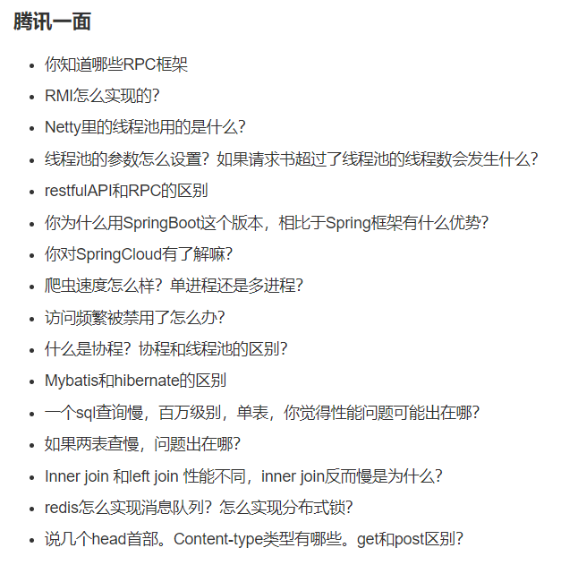

# 2019 春招面经大集合

---

#### **数据结构：**

```markdown
- 反转数组（代码）
- 排序的时间复杂度，空间复杂度，稳定性
- 排序的原理（快排，归并，堆）
- 散列，冲突处理方法
- 布隆过滤器
```

#### **网络：**

```markdown
- ※HTTP 方法/协议状态码---`HTTP幂等性及GET、POST、PUT、DELETE的区别和有无幂等性`
- TIME_WAIT 状态
- 三次握手，四次挥手/tcp 和 udp 的区别
- TCP 协议拥塞
```

#### **Java 基础**

```markdown
- main 方法中 String[] args 为什么要使用 String？main 方法的返回值为什么是 void？
- int,double,float 长度（其实等于 java 为什么跨平台）
- 自动拆箱和自动装箱
- object 的方法
- Java Collection
- ※栈和堆
- 异常你了解吗？有哪些
- 面向对象三大特征---`介绍多态`

**JVM 是重点**

- ※JVM 的垃圾垃圾回收机制--`GC算法`---`常见的垃圾回收器及他们之间区别，垃圾回收发生在哪里`---`JVM调优命令`---`新生代老年代大小如何划分`
- ※HashMap 源码级别的原理，rehash 是什么---`Hashmap的缩容，扩容机制`---`位运算的好处`---`hashmap和hashtable区别,模运算比较`---`为什么使用红黑树`
- 说一说 HashMap、volatile、Java 中的 NIO
- ※concurrent 包下有哪些常用的类--- `※concurrenthashmap，原理/JDK8 的变化`
- 抽象类和接口
- Java 中类变量和成员变量，类方法和成员方法
- ※什么是线程池？线程池的参数？线程池的工作原理？线程池的种类？任务拒绝策略？
- 锁机制极其重要 ---`CAS原理/内存可见性/问题`---`※synchronized 锁静态方法和普通方法区别，volitile 关键字的理解`---`lock和synchronized区别`
- ※Java 中的线程安全-`线程实现的方式`---`继承Thread类和实现Runale接口`---`进程和线程的区别`---`sleep和wait区别`---`threadlocal`---`start和run方法的区别，什么方法开启线程`---`进程间通讯的方式`
- ※Java --`Java的内存模型-8个指令`--`java中变量存储的位置`
- 请求 servlet 的过程-`servlet的生命周期`
- 容器---`容器的一个接口路线，从iterator往下，两个，一个map,一个Collection，map下面的hashmap，treemap,Collection下面的list,Set。list下面的ArrayList和LinkedList,Set下面的hashSet和TreeSet等，之后再吹了一下迭代器的快速失败和安全失败`
- 反射机制
- 注解是什么
- ※StringBuilder 和 StringBuffer

- 双亲委派模型 本质/用处
- 有几种类加载器
```

#### **Java 框架**

```markdown
- servlet 生命周期/怎么响应浏览器请求
- Java 容器整体框架
- ※Spring---IOC/DI/AOP---`AOP有哪几种实现`
- MVC 是什么-`.springmvc里session和cookie/区别/联系？`
- springboot 与 springMVC 有什么区别
- springMVC 执行过程
- spring bean 的生命周期
```

#### **数据库**

```markdown
- 怎么优化 mysql，mysql 性能分析工具---`mysql的查询优化，用explain查询是否用到了索引`
- jdbc 的使用，什么是 sql 注入
- ※MySQL 的锁机制
- ※Mybatis 底层实现---`一二级缓存，#和\$的区别`
- MVCC 机制的实现原理
- 数据库的隔离级别
- 数据库范式
- mysql 存储引擎以及适用场景 innodb 和 myisam 的区别？
- ※数据库的索引---`如何建索引`---`索引失效`---`索引底层实现是什么`-`聚簇索引和非聚簇索引`
- 事务的特性---`什么是事务 事物的几种特性 如何理解 mysql事务隔离级别`---`事务的二段提交`
- 为什么 Mysql 索引要用 B+树不用别的数据结构
- MySQL 外键删除策略
- MySQL 分库分表的方案
- SQL 语句 exist 和 in 的区别
```

#### **设计模式**

```markdown
- 简单工厂抽象工厂
```

#### **分布式**

```markdown
- 一致性哈希-`服务器挂了，数据会丢失吗`
- 分布式锁？分布式锁如何实现
- 负载均衡的策略
```

#### **Linux**

```markdown
- ※Linux 的常见命令
- select poll 和 epoll 的区别
```

## 以下基本是项目里涉及

---

#### **eureka**

```markdown
- 底层原理
```

#### **Redis**

```markdown
- ※redis 有哪些数据结构
- redis 怎么保证原子性
- redis 分布式锁
- Redis 的跳表
- Redis 一主多从的实现？如果主服务器挂了怎么办？能锁住吗
- key 的写入和删除的原理
- 怎么保证 Redis 的高可用
```

#### **RabbitMQ**

```markdown
- rabbitMQ 是怎么保证消息不丢失
```

## 神奇项目大佬的面试

netty 通信的简易 rpc 调用框架：





